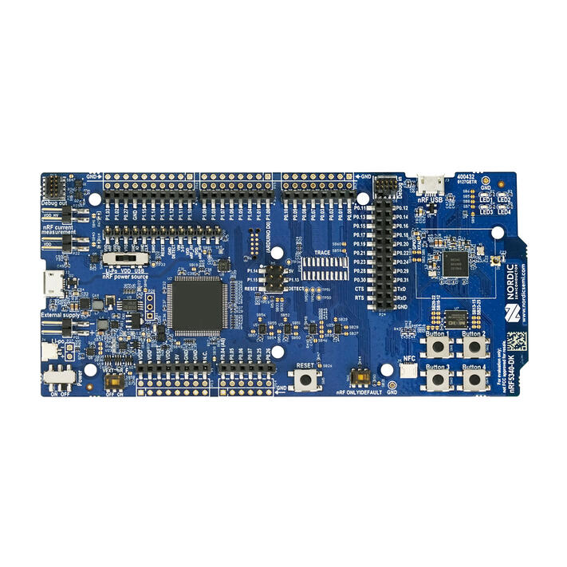

.. _nrf5340dk_nrf5340:

nRF5340 DK
##########

Overview
********

The nRF5340 DK (PCA10095) is a single-board development kit for evaluation
and development on the Nordic nRF5340 System-on-Chip (SoC).

The nRF5340 is a dual-core SoC based on the Arm® Cortex®-M33 architecture, with:

* a full-featured Arm Cortex-M33F core with DSP instructions, FPU, and
  Armv8-M Security Extension, running at up to 128 MHz, referred to as
  the **application core**
* a secondary Arm Cortex-M33 core, with a reduced feature set, running at
  a fixed 64 MHz, referred to as the **network core**.

The ``nrf5340dk/nrf5340/cpuapp`` build target provides support for the application
core on the nRF5340 SoC. The ``nrf5340dk/nrf5340/cpunet`` build target provides
support for the network core on the nRF5340 SoC.

nRF5340 SoC provides support for the following devices:

* :abbr:`ADC (Analog to Digital Converter)`
* CLOCK
* FLASH
* :abbr:`GPIO (General Purpose Input Output)`
* :abbr:`IDAU (Implementation Defined Attribution Unit)`
* :abbr:`I2C (Inter-Integrated Circuit)`
* :abbr:`MPU (Memory Protection Unit)`
* :abbr:`NVIC (Nested Vectored Interrupt Controller)`
* :abbr:`PWM (Pulse Width Modulation)`
* RADIO (Bluetooth Low Energy and 802.15.4)
* :abbr:`RTC (nRF RTC System Clock)`
* Segger RTT (RTT Console)
* :abbr:`SPI (Serial Peripheral Interface)`
* :abbr:`UARTE (Universal asynchronous receiver-transmitter)`
* :abbr:`USB (Universal Serial Bus)`
* :abbr:`WDT (Watchdog Timer)`

     nRF5340 DK (Credit: Nordic Semiconductor)

More information about the board can be found at the
`nRF5340 DK website`_.
The `nRF5340 DK Product Specification`_
contains the processor's information and the datasheet.

Hardware
********

nRF5340 DK has two external oscillators. The frequency of
the slow clock is 32.768 kHz. The frequency of the main clock
is 32 MHz.

Supported Features
==================

The ``nrf5340dk/nrf5340/cpuapp`` board configuration supports the following
hardware features:

+-----------+------------+----------------------+
| Interface | Controller | Driver/Component     |
+===========+============+======================+
| ADC       | on-chip    | adc                  |
+-----------+------------+----------------------+
| CLOCK     | on-chip    | clock_control        |
+-----------+------------+----------------------+
| FLASH     | on-chip    | flash                |
+-----------+------------+----------------------+
| GPIO      | on-chip    | gpio                 |
+-----------+------------+----------------------+
| I2C(M)    | on-chip    | i2c                  |
+-----------+------------+----------------------+
| MPU       | on-chip    | arch/arm             |
+-----------+------------+----------------------+
| NVIC      | on-chip    | arch/arm             |
+-----------+------------+----------------------+
| PWM       | on-chip    | pwm                  |
+-----------+------------+----------------------+
| RTC       | on-chip    | system clock         |
+-----------+------------+----------------------+
| RTT       | Segger     | console              |
+-----------+------------+----------------------+
| SPI(M/S)  | on-chip    | spi                  |
+-----------+------------+----------------------+
| SPU       | on-chip    | system protection    |
+-----------+------------+----------------------+
| UARTE     | on-chip    | serial               |
+-----------+------------+----------------------+
| USB       | on-chip    | usb                  |
+-----------+------------+----------------------+
| WDT       | on-chip    | watchdog             |
+-----------+------------+----------------------+

The ``nrf5340dk/nrf5340/cpunet`` board configuration supports the following
hardware features:

+-----------+------------+----------------------+
| Interface | Controller | Driver/Component     |
+===========+============+======================+
| CLOCK     | on-chip    | clock_control        |
+-----------+------------+----------------------+
| FLASH     | on-chip    | flash                |
+-----------+------------+----------------------+
| GPIO      | on-chip    | gpio                 |
+-----------+------------+----------------------+
| I2C(M)    | on-chip    | i2c                  |
+-----------+------------+----------------------+
| MPU       | on-chip    | arch/arm             |
+-----------+------------+----------------------+
| NVIC      | on-chip    | arch/arm             |
+-----------+------------+----------------------+
| RADIO     | on-chip    | Bluetooth,           |
|           |            | ieee802154           |
+-----------+------------+----------------------+
| RTC       | on-chip    | system clock         |
+-----------+------------+----------------------+
| RTT       | Segger     | console              |
+-----------+------------+----------------------+
| SPI(M/S)  | on-chip    | spi                  |
+-----------+------------+----------------------+
| UARTE     | on-chip    | serial               |
+-----------+------------+----------------------+
| WDT       | on-chip    | watchdog             |
+-----------+------------+----------------------+

Other hardware features have not been enabled yet for this board.
See `nRF5340 DK Product Specification`_
for a complete list of nRF5340 DK board hardware features.

Connections and IOs
===================

LED
---

* LED1 (green) = P0.28
* LED2 (green) = P0.29
* LED3 (green) = P0.30
* LED4 (green) = P0.31

Push buttons
------------

* BUTTON1 = SW1 = P0.23
* BUTTON2 = SW2 = P0.24
* BUTTON3 = SW3 = P0.8
* BUTTON4 = SW4 = P0.9
* BOOT = SW5 = boot/reset

Security components
===================

- Implementation Defined Attribution Unit (`IDAU`_) on the application core.
  The IDAU is implemented with the System Protection Unit and is used to
  define secure and non-secure memory maps.  By default, all of the memory
  space  (Flash, SRAM, and peripheral address space) is defined to be secure
  accessible only.
- Secure boot.

Programming and Debugging
*************************

nRF5340 application core supports the Armv8-M Security Extension.
Applications built for the ``nrf5340dk/nrf5340/cpuapp`` board by default
boot in the Secure state.

nRF5340 network core does not support the Armv8-M Security Extension.
nRF5340 IDAU may configure bus accesses by the nRF5340 network core
to have Secure attribute set; the latter allows to build and run
Secure only applications on the nRF5340 SoC.

Building Secure/Non-Secure Zephyr applications with Arm |reg| TrustZone |reg|
=============================================================================

Applications on the nRF5340 may contain a Secure and a Non-Secure firmware
image for the application core. The Secure image can be built using either
Zephyr or `Trusted Firmware M`_ (TF-M). Non-Secure firmware
images are always built using Zephyr. The two alternatives are described below.

.. note::

   By default the Secure image for nRF5340 application core is built
   using TF-M.

Building the Secure firmware with TF-M
--------------------------------------

The process to build the Secure firmware image using TF-M and the Non-Secure
firmware image using Zephyr requires the following steps:

1. Build the Non-Secure Zephyr application
   for the application core using ``-DBOARD=nrf5340dk/nrf5340/cpuapp/ns``.
   To invoke the building of TF-M the Zephyr build system requires the
   Kconfig option ``BUILD_WITH_TFM`` to be enabled, which is done by
   default when building Zephyr as a Non-Secure application.
   The Zephyr build system will perform the following steps automatically:

      * Build the Non-Secure firmware image as a regular Zephyr application
      * Build a TF-M (secure) firmware image
      * Merge the output image binaries together
      * Optionally build a bootloader image (MCUboot)

.. note::

   Depending on the TF-M configuration, an application DTS overlay may be
   required, to adjust the Non-Secure image Flash and SRAM starting address
   and sizes.

2. Build the application firmware for the network core using
   ``-DBOARD=nrf5340dk/nrf5340/cpunet``.

Building the Secure firmware using Zephyr
-----------------------------------------

The process to build the Secure and the Non-Secure firmware images
using Zephyr requires the following steps:

1. Build the Secure Zephyr application for the application core
   using ``-DBOARD=nrf5340dk/nrf5340/cpuapp`` and
   ``CONFIG_TRUSTED_EXECUTION_SECURE=y`` and ``CONFIG_BUILD_WITH_TFM=n``
   in the application project configuration file.
2. Build the Non-Secure Zephyr application for the application core
   using ``-DBOARD=nrf5340dk/nrf5340/cpuapp/ns``.
3. Merge the two binaries together.
4. Build the application firmware for the network core using
   ``-DBOARD=nrf5340dk/nrf5340/cpunet``.

When building a Secure/Non-Secure application for the nRF5340 application core,
the Secure application will have to set the IDAU (SPU) configuration to allow
Non-Secure access to all CPU resources utilized by the Non-Secure application
firmware. SPU configuration shall take place before jumping to the Non-Secure
application.

Building a Secure only application
==================================

Build the Zephyr app in the usual way (see :ref:`build_an_application`
and :ref:`application_run`), using ``-DBOARD=nrf5340dk/nrf5340/cpuapp`` for
the firmware running on the nRF5340 application core, and using
``-DBOARD=nrf5340dk/nrf5340/cpunet`` for the firmware running
on the nRF5340 network core.

Flashing
========

Follow the instructions in the :ref:`nordic_segger` page to install
and configure all the necessary software. Further information can be
found in :ref:`nordic_segger_flashing`. Then you can build and flash
applications as usual (:ref:`build_an_application` and
:ref:`application_run` for more details).

.. warning::

   The nRF5340 has a flash read-back protection feature. When flash read-back
   protection is active, you will need to recover the chip before reflashing.
   If you are flashing with :ref:`west <west-build-flash-debug>`, run
   this command for more details on the related ``--recover`` option:

   .. code-block:: console

      west flash -H -r nrfjprog --skip-rebuild

.. note::

   Flashing and debugging applications on the nRF5340 DK requires
   upgrading the nRF Command Line Tools to version 10.12.0. Further
   information on how to install the nRF Command Line Tools can be
   found in :ref:`nordic_segger_flashing`.

Here is an example for the :zephyr:code-sample:`hello_world` application running on the
nRF5340 application core.

First, run your favorite terminal program to listen for output.

.. code-block:: console

   $ minicom -D <tty_device> -b 115200

Replace :code:`<tty_device>` with the port where the board nRF5340 DK
can be found. For example, under Linux, :code:`/dev/ttyACM0`.

Then build and flash the application in the usual way.

.. zephyr-app-commands::
   :zephyr-app: samples/hello_world
   :board: nrf5340dk/nrf5340/cpuapp
   :goals: build flash

Debugging
=========

Refer to the :ref:`nordic_segger` page to learn about debugging Nordic
boards with a Segger IC.

Testing the LEDs and buttons in the nRF5340 DK
**********************************************

There are 2 samples that allow you to test that the buttons (switches) and
LEDs on the board are working properly with Zephyr:

* :zephyr:code-sample:`blinky`
* :zephyr:code-sample:`button`

You can build and flash the examples to make sure Zephyr is running correctly on
your board. The button and LED definitions can be found in
:zephyr_file:`boards/nordic/nrf5340dk/nrf5340_cpuapp_common.dtsi`.

References
**********

.. target-notes::

.. _IDAU:
   https://developer.arm.com/docs/100690/latest/attribution-units-sau-and-idau
.. _nRF5340 DK website:
   https://www.nordicsemi.com/Software-and-tools/Development-Kits/nRF5340-DK
.. _nRF5340 DK Product Specification: https://docs.nordicsemi.com/bundle/ps_nrf5340/page/keyfeatures_html5.html
.. _Trusted Firmware M: https://www.trustedfirmware.org/projects/tf-m/
