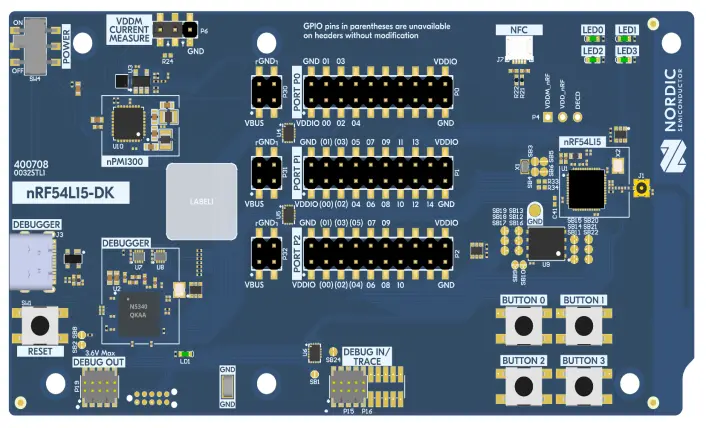

.. _nrf54l15dk_nrf54l15:

nRF54L15 DK
############

Overview
********

.. note::
   You can find more information about the nRF54L15 SoC on the `nRF54L15 website`_.
   For the nRF54L15 technical documentation and other resources (such as
   SoC Datasheet), see the `nRF54L15 documentation`_ page.

The nRF54L15 Development Kit hardware provides support for the Nordic Semiconductor
nRF54L15 Arm Cortex-M33 CPU and the following devices:

* :abbr:`SAADC (Successive Approximation Analog to Digital Converter)`
* CLOCK
* RRAM
* :abbr:`GPIO (General Purpose Input Output)`
* :abbr:`TWIM (I2C-compatible two-wire interface master with EasyDMA)`
* MEMCONF
* :abbr:`MPU (Memory Protection Unit)`
* :abbr:`NVIC (Nested Vectored Interrupt Controller)`
* :abbr:`PWM (Pulse Width Modulation)`
* :abbr:`GRTC (Global real-time counter)`
* Segger RTT (RTT Console)
* :abbr:`SPI (Serial Peripheral Interface)`
* :abbr:`UARTE (Universal asynchronous receiver-transmitter)`
* :abbr:`WDT (Watchdog Timer)`

     nRF54L15 DK (Credit: Nordic Semiconductor)

Hardware
********

nRF54L15 DK has two crystal oscillators:

* High-frequency 32 MHz crystal oscillator (HFXO)
* Low-frequency 32.768 kHz crystal oscillator (LFXO)

The crystal oscillators can be configured to use either
internal or external capacitors.

Supported Features
==================

The ``nrf54l15dk/nrf54l15/cpuapp`` board target configuration supports the following
hardware features:

+-----------+------------+----------------------+
| Interface | Controller | Driver/Component     |
+===========+============+======================+
| CLOCK     | on-chip    | clock_control        |
+-----------+------------+----------------------+
| GPIO      | on-chip    | gpio                 |
+-----------+------------+----------------------+
| GRTC      | on-chip    | counter              |
+-----------+------------+----------------------+
| MEMCONF   | on-chip    | retained_mem         |
+-----------+------------+----------------------+
| MPU       | on-chip    | arch/arm             |
+-----------+------------+----------------------+
| NVIC      | on-chip    | arch/arm             |
+-----------+------------+----------------------+
| PWM       | on-chip    | pwm                  |
+-----------+------------+----------------------+
| RRAM      | on-chip    | flash                |
+-----------+------------+----------------------+
| RTT       | Segger     | console              |
+-----------+------------+----------------------+
| SAADC     | on-chip    | adc                  |
+-----------+------------+----------------------+
| SPI(M/S)  | on-chip    | spi                  |
+-----------+------------+----------------------+
| SPU       | on-chip    | system protection    |
+-----------+------------+----------------------+
| TWIM      | on-chip    | i2c                  |
+-----------+------------+----------------------+
| UARTE     | on-chip    | serial               |
+-----------+------------+----------------------+
| WDT       | on-chip    | watchdog             |
+-----------+------------+----------------------+

Other hardware features have not been enabled yet for this board.

Programming and Debugging
*************************

Applications for the ``nrf54l15dk/nrf54l15/cpuapp`` board target can be
built, flashed, and debugged in the usual way. See
:ref:`build_an_application` and :ref:`application_run` for more details on
building and running.

Applications for the ``nrf54l15dk/nrf54l15/cpuflpr`` board target need
to be built as multicore configuration with code snippet called ``vpr_launcher``
for the application core.

Enter the following command to compile ``hello_world`` for the FLPR core::
 west build -p -b nrf54l15dk/nrf54l15/cpuflpr --sysbuild -- -DSB_VPR_LAUNCHER=y

Flashing
========

As an example, this section shows how to build and flash the :zephyr:code-sample:`hello_world`
application.

.. warning::

   When programming the device, you might get an error similar to the following message::

    ERROR: The operation attempted is unavailable due to readback protection in
    ERROR: your device. Please use --recover to unlock the device.

   This error occurs when readback protection is enabled.
   To disable the readback protection, you must *recover* your device.

   Enter the following command to recover the core::

    west flash --recover

   The ``--recover`` command erases the flash memory and then writes a small binary into
   the recovered flash memory.
   This binary prevents the readback protection from enabling itself again after a pin
   reset or power cycle.

Follow the instructions in the :ref:`nordic_segger` page to install
and configure all the necessary software. Further information can be
found in :ref:`nordic_segger_flashing`.

To build and program the sample to the nRF54L15 DK, complete the following steps:

First, connect the nRF54L15 DK to you computer using the IMCU USB port on the DK.
Next, build the sample by running the following command:

.. zephyr-app-commands::
   :zephyr-app: samples/hello_world
   :board: nrf54l15dk/nrf54l15/cpuapp
   :goals: build flash

Testing the LEDs and buttons in the nRF54L15 DK
************************************************

Test the nRF54L15 DK with a :zephyr:code-sample:`blinky` sample.

.. _nRF54L15 website: https://www.nordicsemi.com/Products/nRF54L15
.. _nRF54L15 documentation: https://docs.nordicsemi.com/bundle/ncs-latest/page/nrf/app_dev/device_guides/nrf54l/index.html

.. _nrf54l15dk_nrf54l05:

nRF54L05 emulation on nRF54L15 DK
#################################

Overview
********

The ``nrf54l15dk/nrf54l05`` board is a modified version of the :ref:`nrf54l15dk_nrf54l15`
that enforces the limitations imposed by the nRF54L05 IC, which is a
cost-reduced variant of the original nRF54L15. Since Nordic does not offer a
development kit for the nRF54L05, you can use this board to develop for this
IC while using the nRF54L15 Development Kit (PCA10156).

See :ref:`nrf54l15dk_nrf54l15` for more information about the development board and
`nRF54L05 website`_ for the official reference on the IC itself.

.. _nRF54L05 website: https://www.nordicsemi.com/Products/nRF54L05

.. _nrf54l15dk_nrf54l10:

nRF54L10 emulation on nRF54L15 DK
#################################

Overview
********

The ``nrf54l15dk/nrf54l10`` board is a modified version of the :ref:`nrf54l15dk_nrf54l15`
that enforces the limitations imposed by the nRF54L10 IC, which is a
cost-reduced variant of the original nRF54L15. Since Nordic does not offer a
development kit for the nRF54L10 you can use this board to develop for this
IC while using the nRF54L15 Development Kit (PCA10156).

See :ref:`nrf54l15dk_nrf54l15` for more information about the development board and
`nRF54L10 website`_ for the official reference on the IC itself.

.. _nRF54L10 website: https://www.nordicsemi.com/Products/nRF54L10
