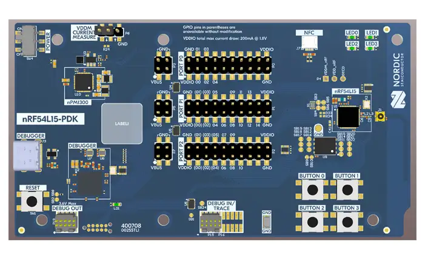

.. _nrf54l15pdk_nrf54l15:

nRF54L15 PDK
############

Overview
********

.. note::

   All software for the nRF54L15 SoC is experimental and hardware availability
   is restricted to the participants in the limited sampling program.

The nRF54L15 Preview Development Kit hardware provides
support for the Nordic Semiconductor nRF54L15 Arm Cortex-M33 CPU and
the following devices:

* :abbr:`SAADC (Successive Approximation Analog to Digital Converter)`
* CLOCK
* RRAM
* :abbr:`GPIO (General Purpose Input Output)`
* :abbr:`TWIM (I2C-compatible two-wire interface master with EasyDMA)`
* MEMCONF
* :abbr:`MPU (Memory Protection Unit)`
* :abbr:`NVIC (Nested Vectored Interrupt Controller)`
* :abbr:`PWM (Pulse Width Modulation)`
* :abbr:`GRTC (Global real-time counter)`
* Segger RTT (RTT Console)
* :abbr:`SPI (Serial Peripheral Interface)`
* :abbr:`UARTE (Universal asynchronous receiver-transmitter)`
* :abbr:`WDT (Watchdog Timer)`

     nRF54L15 PDK (Credit: Nordic Semiconductor)

Hardware
********

nRF54L15 PDK has two crystal oscillators:

* High-frequency 32 MHz crystal oscillator (HFXO)
* Low-frequency 32.768 kHz crystal oscillator (LFXO)

The crystal oscillators can be configured to use either
internal or external capacitors.

Supported Features
==================

The ``nrf54l15pdk/nrf54l15/cpuapp`` board configuration supports the following
hardware features:

+-----------+------------+----------------------+
| Interface | Controller | Driver/Component     |
+===========+============+======================+
| SAADC     | on-chip    | adc                  |
+-----------+------------+----------------------+
| CLOCK     | on-chip    | clock_control        |
+-----------+------------+----------------------+
| RRAM      | on-chip    | flash                |
+-----------+------------+----------------------+
| GPIO      | on-chip    | gpio                 |
+-----------+------------+----------------------+
| TWIM      | on-chip    | i2c                  |
+-----------+------------+----------------------+
| MEMCONF   | on-chip    | retained_mem         |
+-----------+------------+----------------------+
| MPU       | on-chip    | arch/arm             |
+-----------+------------+----------------------+
| NVIC      | on-chip    | arch/arm             |
+-----------+------------+----------------------+
| PWM       | on-chip    | pwm                  |
+-----------+------------+----------------------+
| GRTC      | on-chip    | counter              |
+-----------+------------+----------------------+
| RTT       | Segger     | console              |
+-----------+------------+----------------------+
| SPI(M/S)  | on-chip    | spi                  |
+-----------+------------+----------------------+
| SPU       | on-chip    | system protection    |
+-----------+------------+----------------------+
| UARTE     | on-chip    | serial               |
+-----------+------------+----------------------+
| WDT       | on-chip    | watchdog             |
+-----------+------------+----------------------+

Other hardware features have not been enabled yet for this board.

Programming and Debugging
*************************

Applications for the ``nrf54l15pdk/nrf54l15/cpuapp`` board can be
built, flashed, and debugged in the usual way. See
:ref:`build_an_application` and :ref:`application_run` for more details on
building and running.

Flashing
========

As an example, this section shows how to build and flash the :zephyr:code-sample:`hello_world`
application.

.. warning::

   When programming the device, you might get an error similar to the following message::

    ERROR: The operation attempted is unavailable due to readback protection in
    ERROR: your device. Please use --recover to unlock the device.

   This error occurs when readback protection is enabled.
   To disable the readback protection, you must *recover* your device.

   Enter the following command to recover the core::

    west flash --recover

   The ``--recover`` command erases the flash memory and then writes a small binary into
   the recovered flash memory.
   This binary prevents the readback protection from enabling itself again after a pin
   reset or power cycle.

Follow the instructions in the :ref:`nordic_segger` page to install
and configure all the necessary software. Further information can be
found in :ref:`nordic_segger_flashing`.

To build and program the sample to the nRF54L15 PDK, complete the following steps:

First, connect the nRF54L15 PDK to you computer using the IMCU USB port on the PDK.
Next, build the sample by running the following command:

.. zephyr-app-commands::
   :zephyr-app: samples/hello_world
   :board: nrf54l15pdk/nrf54l15/cpuapp
   :goals: build flash

Testing the LEDs and buttons in the nRF54L15 PDK
************************************************

Test the nRF54L15 PDK with a :zephyr:code-sample:`blinky` sample.
