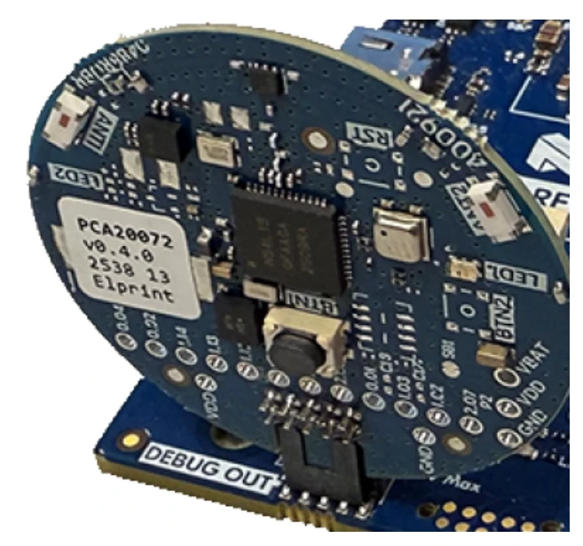

.. zephyr:board:: nrf54l15tag

Overview
********

The nRF54L15 TAG is a hardware development platform used to design and develop applications for the
nrf54L15 SoC.

Hardware
********

The nRF54L15 TAG has a number of exposed pins which can be used for application specific purposes.
The following is the default availability (no optional components mounted by user).

* P0.01 Available
* P0.02 Available
* P0.04 Available
* P1.02 Available
* P1.03 Available
* P1.11 SCL (i2c21)
* P1.12 SDA (i2c21)
* P1.13 Available
* P1.14 Available
* P2.05 Reserved
* P2.06 Available
* P2.07 Available

.. note:: By default the ANT1 antenna is connected to the SoC using GPIO Hogs.

Supported Features
******************

.. zephyr:board-supported-hw::

Programming and Debugging
*************************

.. zephyr:board-supported-runners::

The nRF54L15 TAG is programmed and debugged using the onboard debugger of an nRF54L DK as
depicted below:

     nRF54L15 TAG debugging (Credit: Nordic Semiconductor)

Once the nRF54L15 TAG is inserted into the DK's ``DEBUG OUT`` header, the nRF54L DK's onboard
debugger is rerouted from the DK's nRF54L15 SoC to the TAG's nRF54L15 SoC. Once powered, the TAG's
nRF54L15 SoC is then programmed and debugged just like the nRF54L15 SoC of an nRF54L DK, see
:zephyr:board:`nrf54l15dk`.

.. warning::

   Do not apply 3.3V to ``VDD SWD0`` or the ``VDD`` on the TAG in general if a coin cell battery
   is inserted.

The nRF54L15 TAG is not powered from the ``DEBUG OUT`` header by default. To power the nRF54L15
TAG, either insert a CR2032 coin cell battery into its battery holder, **OR** apply 3.3V to the
``VDD SWD0`` pin on the nRF54L DK to power the TAG externally.

Using an nRF54L15 DK, the DK can be configured to set VDD to 3.3V, and a jumper between any
of the DK's ``VDDIO`` pins and the ``VDD SWD0`` pin can be connected.

Console and logging
*******************

To get console and logging output, enable Segger RTT using the :ref:`snippet-rtt-console` snippet:

.. zephyr-app-commands::
   :zephyr-app: samples/hello_world
   :board: nrf54l15tag/nrf54l15/cpuapp
   :goals: build flash
   :west-args: --snippet rtt-console
   :compact:

or enable the NUS service using the :ref:`snippet-nus-console` snippet:

.. zephyr-app-commands::
   :zephyr-app: samples/hello_world
   :board: nrf54l15tag/nrf54l15/cpuapp
   :goals: build flash
   :west-args: --snippet nus-console
   :compact:
