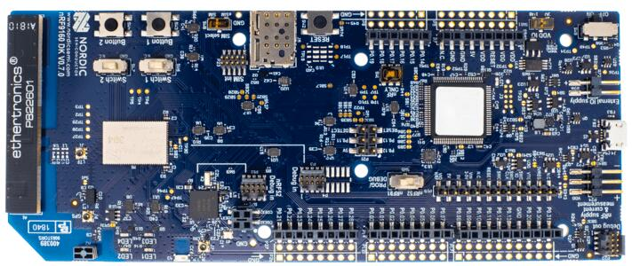

.. _nrf9160dk_nrf9160:

nRF9160 DK
##########

Overview
********

The nRF9160 DK (PCA10090) is a single-board development kit for evaluation and
development on the nRF9160 SiP for LTE-M and NB-IoT. The nrf9160dk/nrf9160
board configuration provides support for the Nordic Semiconductor nRF9160 ARM
Cortex-M33F CPU with ARMv8-M Security Extension and the following devices:

* :abbr:`ADC (Analog to Digital Converter)`
* CLOCK
* FLASH
* :abbr:`GPIO (General Purpose Input Output)`
* :abbr:`I2C (Inter-Integrated Circuit)`
* :abbr:`MPU (Memory Protection Unit)`
* :abbr:`NVIC (Nested Vectored Interrupt Controller)`
* :abbr:`PWM (Pulse Width Modulation)`
* :abbr:`RTC (nRF RTC System Clock)`
* Segger RTT (RTT Console)
* :abbr:`SPI (Serial Peripheral Interface)`
* :abbr:`UARTE (Universal asynchronous receiver-transmitter with EasyDMA)`
* :abbr:`WDT (Watchdog Timer)`
* :abbr:`IDAU (Implementation Defined Attribution Unit)`

     nRF9160 DK (Credit: Nordic Semiconductor)

More information about the board can be found at the
`nRF9160 DK website`_. The `Nordic Semiconductor Infocenter`_
contains the processor's information and the datasheet.

Hardware
********

nRF9160 DK has two external oscillators. The frequency of
the slow clock is 32.768 kHz. The frequency of the main clock
is 32 MHz.

Supported Features
==================

The nrf9160dk/nrf9160 board configuration supports the following
hardware features:

+-----------+------------+----------------------+
| Interface | Controller | Driver/Component     |
+===========+============+======================+
| ADC       | on-chip    | adc                  |
+-----------+------------+----------------------+
| CLOCK     | on-chip    | clock_control        |
+-----------+------------+----------------------+
| FLASH     | on-chip    | flash                |
+-----------+------------+----------------------+
| GPIO      | on-chip    | gpio                 |
+-----------+------------+----------------------+
| I2C(M)    | on-chip    | i2c                  |
+-----------+------------+----------------------+
| MPU       | on-chip    | arch/arm             |
+-----------+------------+----------------------+
| NVIC      | on-chip    | arch/arm             |
+-----------+------------+----------------------+
| PWM       | on-chip    | pwm                  |
+-----------+------------+----------------------+
| RTC       | on-chip    | system clock         |
+-----------+------------+----------------------+
| RTT       | Segger     | console              |
+-----------+------------+----------------------+
| SPI(M/S)  | on-chip    | spi                  |
+-----------+------------+----------------------+
| SPU       | on-chip    | system protection    |
+-----------+------------+----------------------+
| UARTE     | on-chip    | serial               |
+-----------+------------+----------------------+
| WDT       | on-chip    | watchdog             |
+-----------+------------+----------------------+

.. _nrf9160dk_additional_hardware:

Additional hardware in v0.14.0+
-------------------------------

Starting from v0.14.0, additional hardware is available on the DK:

* External flash memory (MX25R6435F, 64 Mb)
* I/O expander (PCAL6408A) that can be used to interface LEDs, slide switches,
  and buttons

To use this additional hardware, specify the revision of the board that
should be used when building your application (for more information, see
:ref:`application_board_version`). For example, to build for nRF9160 DK v1.0.0:

.. zephyr-app-commands::
   :tool: all
   :cd-into:
   :board: nrf9160dk/nrf9160@1.0.0
   :goals: build
   :compact:

Remember to also enable routing for this additional hardware in the firmware for
:ref:`nrf9160dk_nrf52840` (see :ref:`nrf9160dk_board_controller_firmware`).

Other hardware features have not been enabled yet for this board.
See `nRF9160 DK website`_ and `Nordic Semiconductor Infocenter`_
for a complete list of nRF9160 DK board hardware features.

Connections and IOs
===================

LED
---

* LED1 (green) = P0.2
* LED2 (green) = P0.3
* LED3 (green) = P0.4
* LED4 (green) = P0.5

Push buttons and Switches
-------------------------

* BUTTON1 = P0.6
* BUTTON2 = P0.7
* SWITCH1 = P0.8
* SWITCH2 = P0.9
* BOOT = SW5 = boot/reset

Security components
===================

- Implementation Defined Attribution Unit (`IDAU`_).  The IDAU is implemented
  with the System Protection Unit and is used to define secure and non-secure
  memory maps.  By default, all of the memory space  (Flash, SRAM, and
  peripheral address space) is defined to be secure accessible only.
- Secure boot.

Programming and Debugging
*************************

nrf9160dk/nrf9160 supports the Armv8m Security Extension, and by default boots
in the Secure state.

Building Secure/Non-Secure Zephyr applications with Arm |reg| TrustZone |reg|
=============================================================================

Applications on the nRF9160 may contain a Secure and a Non-Secure firmware
image. The Secure image can be built using either Zephyr or
`Trusted Firmware M`_ (TF-M). Non-Secure firmware images are always built
using Zephyr. The two alternatives are described below.

.. note::

   By default the Secure image for nRF9160 is built using TF-M.

Building the Secure firmware using Zephyr
-----------------------------------------

The process requires the following steps:

1. Build the Secure Zephyr application using ``-DBOARD=nrf9160dk/nrf9160`` and
   ``CONFIG_TRUSTED_EXECUTION_SECURE=y`` in the application project configuration file.
2. Build the Non-Secure Zephyr application using ``-DBOARD=nrf9160dk/nrf9160/ns``.
3. Merge the two binaries together.

Building the Secure firmware with TF-M
--------------------------------------

The process to build the Secure firmware image using TF-M and the Non-Secure
firmware image using Zephyr requires the following action:

1. Build the Non-Secure Zephyr application
   using ``-DBOARD=nrf9160dk_nrf9160_ns``.
   To invoke the building of TF-M the Zephyr build system requires the
   Kconfig option ``BUILD_WITH_TFM`` to be enabled, which is done by
   default when building Zephyr as a Non-Secure application.
   The Zephyr build system will perform the following steps automatically:

      * Build the Non-Secure firmware image as a regular Zephyr application
      * Build a TF-M (secure) firmware image
      * Merge the output binaries together
      * Optionally build a bootloader image (MCUboot)

.. note::

   Depending on the TF-M configuration, an application DTS overlay may be
   required, to adjust the Non-Secure image Flash and SRAM starting address
   and sizes.

When building a Secure/Non-Secure application, the Secure application will
have to set the IDAU (SPU) configuration to allow Non-Secure access to all
CPU resources utilized by the Non-Secure application firmware. SPU
configuration shall take place before jumping to the Non-Secure application.

Building a Secure only application
==================================

Build the Zephyr app in the usual way (see :ref:`build_an_application`
and :ref:`application_run`), using ``-DBOARD=nrf9160dk/nrf9160``.

Flashing
========

Follow the instructions in the :ref:`nordic_segger` page to install
and configure all the necessary software. Further information can be
found in :ref:`nordic_segger_flashing`. Then build and flash
applications as usual (see :ref:`build_an_application` and
:ref:`application_run` for more details).

Here is an example for the :ref:`hello_world` application.

First, run your favorite terminal program to listen for output.

.. code-block:: console

   $ minicom -D <tty_device> -b 115200

Replace :code:`<tty_device>` with the port where the nRF9160 DK
can be found. For example, under Linux, :code:`/dev/ttyACM0`.

Then build and flash the application in the usual way.

.. zephyr-app-commands::
   :zephyr-app: samples/hello_world
   :board: nrf9160dk/nrf9160
   :goals: build flash

Debugging
=========

Refer to the :ref:`nordic_segger` page to learn about debugging Nordic boards with a
Segger IC.

Testing the LEDs and buttons in the nRF9160 DK
**********************************************

There are 2 samples that allow you to test that the buttons (switches) and LEDs on
the board are working properly with Zephyr:

* :zephyr:code-sample:`blinky`
* :zephyr:code-sample:`button`

You can build and flash the examples to make sure Zephyr is running correctly on
your board. The button and LED definitions can be found in
:zephyr_file:`boards/nordic_nrf/nrf9160dk/nrf9160dk_nrf9160_common.dtsi`.

.. _nrf9160dk_nrf52840:

nRF9160 DK - nRF52840
#####################

Overview
********

The nRF52840 SoC on the nRF9160 DK (PCA10090) hardware provides support for the
Nordic Semiconductor nRF52840 ARM Cortex-M4F CPU and the following devices:

* CLOCK
* FLASH
* :abbr:`GPIO (General Purpose Input Output)`
* :abbr:`MPU (Memory Protection Unit)`
* :abbr:`NVIC (Nested Vectored Interrupt Controller)`
* :abbr:`PWM (Pulse Width Modulation)`
* RADIO (Bluetooth Low Energy and 802.15.4)
* :abbr:`RTC (nRF RTC System Clock)`
* Segger RTT (RTT Console)
* :abbr:`UART (Universal asynchronous receiver-transmitter)`
* :abbr:`WDT (Watchdog Timer)`

The nRF52840 SoC does not have any connection to the any of the LEDs,
buttons, switches, and Arduino pin headers on the nRF9160 DK board. It is,
however, possible to route some of the pins of the nRF52840 SoC to the nRF9160
SiP.

More information about the board can be found at
the `Nordic Low power cellular IoT`_ website.
The `Nordic Semiconductor Infocenter`_
contains the processor's information and the datasheet.

Hardware
********

The nRF9160 DK has two external oscillators. The frequency of
the slow clock is 32.768 kHz. The frequency of the main clock
is 32 MHz.

Supported Features
==================

The nrf9160dk/nrf52840 board configuration supports the following
hardware features:

+-----------+------------+----------------------+
| Interface | Controller | Driver/Component     |
+===========+============+======================+
| CLOCK     | on-chip    | clock_control        |
+-----------+------------+----------------------+
| FLASH     | on-chip    | flash                |
+-----------+------------+----------------------+
| GPIO      | on-chip    | gpio                 |
+-----------+------------+----------------------+
| MPU       | on-chip    | arch/arm             |
+-----------+------------+----------------------+
| NVIC      | on-chip    | arch/arm             |
+-----------+------------+----------------------+
| PWM       | on-chip    | pwm                  |
+-----------+------------+----------------------+
| RADIO     | on-chip    | Bluetooth,           |
|           |            | ieee802154           |
+-----------+------------+----------------------+
| RTC       | on-chip    | system clock         |
+-----------+------------+----------------------+
| RTT       | Segger     | console              |
+-----------+------------+----------------------+
| UART      | on-chip    | serial               |
+-----------+------------+----------------------+
| WDT       | on-chip    | watchdog             |
+-----------+------------+----------------------+

Programming and Debugging
*************************

Applications for the ``nrf9160dk/nrf52840`` board configuration can be
built and flashed in the usual way (see :ref:`build_an_application`
and :ref:`application_run` for more details).

Make sure that the PROG/DEBUG switch on the DK is set to nRF52.

Flashing
========

Follow the instructions in the :ref:`nordic_segger` page to install
and configure all the necessary software. Further information can be
found in :ref:`nordic_segger_flashing`. Then build and flash
applications as usual (see :ref:`build_an_application` and
:ref:`application_run` for more details).

Remember to set the PROG/DEBUG switch on the DK to nRF52.

See the following example for the :ref:`hello_world` application.

First, run your favorite terminal program to listen for output.

.. code-block:: console

   $ minicom -D <tty_device> -b 115200

Replace :code:`<tty_device>` with the port where the nRF52840 SoC is connected
to. Usually, under Linux it will be ``/dev/ttyACM1``. The ``/dev/ttyACM0``
port is connected to the nRF9160 SiP on the board.

Then build and flash the application in the usual way.

.. zephyr-app-commands::
   :zephyr-app: samples/hello_world
   :board: nrf9160dk/nrf52840
   :goals: build flash

Debugging
=========

Refer to the :ref:`nordic_segger` page to learn about debugging Nordic boards
with a Segger IC.

Remember to set the PROG/DEBUG switch on the DK to nRF52.

.. _nrf9160dk_board_controller_firmware:

Board controller firmware
*************************

The board controller firmware is a small snippet of code that takes care of
routing specific pins of the nRF9160 SiP to different components on the DK,
such as LEDs and buttons, UART interfaces (VCOMx) of the interface MCU, and
specific nRF52840 SoC pins.

.. note::
   In nRF9160 DK revisions earlier than v0.14.0, nRF9160 signals routed to
   other components on the DK are not simultaneously available on the DK
   connectors.

When compiling a project for nrf9160dk/nrf52840, the board controller firmware
will be compiled and run automatically after the Kernel has been initialized.

By default, the board controller firmware will route the following:

+--------------------------------+----------------------------------+
| nRF9160 pins                   | Routed to                        |
+================================+==================================+
| P0.26, P0.27, P0.28, and P0.29 | VCOM0                            |
+--------------------------------+----------------------------------+
| P0.01, P0.00, P0.15, and P0.14 | VCOM2                            |
+--------------------------------+----------------------------------+
| P0.02                          | LED1                             |
+--------------------------------+----------------------------------+
| P0.03                          | LED2                             |
+--------------------------------+----------------------------------+
| P0.04                          | LED3                             |
+--------------------------------+----------------------------------+
| P0.05                          | LED4                             |
+--------------------------------+----------------------------------+
| P0.08                          | Switch 1                         |
+--------------------------------+----------------------------------+
| P0.09                          | Switch 2                         |
+--------------------------------+----------------------------------+
| P0.06                          | Button 1                         |
+--------------------------------+----------------------------------+
| P0.07                          | Button 2                         |
+--------------------------------+----------------------------------+
| P0.17, P0.18, and P0.19        | Arduino pin headers              |
+--------------------------------+----------------------------------+
| P0.21, P0.22, and P0.23        | Trace interface                  |
+--------------------------------+----------------------------------+
| COEX0, COEX1, and COEX2        | COEX interface                   |
+--------------------------------+----------------------------------+

For a complete list of all the routing options available,
see the `nRF9160 DK board control section in the nRF9160 DK User Guide`_.

If you want to route some of the above pins differently or enable any of the
other available routing options, enable or disable the devicetree node that
represents the analog switch that provides the given routing.

The following devicetree nodes are defined for the analog switches present
on the nRF9160 DK:

+------------------------------------+------------------------------+
| Devicetree node label              | Analog switch name           |
+====================================+==============================+
| ``vcom0_pins_routing``             | nRF91_UART1 (nRF91_APP1)     |
+------------------------------------+------------------------------+
| ``vcom2_pins_routing``             | nRF91_UART2 (nRF91_APP2)     |
+------------------------------------+------------------------------+
| ``led1_pin_routing``               | nRF91_LED1                   |
+------------------------------------+------------------------------+
| ``led2_pin_routing``               | nRF91_LED2                   |
+------------------------------------+------------------------------+
| ``led3_pin_routing``               | nRF91_LED3                   |
+------------------------------------+------------------------------+
| ``led4_pin_routing``               | nRF91_LED4                   |
+------------------------------------+------------------------------+
| ``switch1_pin_routing``            | nRF91_SWITCH1                |
+------------------------------------+------------------------------+
| ``switch2_pin_routing``            | nRF91_SWITCH2                |
+------------------------------------+------------------------------+
| ``button1_pin_routing``            | nRF91_BUTTON1                |
+------------------------------------+------------------------------+
| ``button2_pin_routing``            | nRF91_BUTTON2                |
+------------------------------------+------------------------------+
| ``nrf_interface_pins_0_2_routing`` | nRF_IF0-2_CTRL (nRF91_GPIO)  |
+------------------------------------+------------------------------+
| ``nrf_interface_pins_3_5_routing`` | nRF_IF3-5_CTRL (nRF91_TRACE) |
+------------------------------------+------------------------------+
| ``nrf_interface_pins_6_8_routing`` | nRF_IF6-8_CTRL (nRF91_COEX)  |
+------------------------------------+------------------------------+

When building for the DK revision 0.14.0 or later, you can use the following
additional nodes (see :ref:`application_board_version` for information how to
build for specific revisions of the board):

+------------------------------------+------------------------------+
| Devicetree node label              | Analog switch name           |
+====================================+==============================+
| ``nrf_interface_pin_9_routing``    | nRF_IF9_CTRL                 |
+------------------------------------+------------------------------+
| ``io_expander_pins_routing``       | IO_EXP_EN                    |
+------------------------------------+------------------------------+
| ``external_flash_pins_routing``    | EXT_MEM_CTRL                 |
+------------------------------------+------------------------------+

For example, if you want to enable the optional routing for the nRF9160 pins
P0.17, P0.18, and P0.19 so that they are routed to nRF52840 pins P0.17, P0.20,
and P0.15, respectively, add the following in the devicetree overlay in your
application:

.. code-block:: devicetree

   &nrf_interface_pins_0_2_routing {
           status = "okay";
   };

And if you want to, for example, disable routing for the VCOM2 pins, add the
following:

.. code-block:: devicetree

   &vcom2_pins_routing {
           status = "disabled";
   };

A few helper .dtsi files are provided in the directories
:zephyr_file:`boards/nordic_nrf/nrf9160dk/dts/nrf52840` and
:zephyr_file:`boards/nordic_nrf/nrf9160dk/dts/nrf9160`. They can serve as examples of
how to configure and use the above routings. You can also include them from
respective devicetree overlay files in your applications to conveniently
configure the signal routing between nRF9160 and nRF52840 on the nRF9160 DK.
For example, to use ``uart1`` on both these chips for communication between
them, add the following line in the overlays for applications on both sides, nRF52840:

.. code-block:: devicetree

   #include <nrf52840/nrf9160dk_uart1_on_if0_3.dtsi>

nRF9160:

.. code-block:: devicetree

   #include <nrf9160/nrf9160dk_uart1_on_if0_3.dtsi>

References
**********

.. target-notes::

.. _IDAU:
   https://developer.arm.com/docs/100690/latest/attribution-units-sau-and-idau
.. _nRF9160 DK website: https://www.nordicsemi.com/Software-and-Tools/Development-Kits/nRF9160-DK
.. _Trusted Firmware M: https://www.trustedfirmware.org/projects/tf-m/
.. _Nordic Low power cellular IoT: https://www.nordicsemi.com/Products/Low-power-cellular-IoT
.. _Nordic Semiconductor Infocenter: https://infocenter.nordicsemi.com
.. _J-Link Software and documentation pack: https://www.segger.com/jlink-software.html
.. _nRF9160 DK board control section in the nRF9160 DK User Guide: https://infocenter.nordicsemi.com/topic/ug_nrf91_dk/UG/nrf91_DK/board_controller.html
