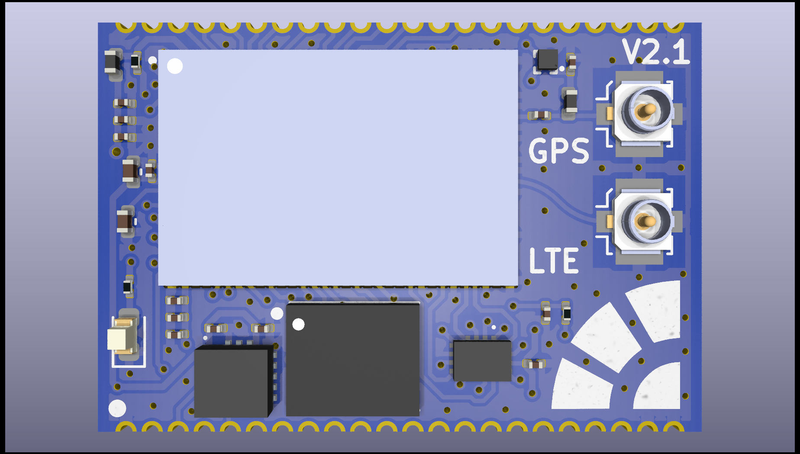
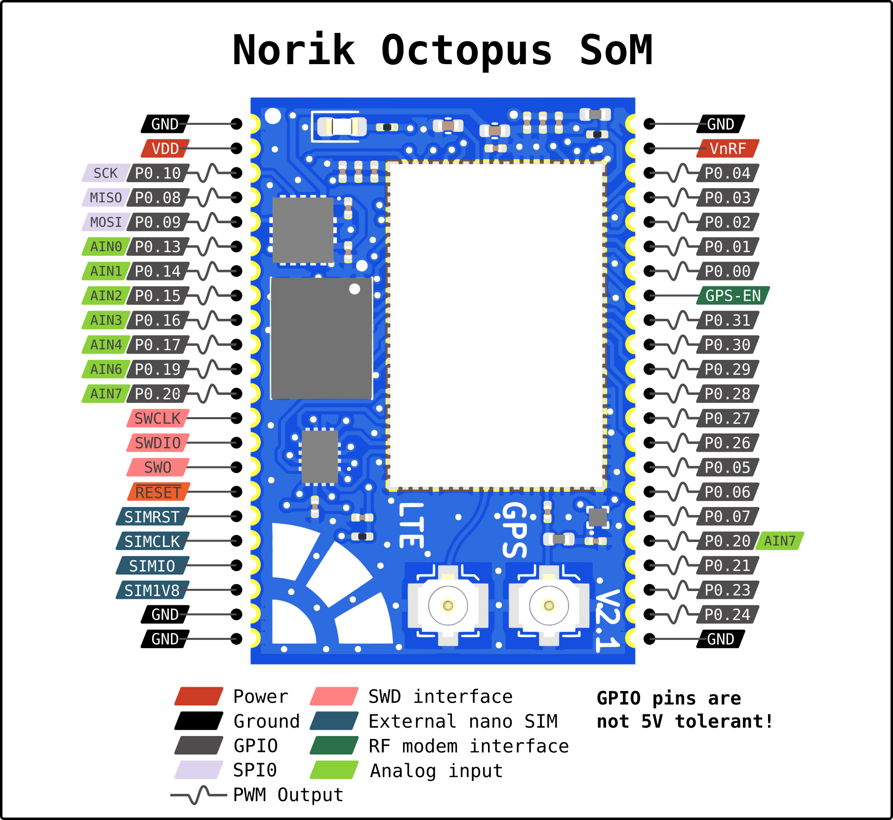

.. _norik_octopus_som:

Norik Octopus SOM
#################

Overview
********

Octopus SoM is a System on Module (SoM) built around the nRF9160 SiP 
offering NB-IoT and LTE-M connectivity, GPS and accelerometer. 
It supports on board eSIM and external nano SIM connector. It's purpose
is to provide flexible hardware platform for IoT applications.

nRF9160 SiP contains ARM Cortex-M33 application processor and the 
following devices:

* :abbr:`ADC (Analog to Digital Converter)`
* CLOCK
* FLASH
* :abbr:`GPIO (General Purpose Input Output)`
* :abbr:`I2C (Inter-Integrated Circuit)`
* :abbr:`MPU (Memory Protection Unit)`
* :abbr:`NVIC (Nested Vectored Interrupt Controller)`
* :abbr:`PWM (Pulse Width Modulation)`
* :abbr:`RTC (nRF RTC System Clock)`
* Segger RTT (RTT Console)
* :abbr:`SPI (Serial Peripheral Interface)`
* :abbr:`UARTE (Universal asynchronous receiver-transmitter with EasyDMA)`
* :abbr:`WDT (Watchdog Timer)`
* :abbr:`IDAU (Implementation Defined Attribution Unit)`

      
      Norik Octopus SoM

Hardware
********

The Norik Octopus SoM supports the following hardware features:

+-----------+------------+----------------------+
| Interface | Controller | Driver/Component     |
+===========+============+======================+
| ADC       | on-chip    | adc                  |
+-----------+------------+----------------------+
| CLOCK     | on-chip    | clock_control        |
+-----------+------------+----------------------+
| FLASH     | on-chip    | flash                |
+-----------+------------+----------------------+
| GPIO      | on-chip    | gpio                 |
+-----------+------------+----------------------+
| I2C(M)    | on-chip    | i2c                  |
+-----------+------------+----------------------+
| MPU       | on-chip    | arch/arm             |
+-----------+------------+----------------------+
| NVIC      | on-chip    | arch/arm             |
+-----------+------------+----------------------+
| PWM       | on-chip    | pwm                  |
+-----------+------------+----------------------+
| RTC       | on-chip    | system clock         |
+-----------+------------+----------------------+
| RTT       | Segger     | console              |
+-----------+------------+----------------------+
| SPI(M/S)  | on-chip    | spi                  |
+-----------+------------+----------------------+
| SPU       | on-chip    | system protection    |
+-----------+------------+----------------------+
| UARTE     | on-chip    | serial               |
+-----------+------------+----------------------+
| WDT       | on-chip    | watchdog             |
+-----------+------------+----------------------+
| ACCEL     | Analog     | adxl362              |
+-----------+------------+----------------------+

Connections and IOs
===================

Pinout Diagram
--------------

     
     Norik Octopus SoM pinout

Accelerometer
-------------
* MISO = P0.05
* MOSI = P0.09
* SCK = P0.10
* CS = P0.05
* INT1 = P0.12

LED
---
* LED1 (green) = P0.07

SIM select switch
-----------------
* Select = P0.25

Programming and Debugging
*************************

Norik Octopus SoM can be programmed and debugged using the exposed SWD pins.

Building an application
=======================

In most case you'll need to use ``ns`` target for building examples. 
Some examples don't require non secure mode and can be built without ``ns`` target.

Flashing
========
Refer to the instruction in the :ref:`nordic_segger` page to install and
configure all the necessary software.

Here is an example for the Hello World application.

First, run your favorite terminal program to listen for output.

.. code-block:: console

   $ minicom /dev/<tty_device> 115200

Replace <tty_device> with the port where the Octopus SoM can be found. For example, under Linux, /dev/ttyACM0.

Then build and flash the application in the usual way.

.. zephyr-app-commands::
   :zephyr-app: samples/hello_world
   :board: norik_octopus_som
   :goals: build flash

To build and flash the application in non-secure mode, use the following command:

.. zephyr-app-commands::
   :zephyr-app: samples/hello_world
   :board: norik_octopus_som/nrf9160/ns
   :goals: build flash

Debugging
=========
Refer to the instruction in the :ref:`nordic_segger` page for information on
debugging.

Testing the on-board LED
========================
Use the :zephyr:code-sample:`blinky` sample to test the on-board LED. Build and flash the example to make sure Zephyr is running correctly on your board.

.. zephyr-app-commands::
   :zephyr-app: samples/basic/blinky
   :board: norik_octopus_som
   :goals: build flash

References
**********
