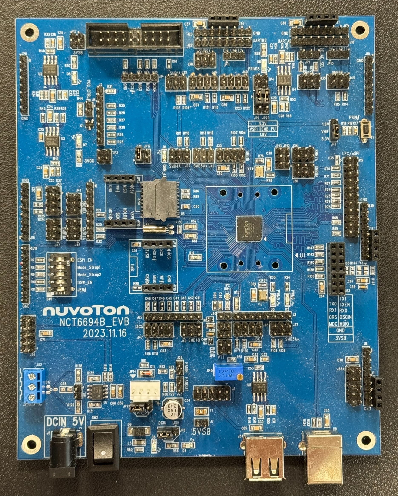

.. _nct6694b_evb:

Nuvoton NCT6694B_EVB
####################

Overview
********

The NCT6694B_EVB kit is a development platform to evaluate the
Nuvoton NCT669x series microcontrollers. This board needs to be mated with
part number NCT6694B.

Hardware
********

- ARM Cortex-M4F Processor
- 768 KB RAM and 72 KB boot ROM
- ADC & GPIO headers
- UART0 and UART1
- FAN PWM interface
- Jtag interface
- SPI Flash interface
- I2C interface
- USB device interface

Supported Features
==================

The following features are supported:

+-----------+------------+-------------------------------------+
| Interface | Controller | Driver/Component                    |
+===========+============+=====================================+
| NVIC      | on-chip    | nested vector interrupt controller  |
+-----------+------------+-------------------------------------+
| ADC       | on-chip    | adc controller                      |
+-----------+------------+-------------------------------------+
| CLOCK     | on-chip    | reset and clock control             |
+-----------+------------+-------------------------------------+
| GPIO      | on-chip    | gpio                                |
+-----------+------------+-------------------------------------+
| I2C       | on-chip    | i2c port/controller                 |
+-----------+------------+-------------------------------------+
| I3C       | on-chip    | i3c port/controller                 |
+-----------+------------+-------------------------------------+
| PINMUX    | on-chip    | pinmux                              |
+-----------+------------+-------------------------------------+
| PWM       | on-chip    | pulse width modulator               |
+-----------+------------+-------------------------------------+
| TACH      | on-chip    | tachometer sensor                   |
+-----------+------------+-------------------------------------+
| UART      | on-chip    | serial port-polling;                |
|           |            | serial port-interrupt               |
+-----------+------------+-------------------------------------+
| WDT       | on-chip    | watchdog                            |
+-----------+------------+-------------------------------------+
| SPI       | on-chip    | spi controller                      |
+-----------+------------+-------------------------------------+
| USBD      | on-chip    | usb device controller               |
+-----------+------------+-------------------------------------+

The default configuration can be found in the defconfig file:
:zephyr_file:`boards/nuvoton/nct6694b_evb/nct6694b_evb_defconfig`

Connections and IOs
===================

Nuvoton to provide the schematic for this board.

System Clock
============

The NCT6694B MCU is configured to use the 96Mhz.

Serial Port
===========

UART0 is configured for serial logs.

Programming and Debugging
*************************

This board comes with a Cortex ETM port which facilitates tracing and debugging
using a single physical connection. In addition, it comes with sockets for
JTAG-only sessions.

Flashing
========

If the correct headers are installed, this board supports J-TAG.

To flash with J-TAG, install the drivers for your programmer, for example:
SEGGER J-link's drivers are at https://www.segger.com/downloads/jlink/

Build and flash the shell module sample.::

  west build -t clean && \
    west build -c -p auto -b nct6694b_evb samples/hello_world && \
    west flash

Debugging
=========

Use JTAG/SWD with a J-Link

References
**********
