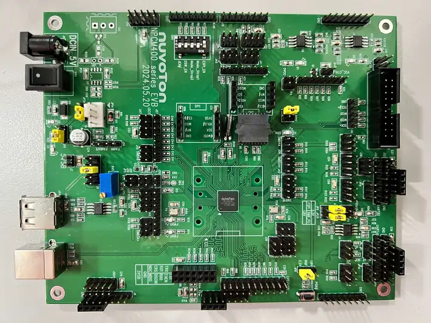

.. _npcm400_evb:

Nuvoton NPCM400_EVB
####################

Overview
********

The NPCM400_EVB kit is a development platform to evaluate the
Nuvoton NPCM4 series microcontrollers. This board needs to be mated with
part number NPCM400 Satellite Management Controller (SMC).

Hardware
********

- ARM Cortex-M4F Processor
- Core clock up to 100 MHz
- 1MB Integrated Flash
- 32KB cache for XIP and Data
- 768 KB RAM and 64 KB boot ROM
- ADC & GPIO headers
- UART0 and UART1
- I2C/I3C
- RMII
- USB2.0 Device
- USB1.1 Host
- Secure Boot is supported

Supported Features
==================

The following features are supported:

+-----------+------------+-------------------------------------+
| Interface | Controller | Driver/Component                    |
+===========+============+=====================================+
| NVIC      | on-chip    | nested vector interrupt controller  |
+-----------+------------+-------------------------------------+
| ADC       | on-chip    | adc controller                      |
+-----------+------------+-------------------------------------+
| CLOCK     | on-chip    | reset and clock control             |
+-----------+------------+-------------------------------------+
| GPIO      | on-chip    | gpio                                |
+-----------+------------+-------------------------------------+
| I2C       | on-chip    | i2c port/controller                 |
+-----------+------------+-------------------------------------+
| I3C       | on-chip    | i3c port/controller                 |
+-----------+------------+-------------------------------------+
| PINMUX    | on-chip    | pinmux                              |
+-----------+------------+-------------------------------------+
| UART      | on-chip    | serial port-polling;                |
|           |            | serial port-interrupt               |
+-----------+------------+-------------------------------------+
| WDT       | on-chip    | watchdog                            |
+-----------+------------+-------------------------------------+

The default configuration can be found in the defconfig file:
:zephyr_file:`boards/nuvoton/npcm400_evb/npcm400_evb_defconfig`

Connections and IOs
===================

Nuvoton to provide the schematic for this board.

Serial Port
===========

UART0 is configured for serial logs. The default serial setup is 115200 8N1.

Programming and Debugging
*************************

This board comes with a Cortex ETM port which facilitates tracing and debugging
using a single physical connection. In addition, it comes with sockets for
JTAG-only sessions.

Flashing
========

If the correct headers are installed, this board supports J-TAG.

To flash with J-TAG, install the drivers for your programmer, for example:
SEGGER J-link's drivers are at https://www.segger.com/downloads/jlink/

Here is an example for the :ref:`hello_world` application.

.. zephyr-app-commands::
    :zephyr-app: samples/hello_world
    :board: npcm400_evb
    :goals: flash

Open a serial terminal, and you should see the following message in the terminal:

.. code-block:: console

    Hello World! npcm400_evb/npcm400

Debugging
=========

Use JTAG/SWD with a J-Link

References
**********
