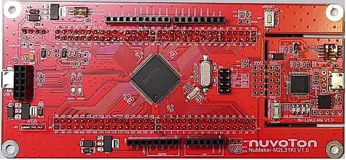

.. _nuvoton_m2l31ki:

NUVOTON NUMAKER M2L31KI
########################

Overview
********

The NuMaker M2L31KI is an Internet of Things (IoT) application focused platform
specially developed by Nuvoton. The NuMaker-M2L31KI is based on the NuMicro® M2L31
series MCU with ARM® -Cortex®-M23 core.

Features:
=========
- 32-bit Arm Cortex®-M23 M2L31KIDAE MCU
- Core clock up to 72 MHz
- 512 KB embedded Dual Bank Flash and 168 KB SRAM
- USB 2.0 Full-Speed OTG / Device
- USB 1.1 Host
- Arduino UNO compatible interface
- One push-button is for reset
- Two LEDs: one is for power indication and the other is for user-defined
- On-board NU-Link2 ICE debugger/programmer with SWD connector

More information about the board can be found at the `NuMaker M2L31KI User Manual`_.

Supported Features
==================

* The on-board 12-MHz crystal allows the device to run at its maximum operating speed of 72MHz.

The development board configuration supports the following hardware features:

+-----------+------------+-----------------------+
| Interface | Controller | Driver/Component      |
+===========+============+=======================+
| NVIC      | on-chip    | nested vectored       |
|           |            | interrupt controller  |
+-----------+------------+-----------------------+
| SYSTICK   | on-chip    | system clock          |
+-----------+------------+-----------------------+
| UART      | on-chip    | serial port           |
+-----------+------------+-----------------------+
| GPIO      | on-chip    | gpio                  |
+-----------+------------+-----------------------+

Other hardware features are not yet supported on Zephyr porting.

More details about the supported peripherals are available in `M2L31 TRM`_
Other hardware features are not currently supported by the Zephyr kernel.

Building and Flashing
*********************
Flashing
========

Here is an example for the :zephyr:code-sample:`hello_world` application.

On board debugger Nu-link2 can emulate UART0 as a virtual COM port over usb,
To enable this, set ISW1 DIP switch 1-3 (TXD RXD VOM) to ON.
Connect the NuMaker-M2L31KI to your host computer using the USB port, then
run a serial host program to connect with your board. For example:

.. code-block:: console

   $ minicom -D /dev/ttyACM0

.. zephyr-app-commands::
   :zephyr-app: samples/hello_world
   :board: numaker_m2l31ki
   :goals: flash

Debugging
=========

Here is an example for the :zephyr:code-sample:`hello_world` application.

.. zephyr-app-commands::
   :zephyr-app: samples/hello_world
   :board: numaker_m2l31ki
   :goals: debug

Step through the application in your debugger.

References
**********

.. _NuMaker M2L31KI User Manual:
   https://www.nuvoton.com/products/microcontrollers/arm-cortex-m23-mcus/m2l31-series/
.. _M2L31 TRM:
   https://www.nuvoton.com/products/microcontrollers/arm-cortex-m23-mcus/m2l31-series/
