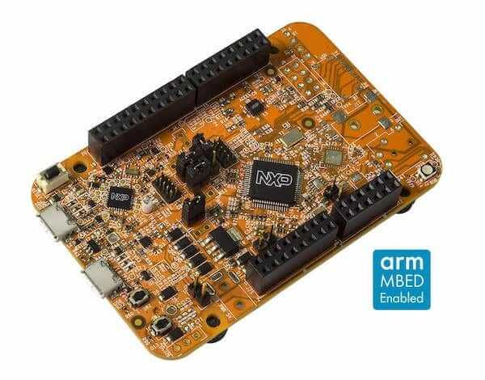

.. _frdm_k22f:

NXP FRDM-K22F
##############

Overview
********

The Freedom-K22F is an ultra-low-cost development platform for Kinetis K22
MCUs.

- Form-factor compatible with the Arduino R3 pin layout
- Peripherals enable rapid prototyping, including a 6-axis digital
  accelerometer and magnetometer to create full eCompass capabilities, a
  tri-colored LED and 2 user push-buttons for direct interaction, a optional
  microSD card slot, and headers for use with Bluetooth* and 2.4 GHz radio
  add-on modules
- OpenSDAv2, the NXP open source hardware embedded serial and debug adapter
  running an open source bootloader, offers options for serial communication,
  flash programming, and run-control debugging

Hardware
********

- MK22FN512VLH12 (120 MHz, 512 KB flash memory, 128 KB RAM, low-power,
  crystal-less USB, and 64 pin Low profile Quad Flat Package (LQFP))
- Dual role USB interface with micro-B USB connector
- RGB LED
- FXOS8700CQ accelerometer and magnetometer
- Two user push buttons
- Flexible power supply option - OpenSDAv2 USB, Kinetis K22 USB, and external source
- Easy access to MCU input/output through Arduino* R3 compatible I/O connectors
- Programmable OpenSDAv2 debug circuit supporting the CMSIS-DAP Interface
  software that provides:

  - Mass storage device (MSD) flash programming interface
  - CMSIS-DAP debug interface over a driver-less USB HID connection providing
    run-control debugging and compatibility with IDE tools
  - Virtual serial port interface
  - Open source CMSIS-DAP software project

- Optional SDHC

For more information about the K22F SoC and FRDM-K22F board:

- `K22F Website`_
- `K22F Datasheet`_
- `K22F Reference Manual`_
- `FRDM-K22F Website`_
- `FRDM-K22F User Guide`_
- `FRDM-K22F Schematics`_

Supported Features
==================

The frdm_k22f board configuration supports the hardware features listed
below.  For additional features not yet supported, please also refer to the
:ref:`frdm_k64f`, which is the superset board in NXP's Kinetis K series.
NXP prioritizes enabling the superset board with NXP's Full Platform Support for
Zephyr.  Therefore, the frdm_k64f board may have additional features
already supported, which can also be re-used on this frdm_k22f board:

+-----------+------------+-------------------------------------+
| Interface | Controller | Driver/Component                    |
+===========+============+=====================================+
| NVIC      | on-chip    | nested vector interrupt controller  |
+-----------+------------+-------------------------------------+
| SYSTICK   | on-chip    | systick                             |
+-----------+------------+-------------------------------------+
| PINMUX    | on-chip    | pinmux                              |
+-----------+------------+-------------------------------------+
| GPIO      | on-chip    | gpio                                |
+-----------+------------+-------------------------------------+
| I2C       | on-chip    | i2c                                 |
+-----------+------------+-------------------------------------+
| SPI       | on-chip    | spi                                 |
+-----------+------------+-------------------------------------+
| WATCHDOG  | on-chip    | watchdog                            |
+-----------+------------+-------------------------------------+
| ADC       | on-chip    | adc                                 |
+-----------+------------+-------------------------------------+
| PWM       | on-chip    | pwm                                 |
+-----------+------------+-------------------------------------+
| UART      | on-chip    | serial port-polling;                |
|           |            | serial port-interrupt               |
+-----------+------------+-------------------------------------+
| FLASH     | on-chip    | soc flash                           |
+-----------+------------+-------------------------------------+
| USB       | on-chip    | USB device                          |
+-----------+------------+-------------------------------------+
| SENSOR    | off-chip   | fxos8700 polling;                   |
|           |            | fxos8700 trigger                    |
+-----------+------------+-------------------------------------+
| RNGA      | on-chip    | entropy;                            |
|           |            | random                              |
+-----------+------------+-------------------------------------+
| FTFE      | on-chip    | flash programming                   |
+-----------+------------+-------------------------------------+

The default configuration can be found in the defconfig file:

:zephyr_file:`boards/nxp/frdm_k22f/frdm_k22f_defconfig`

Other hardware features are not currently supported by the port.

Connections and IOs
===================

The K22F SoC has five pairs of pinmux/gpio controllers.

+-------+-----------------+---------------------------+
| Name  | Function        | Usage                     |
+=======+=================+===========================+
| PTA1  | GPIO            | Red LED                   |
+-------+-----------------+---------------------------+
| PTA2  | GPIO            | Green LED                 |
+-------+-----------------+---------------------------+
| PTD5  | GPIO            | Blue LED                  |
+-------+-----------------+---------------------------+
| PTC1  | GPIO            | SW2                       |
+-------+-----------------+---------------------------+
| PTD0  | GPIO            | FXOS8700 INT1             |
+-------+-----------------+---------------------------+
| PTD1  | GPIO            | FXOS8700 INT2             |
+-------+-----------------+---------------------------+
| PTB17 | GPIO            | SW3                       |
+-------+-----------------+---------------------------+
| PTE1  | UART1_RX        | UART Console              |
+-------+-----------------+---------------------------+
| PTE0  | UART1_TX        | UART Console              |
+-------+-----------------+---------------------------+
| PTD2  | UART2_RX        | UART BT HCI               |
+-------+-----------------+---------------------------+
| PTD3  | UART2_TX        | UART BT HCI               |
+-------+-----------------+---------------------------+
| PTC4  | SPI0_PCS0       | SPI                       |
+-------+-----------------+---------------------------+
| PTD1  | SPI0_SCK        | SPI                       |
+-------+-----------------+---------------------------+
| PTD2  | SPI0_SOUT       | SPI                       |
+-------+-----------------+---------------------------+
| PTD3  | SPI0_SIN        | SPI                       |
+-------+-----------------+---------------------------+
| PTB2  | I2C0_SCL        | I2C / FXOS8700            |
+-------+-----------------+---------------------------+
| PTB3  | I2C0_SDA        | I2C / FXOS8700            |
+-------+-----------------+---------------------------+

System Clock
============

The K22F SoC is configured to use the 8 MHz crystal oscillator on the board
with the on-chip PLL to generate a 72 MHz system clock in its RUN mode. This
clock was selected to allow for the maximum number of peripherals to be used
with the crystal and PLL clocks. Other clock configurations are possible
through NXP SDK currently.

Serial Port
===========

The K22F SoC has three UARTs. One is configured for the console, another for BT
HCI, and the remaining are not used.

USB
===

The K22F SoC has a USB OTG (USBOTG) controller that supports both
device and host functions through its micro USB connector (K22F USB).
Only USB device function is supported in Zephyr at the moment.

Programming and Debugging
*************************

Build and flash applications as usual (see :ref:`build_an_application` and
:ref:`application_run` for more details).

Configuring a Debug Probe
=========================

A debug probe is used for both flashing and debugging the board. This board is
configured by default to use the :ref:`opensda-daplink-onboard-debug-probe`.

Early versions of this board have an outdated version of the OpenSDA bootloader
and require an update. Please see the `DAPLink Bootloader Update`_ page for
instructions to update from the CMSIS-DAP bootloader to the DAPLink bootloader.

Option 1: :ref:`opensda-daplink-onboard-debug-probe` (Recommended)
------------------------------------------------------------------

Install the :ref:`pyocd-debug-host-tools` and make sure they are in your search
path.

Follow the instructions in :ref:`opensda-daplink-onboard-debug-probe` to program
the `OpenSDA DAPLink FRDM-K22F Firmware`_.

Option 2: :ref:`opensda-jlink-onboard-debug-probe`
--------------------------------------------------

Install the :ref:`jlink-debug-host-tools` and make sure they are in your search
path.

Follow the instructions in :ref:`opensda-jlink-onboard-debug-probe` to program
the `Segger J-Link OpenSDA V2.1 Firmware`_. Note that Segger
does provide an OpenSDA J-Link Board-Specific Firmware for this board, however
it is not compatible with the DAPLink bootloader.

Add the arguments ``-DBOARD_FLASH_RUNNER=jlink`` and
``-DBOARD_DEBUG_RUNNER=jlink`` when you invoke ``west build`` to override the
default runner from pyOCD to J-Link:

.. zephyr-app-commands::
   :zephyr-app: samples/hello_world
   :board: frdm_k22f
   :gen-args: -DBOARD_FLASH_RUNNER=jlink -DBOARD_DEBUG_RUNNER=jlink
   :goals: build

Configuring a Console
=====================

Regardless of your choice in debug probe, we will use the OpenSDA
microcontroller as a usb-to-serial adapter for the serial console.

Connect a USB cable from your PC to J26.

Use the following settings with your serial terminal of choice (minicom, putty,
etc.):

- Speed: 115200
- Data: 8 bits
- Parity: None
- Stop bits: 1

Flashing
========

Here is an example for the :zephyr:code-sample:`hello_world` application.

.. zephyr-app-commands::
   :zephyr-app: samples/hello_world
   :board: frdm_k22f
   :goals: flash

Open a serial terminal, reset the board (press the SW1 button), and you should
see the following message in the terminal:

.. code-block:: console

   ***** Booting Zephyr OS v2.0.0 *****
   Hello World! frdm_k22f

Debugging
=========

Here is an example for the :zephyr:code-sample:`hello_world` application.

.. zephyr-app-commands::
   :zephyr-app: samples/hello_world
   :board: frdm_k22f
   :goals: debug

Open a serial terminal, step through the application in your debugger, and you
should see the following message in the terminal:

.. code-block:: console

   ***** Booting Zephyr OS v2.0.0 *****
   Hello World! frdm_k22f

.. _FRDM-K22F Website:
   https://www.nxp.com/support/developer-resources/evaluation-and-development-boards/freedom-development-boards/mcu-boards/nxp-freedom-development-platform-for-kinetis-k22-mcus:FRDM-K22F

.. _FRDM-K22F User Guide:
   https://www.nxp.com/webapp/Download?colCode=FRDMK22FUG

.. _FRDM-K22F Schematics:
   https://www.nxp.com/webapp/Download?colCode=FRDM-K22F-SCH

.. _K22F Website:
   https://www.nxp.com/products/processors-and-microcontrollers/arm-based-processors-and-mcus/kinetis-cortex-m-mcus/k-seriesperformancem4/k2x-usb/kinetis-k22-120-mhz-cost-effective-full-speed-usb-microcontrollers-mcus-based-on-arm-cortex-m4-core:K22_120

.. _K22F Datasheet:
   https://www.nxp.com/docs/en/data-sheet/K22P121M120SF7.pdf

.. _K22F Reference Manual:
   https://www.nxp.com/docs/en/reference-manual/K22P121M120SF7RM.pdf

.. _OpenSDA DAPLink FRDM-K22F Firmware:
   https://www.nxp.com/downloads/en/snippets-boot-code-headers-monitors/k20dx_frdmk22f_if_crc_legacy_0x8000.bin

.. _DAPLink Bootloader Update:
   https://os.mbed.com/blog/entry/DAPLink-bootloader-update/

.. _Segger J-Link OpenSDA V2.1 Firmware:
   https://www.segger.com/downloads/jlink/OpenSDA_V2_1.bin
