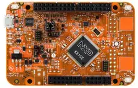

.. _frdm_ke15z:

NXP FRDM-KE15Z
##############

Overview
********

The FRDM-KE15Z is a development board for NXP Kinetis KE1xZ 32-bit
MCU-based platforms. The FRDM-KE15Z contains a robust TSI module
with up to 50 channels which makes this board highly flexible
for touch keys. Offers options for serial
communication, flash programming, and run-control debugging.

Hardware
********

- MKE15Z256VLL7 MCU (up to 72 MHz, 256 KB flash memory, 32 KB RAM)
- OpenSDA Debug Circuit with a virtual serial port
- Touch electrodes in the self-capacitive mode
- Compatible with FRDM-TOUCH, FRDM-MC-LVBLDC, and Arduino® boards
- User Components such as Reset; RGB LED and two user buttons
- 6-axis FXOS8700CQ digital accelerometer and magnetometer

For more information about the KE1xZ SoC and the FRDM-KE15Z board, see
these NXP reference documents:

- `KE1XZ SOC Website`_
- `FRDM-KE15Z Datasheet`_
- `FRDM-KE15Z Reference Manual`_
- `FRDM-KE15Z Website`_
- `FRDM-KE15Z User Guide`_
- `FRDM-KE15Z Schematics`_

Supported Features
==================

The frdm_ke15z board configuration supports the following hardware
features:

+-----------+------------+-------------------------------------+
| Interface | Controller | Driver/Component                    |
+===========+============+=====================================+
| NVIC      | on-chip    | nested vector interrupt controller  |
+-----------+------------+-------------------------------------+
| SYSTICK   | on-chip    | systick                             |
+-----------+------------+-------------------------------------+
| GPIO      | on-chip    | gpio                                |
+-----------+------------+-------------------------------------+
| UART      | on-chip    | uart polling;                       |
|           |            | uart interrupt                      |
+-----------+------------+-------------------------------------+

The default configuration can be found in the defconfig file:
:zephyr_file:`boards/nxp/frdm_ke15z/frdm_ke15z_defconfig`.

Other hardware features are not currently supported by the port.

System Clock
============

The KE15 SoC is configured to run at 48 MHz using the FIRC.

Serial Port
===========

The KE15 SoC has three UARTs. UART1 is configured for the console.

Programming and Debugging
*************************

Build and flash applications as usual (see :ref:`build_an_application` and
:ref:`application_run` for more details).

Configuring a Debug Probe
=========================

A debug probe is used for both flashing and debugging the board. This board is
configured by default to use Linkserver.

Early versions of this board have an outdated version of the OpenSDA bootloader
and require an update. Please see the `DAPLink Bootloader Update`_ page for
instructions to update from the CMSIS-DAP bootloader to the DAPLink bootloader.

Option 1: Linkserver
-------------------------------------------------------

Install the :ref:`linkserver-debug-host-tools` and make sure they are in your
search path.  LinkServer works with the default CMSIS-DAP firmware included in
the on-board debugger.

Linkserver is the default for this board, ``west flash`` and ``west debug`` will
call the linkserver runner.

Option 2: :ref:`opensda-jlink-onboard-debug-probe`
--------------------------------------------------

Install the :ref:`jlink-debug-host-tools` and make sure they are in your search
path.

Follow the instructions in :ref:`opensda-jlink-onboard-debug-probe` to program
the `OpenSDA J-Link Firmware for FRDM-KE15Z`_.
Use the ``-r jlink`` option with west to use the jlink runner.

.. code-block:: console

   west flash -r jlink

Configuring a Console
=====================

Regardless of your choice in debug probe, we will use the OpenSDA
microcontroller as a usb-to-serial adapter for the serial console.

Connect a USB cable from your PC to J5.

Use the following settings with your serial terminal of choice (minicom, putty,
etc.):

- Speed: 115200
- Data: 8 bits
- Parity: None
- Stop bits: 1

Flashing
========

Here is an example for the :ref:`hello_world` application.

.. zephyr-app-commands::
   :zephyr-app: samples/hello_world
   :board: frdm_ke15z
   :goals: flash

Open a serial terminal, reset the board (press the SW1 button), and you should
see the following message in the terminal:

.. code-block:: console

   *** Booting Zephyr OS build v3.6.0-3478-gb923667860b1 ***
   Hello World! frdm_ke15z/mke15z7

Debugging
=========

Here is an example for the :ref:`hello_world` application.

.. zephyr-app-commands::
   :zephyr-app: samples/hello_world
   :board: frdm_ke15z
   :goals: debug

Open a serial terminal, step through the application in your debugger, and you
should see the following message in the terminal:

.. code-block:: console

   ***** Booting Zephyr OS v3.6.0-xxx-gxxxxxxxxxxxx *****
   Hello World! frdm_ke15z

.. _KE1XZ SoC Website:
   https://www.nxp.com/products/processors-and-microcontrollers/arm-microcontrollers/general-purpose-mcus/ke-series-arm-cortex-m4-m0-plus/ke1xz-arm-cortex-m0-plus-5v-main-stream-mcu-with-nxp-touch-and-can-control:KE1xZ

.. _FRDM-KE15Z Datasheet:
   https://www.nxp.com/docs/en/data-sheet/KE1xZP100M72SF0.pdf

.. _FRDM-KE15Z Reference Manual:
   https://www.nxp.com/webapp/Download?colCode=KE1XZP100M72SF0RM

.. _FRDM-KE15Z Website:
   https://www.nxp.com/design/design-center/development-boards-and-designs/general-purpose-mcus/freedom-development-platform-for-kinetis-ke1xmcus:FRDM-KE15Z

.. _FRDM-KE15Z User Guide:
   https://www.nxp.com/document/guide/get-started-with-the-frdm-ke15z:NGS-FRDM-KE15Z

.. _FRDM-KE15Z Schematics:
   https://www.nxp.com/webapp/Download?colCode=FRDM-KE15Z-SCH-DESIGNFILES

.. _DAPLink Bootloader Update:
   https://os.mbed.com/blog/entry/DAPLink-bootloader-update/

.. _OpenSDA J-Link Firmware for FRDM-KE15Z:
   https://www.segger.com/downloads/jlink/OpenSDA_FRDM-KE15Z
