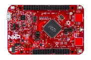

.. _frdm_ke17z:

NXP FRDM-KE17Z
##############

Overview
********

The FRDM-KE17Z is a development board for NXP Kinetis KE1xZ 32-bit
MCU-based platforms. The FRDM-KE17Z contains a robust TSI module
with up to 50 channels which makes this board highly flexible
for touch keys. Offers options for serial
communication, flash programming, and run-control debugging.

   FRDM-KE17Z (Credit: NXP)

Hardware
********

- MKE17Z256VLL7 MCU (up to 72 MHz, 256 KB flash memory, 48 KB SRAM,
  and 100 Low profile Quad Flat Package (LQFP))
- 3.3 V or 5 V MCU operation
- 6-axis FXOS8700CQ digital accelerometer
- 3-axis digital angular rate gyroscope
- One RGB LED
- Two user push-buttons
- Thermistor
- Two capacitive touchpads
- Flex I/O pin header

For more information about the KE1xZ SoC and the FRDM-KE17Z board, see
these NXP reference documents:

- `FRDM-KE17Z Website`_
- `FRDM-KE17Z User Guide`_
- `FRDM-KE17Z Reference Manual`_
- `FRDM-KE17Z Datasheet`_

Supported Features
==================

The frdm_ke17z board configuration supports the following hardware
features:

+-----------+------------+-------------------------------------+
| Interface | Controller | Driver/Component                    |
+===========+============+=====================================+
| NVIC      | on-chip    | nested vector interrupt controller  |
+-----------+------------+-------------------------------------+
| SYSTICK   | on-chip    | systick                             |
+-----------+------------+-------------------------------------+
| PINCTRL   | on-chip    | pinctrl                             |
+-----------+------------+-------------------------------------+
| GPIO      | on-chip    | gpio                                |
+-----------+------------+-------------------------------------+
| LPTMR     | on-chip    | counter                             |
+-----------+------------+-------------------------------------+
| UART      | on-chip    | uart                                |
+-----------+------------+-------------------------------------+
| I2C       | on-chip    | i2c                                 |
+-----------+------------+-------------------------------------+
| ACMP      | on-chip    | sensor                              |
+-----------+------------+-------------------------------------+

The default configuration can be found in the defconfig file:
:zephyr_file:`boards/nxp/frdm_ke17z/frdm_ke17z_defconfig`.

Other hardware features are not currently supported by the port.

System Clock
============

The KE17Z SoC is configured to run at 48 MHz using the FIRC.

Serial Port
===========

The KE17Z SoC has three UARTs. UART0 is configured for the console.

Programming and Debugging
*************************

Build and flash applications as usual (see :ref:`build_an_application` and
:ref:`application_run` for more details).

Configuring a Debug Probe
=========================

A debug probe is used for both flashing and debugging the board. This board is
configured by default to use Linkserver.

Early versions of this board have an outdated version of the OpenSDA bootloader
and require an update. Please see the `DAPLink Bootloader Update`_ page for
instructions to update from the CMSIS-DAP bootloader to the DAPLink bootloader.

Option 1: Linkserver
--------------------

Install the :ref:`linkserver-debug-host-tools` and make sure they are in your
search path.  LinkServer works with the default CMSIS-DAP firmware included in
the on-board debugger.

      Linkserver is the default for this board, ``west flash`` and ``west debug`` will
      call the linkserver runner.

.. code-block:: console

   west flash

External JLink: :ref:`jlink-external-debug-probe`
-------------------------------------------------

Install the :ref:`jlink-debug-host-tools` and make sure they are in your search
path.

Attach a J-Link 10-pin connector to J14. Check that jumpers J8 and J9 are
**off** (they are on by default when boards ship from the factory) to ensure
SWD signals are disconnected from the OpenSDA microcontroller.
Use the ``-r jlink`` option with west to use the jlink runner.

.. code-block:: console

   west flash -r jlink

Configuring a Console
=====================

Regardless of your choice in debug probe, we will use the OpenSDA
microcontroller as a usb-to-serial adapter for the serial console.

Connect a USB cable from your PC to J6.

Use the following settings with your serial terminal of choice (minicom, putty,
etc.):

- Speed: 115200
- Data: 8 bits
- Parity: None
- Stop bits: 1

Flashing
========

Here is an example for the :ref:`hello_world` application.

.. zephyr-app-commands::
   :zephyr-app: samples/hello_world
   :board: frdm_ke17z
   :goals: flash

Open a serial terminal, reset the board (press the SW1 button), and you should
see the following message in the terminal:

.. code-block:: console

   *** Booting Zephyr OS build xxxxxxxxxxxx ***
   Hello World! frdm_ke17z/mke17z7

Debugging
=========

Here is an example for the :ref:`hello_world` application.

.. zephyr-app-commands::
   :zephyr-app: samples/hello_world
   :board: frdm_ke17z
   :goals: debug

Open a serial terminal, step through the application in your debugger, and you
should see the following message in the terminal:

.. code-block:: console

   *** Booting Zephyr OS build xxxxxxxxxxxx ***
   Hello World! frdm_ke17z/mke17z7

.. _FRDM-KE17Z Website:
   https://www.nxp.com/design/design-center/development-boards-and-designs/general-purpose-mcus/freedom-development-platform-for-72mhz-ke17z-ke13z-ke12z-mcus:FRDM-KE17Z

.. _FRDM-KE17Z User Guide:
   https://www.nxp.com/docs/en/user-guide/KE17ZHDG.pdf

.. _FRDM-KE17Z Reference Manual:
   https://www.nxp.com/docs/en/reference-manual/KE1xZP100M72SF1RM.pdf

.. _FRDM-KE17Z Datasheet:
   https://www.nxp.com/docs/en/data-sheet/KE1xZP100M72SF1.pdf

.. _DAPLink Bootloader Update:
   https://os.mbed.com/blog/entry/DAPLink-bootloader-update/

.. _OpenSDA DAPLink FRDM-KE17Z Firmware:
   https://www.nxp.com/design/design-center/software/sensor-toolbox/opensda-serial-and-debug-adapter:OPENSDA?tid=vanOpenSDA

.. _linkserver-debug-host-tools:
   https://www.nxp.com/lgfiles/updates/mcuxpresso/LinkServer_1.5.30.exe

.. _OpenSDA J-Link Firmware for FRDM-KE17Z:
   https://www.segger.com/downloads/jlink/OpenSDA_FRDM-KE17Z
