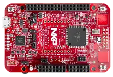

.. _frdm_ke17z512:

NXP  FRDM-KE17Z512
##################

Overview
********

The FRDM-KE17Z512 is a development board for NXP Kinetis KE1xZ 32-bit
MCU-based platforms. The onboard OpenSDAv2 serial and debug adapter,
running an open source bootloader, offers options for serial
communication, flash programming, and run-control debugging.

   FRDM-KE17Z512 (Credit: NXP)

Hardware
********

- MKE17Z512VLL9 MCU (up to 96  MHz, 512 KB flash memory, 96 KB RAM,
  and 100 Low profile Quad Flat Package (LQFP))
- 3.3 V or 5 V MCU operation
- 6-axis FXOS8700CQ digital accelerometer and magnetometer
- RGB LED
- Two user push-buttons
- Thermistor
- Arduino compatible I/O pin header
- OpenSDA on-board debugger
- Two Touch Electrodes

For more information about the KE1xZ SoC and the FRDM-KE17Z512 board, see
these NXP reference documents:

- `KE1xZ Website`_
- `KE1xZ Fact Sheet`_
- `KE1xZ Reference Manual`_
- `FRDM-KE17Z512 Website`_
- `FRDM-KE17Z512 Quick Start Guide`_
- `FRDM-KE17Z512 Reference Manual`_

Supported Features
==================

The frdm_ke17z512 board configuration supports the following hardware
features:

+-----------+------------+-------------------------------------+
| Interface | Controller | Driver/Component                    |
+===========+============+=====================================+
| NVIC      | on-chip    | nested vector interrupt controller  |
+-----------+------------+-------------------------------------+
| SYSTICK   | on-chip    | systick                             |
+-----------+------------+-------------------------------------+
| GPIO      | on-chip    | gpio                                |
+-----------+------------+-------------------------------------+
| UART      | on-chip    | uart polling;                       |
|           |            | uart interrupt                      |
+-----------+------------+-------------------------------------+
| I2C       | on-chip    | I2C                                 |
+-----------+------------+-------------------------------------+

The default configuration can be found in the defconfig file:
``boards/nxp/frdm_ke17z512/frdm_ke17z512_defconfig``.

Other hardware features are not currently supported by the port.

System Clock
============

The KE17Z9 SoC is configured to run at 48 MHz using the FIRC.

Serial Port
===========

The KE17Z9 SoC has three LPUARTs. UART2 is configured for the console.

Programming and Debugging
*************************

Build and flash applications as usual (see :ref:`build_an_application` and
:ref:`application_run` for more details).

Configuring a Debug Probe
=========================

A debug probe is used for both flashing and debugging the board. This board is
configured by default to use Linkserver.

Early versions of this board have an outdated version of the OpenSDA bootloader
and require an update. Please see the `DAPLink Bootloader Update`_ page for
instructions to update from the CMSIS-DAP bootloader to the DAPLink bootloader.

Option 1: Linkserver
--------------------

Install the :ref:`linkserver-debug-host-tools` and make sure they are in your
search path.  LinkServer works with the default CMSIS-DAP firmware included in
the on-board debugger.

Linkserver is the default for this board, ``west flash`` and ``west debug`` will
call the linkserver runner.

Option 2: :ref:`opensda-jlink-onboard-debug-probe`
--------------------------------------------------

Install the :ref:`jlink-debug-host-tools` and make sure they are in your search
path.

Follow the instructions in :ref:`opensda-jlink-onboard-debug-probe` to program
the `Segger J-Link OpenSDA V2.1 Firmware`_.
Use the ``-r jlink`` option with west to use the jlink runner.

.. code-block:: console

   west flash -r jlink

Configuring a Console
=====================

Regardless of your choice in debug probe, we will use the OpenSDA
microcontroller as a usb-to-serial adapter for the serial console.

Connect a USB cable from your PC to J10.

Use the following settings with your serial terminal of choice (minicom, putty,
etc.):

- Speed: 115200
- Data: 8 bits
- Parity: None
- Stop bits: 1

Flashing
========

Here is an example for the :ref:`hello_world` application.

.. zephyr-app-commands::
   :zephyr-app: samples/hello_world
   :board: frdm_ke17z512
   :goals: flash

Open a serial terminal, reset the board (press the SW1 button), and you should
see the following message in the terminal:

.. code-block:: console

   *** Booting Zephyr OS build v3.6.0-xxxx-gxxxxxxxxxxxx ***
   Hello World! frdm_ke17z512/mke17z9

Debugging
=========

Here is an example for the :ref:`hello_world` application.

.. zephyr-app-commands::
   :zephyr-app: samples/hello_world
   :board: frdm_ke17z512
   :goals: debug

Open a serial terminal, step through the application in your debugger, and you
should see the following message in the terminal:

.. code-block:: console

   *** Booting Zephyr OS build v3.6.0-xxxx-gxxxxxxxxxxxx ***
   Hello World! frdm_ke17z512/mke17z9

.. _FRDM-KE17Z512 Website:
   https://www.nxp.com/design/design-center/development-boards-and-designs/general-purpose-mcus/frdm-development-board-for-96-mhz-ke17z-ke13z-ke12z-with-512-kb-flash-mcus:FRDM-KE17Z512

.. _FRDM-KE17Z512 Quick Start Guide:
   https://www.nxp.com/docs/en/quick-reference-guide/FRDMKE17Z512QSG.pdf

.. _FRDM-KE17Z512 Reference Manual:
   https://www.nxp.com/docs/en/reference-manual/KE1XZP100M96SF0RM.pdf

.. _KE1xZ Website:
   https://www.nxp.com/products/processors-and-microcontrollers/arm-microcontrollers/general-purpose-mcus/ke-series-arm-cortex-m4-m0-plus/ke1xz-arm-cortex-m0-plus-5v-main-stream-mcu-with-nxp-touch-and-can-control:KE1xZ

.. _KE1xZ Fact Sheet:
   https://www.nxp.com/docs/en/fact-sheet/KE1xZMCUFAMFS.pdf

.. _KE1xZ Reference Manual:
   https://www.nxp.com/webapp/Download?colCode=KE1XZP100M72SF0RM

.. _linkserver-debug-host-tools:
   https://www.nxp.com/lgfiles/updates/mcuxpresso/LinkServer_1.5.30.exe

.. _Segger J-Link OpenSDA V2.1 Firmware:
   https://www.segger.com/downloads/jlink/OpenSDA_V2_1.bin

.. _DAPLink Bootloader Update:
   https://os.mbed.com/blog/entry/DAPLink-bootloader-update/

.. _jlink-debug-host-tools:
   https://www.segger.com/downloads/jlink/JLink_Windows_V794_x86_64.exe
