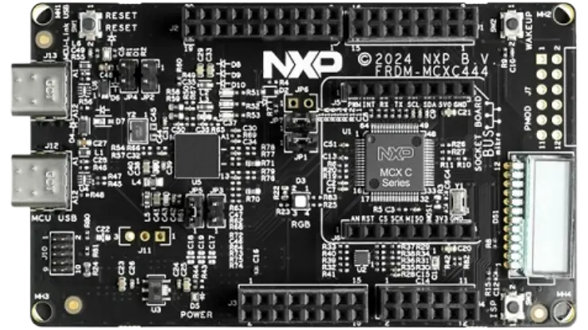

.. _frdm_mcxc444:

NXP FRDM-MCXC444
################

Overview
********

FRDM-MCXC444 is a compact and scalable development board for rapid
prototyping of MCX C444 MCU. It offers industry standard headers
for easy access to the MCU's I/Os, integrated open-standard serial
interfaces and on-board MCU-Link debugger.
The MCXC is a general purpose ultra-low-power MCU family,
providing additional memory, communications and analog peripheral.

Hardware
********

- MCXC444VLH Arm Cortex-M0+ microcontroller running at 48 MHz
- 64LQFP package
- 256 KB flash
- 32 KB SRAM
- USB FS 2.0
- 2x low-power UART, 1x UART, 2x I2C, 2x SPI
- FXLS8974CF accelerometer
- Tri-color LED
- On-board MCU-Link debugger with CMSIS-DAP
- Arduino Header, mikroBUS, Pmod

For more information about the MCXC444 SoC and FRDM-MCXC444 board, see
these references:

- `MCX C14x/24x/44x Website`_
- `MCX C44x Datasheet`_
- `MCX C44x Reference Manual`_
- `FRDM-MCXC444 Website`_
- `FRDM-MCXC444 User Manual`_
- `FRDM-MCXC444 Design Files`_

Supported Features
==================

The ``frdm_mcxc444`` board target supports the following hardware features:

+-----------+------------+-------------------------------------+
| Interface | Controller | Driver/Component                    |
+===========+============+=====================================+
| NVIC      | on-chip    | nested vector interrupt controller  |
+-----------+------------+-------------------------------------+
| SYSTICK   | on-chip    | systick                             |
+-----------+------------+-------------------------------------+
| PINMUX    | on-chip    | pinmux                              |
+-----------+------------+-------------------------------------+
| GPIO      | on-chip    | gpio                                |
+-----------+------------+-------------------------------------+
| UART      | on-chip    | serial port-polling;                |
|           |            | serial port-interrupt               |
+-----------+------------+-------------------------------------+
| FLASH     | on-chip    | soc flash                           |
+-----------+------------+-------------------------------------+

Targets available
==================

The default configuration can be found in
:zephyr_file:`boards/nxp/frdm_mcxc444/frdm_mcxc444_defconfig`

Other hardware features are not currently supported by the port.

Connections and IOs
===================

The MCXC444 SoC has five pairs of pinmux/gpio controllers (PORTA/GPIOA,
PORTB/GPIOB, PORTC/GPIOC, PORTD/GPIOD, and PORTE/GPIOE) for the FRDM-MCXC444 board.

+-------+-------------+---------------------------+
| Name  | Function    | Usage                     |
+=======+=============+===========================+
| PTE20 | ADC         | ADC0 channel 1            |
+-------+-------------+---------------------------+
| PTE31 | GPIO        | Red LED                   |
+-------+-------------+---------------------------+
| PTD5  | GPIO        | Green LED                 |
+-------+-------------+---------------------------+
| PTE29 | GPIO        | Blue LED                  |
+-------+-------------+---------------------------+
| PTA1  | LPUART0_RX  | UART Console              |
+-------+-------------+---------------------------+
| PTA2  | LPUART0_TX  | UART Console              |
+-------+-------------+---------------------------+
| PTA20 | RESET       | RESET Button SW1          |
+-------+-------------+---------------------------+
| PTC3  | GPIO        | User button SW2           |
+-------+-------------+---------------------------+
| PTA4  | GPIO        | User button SW3           |
+-------+-------------+---------------------------+
| PTE25 | I2C0_SDA    | I2C accelerometer         |
+-------+-------------+---------------------------+
| PTE24 | I2C0_SCL    | I2C accelerometer         |
+-------+-------------+---------------------------+

System Clock
============

The MCXC444 SoC is configured to use HIRC running at 48 MHz as a system clock source.

Serial Port
===========

The MCXC444 LPUART0 is used for the console.

Programming and Debugging
*************************

Build and flash applications as usual (see :ref:`build_an_application` and
:ref:`application_run` for more details).

Configuring a Debug Probe
=========================

A debug probe is used for both flashing and debugging the board. This board is
configured by default to use the MCU-Link CMSIS-DAP Onboard Debug Probe.

Using LinkServer
----------------

Linkserver is the default runner for this board, and supports the factory
default MCU-Link firmware. Follow the instructions in
:ref:`mcu-link-cmsis-onboard-debug-probe` to reprogram the default MCU-Link
firmware. This only needs to be done if the default onboard debug circuit
firmware was changed. To put the board in ``DFU mode`` to program the firmware,
short jumper JP2.

Using J-Link
------------

There are two options. The onboard debug circuit can be updated with Segger
J-Link firmware by following the instructions in
:ref:`mcu-link-jlink-onboard-debug-probe`.
To be able to program the firmware, you need to put the board in ``DFU mode``
by shortening the jumper JP1.
The second option is to attach a :ref:`jlink-external-debug-probe` to the
10-pin SWD connector (J10) of the board. Additionally, the jumper JP4 must
be shortened.
For both options use the ``-r jlink`` option with west to use the jlink runner.

.. code-block:: console

   west flash -r jlink

Configuring a Console
=====================

Connect a USB cable from your PC to J13, and use the serial terminal of your choice
(minicom, putty, etc.) with the following settings:

- Speed: 115200
- Data: 8 bits
- Parity: None
- Stop bits: 1

Flashing
========

Here is an example for the :zephyr:code-sample:`hello_world` application.

.. zephyr-app-commands::
   :zephyr-app: samples/hello_world
   :board: frdm_mcxc444
   :goals: flash

Open a serial terminal, reset the board (press the SW1 button), and you should
see the following message in the terminal:

.. code-block:: console

   *** Booting Zephyr OS build v3.6.0-4475-gfa5bd8bb098e ***
   Hello World! frdm_mcxc444/mcxc444

Debugging
=========

Here is an example for the :zephyr:code-sample:`hello_world` application.

.. zephyr-app-commands::
   :zephyr-app: samples/hello_world
   :board: frdm_mcxc444
   :goals: debug

Open a serial terminal, step through the application in your debugger, and you
should see the following message in the terminal:

.. code-block:: console

   *** Booting Zephyr OS build v3.6.0-4475-gfa5bd8bb098e ***
   Hello World! frdm_mcxc444/mcxc444

.. _MCX C14x/24x/44x Website:
   https://www.nxp.com/products/processors-and-microcontrollers/arm-microcontrollers/general-purpose-mcus/mcx-arm-cortex-m/mcx-c-series-microcontrollers/mcx-c14x-24x-44x-mcus-with-arm-cortex-m0-plus-entry-level-mcus-with-usb-segment-lcd-and-classical-peripherals:MCX-C14x-24x-44x

.. _MCX C44x Datasheet:
   https://www.nxp.com/docs/en/data-sheet/MCXC44XP64M48SF6.pdf

.. _MCX C44x Reference Manual:
   https://www.nxp.com/webapp/Download?colCode=MCXC44XP64M48RM

.. _FRDM-MCXC444 Website:
   https://www.nxp.com/design/design-center/development-boards-and-designs/general-purpose-mcus/frdm-development-board-for-mcx-c444-mcus:FRDM-MCXC444

.. _FRDM-MCXC444 User Manual:
   https://www.nxp.com/webapp/Download?colCode=UM12120

.. _FRDM-MCXC444 Design Files:
   https://www.nxp.com/webapp/Download?colCode=FRDM-MCXC444-DESIGNFILES
