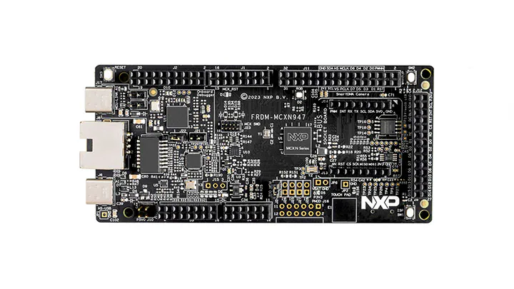

.. _frdm_mcxn947:

NXP FRDM-MCXN947
################

Overview
********

FRDM-MCXN947 are compact and scalable development boards for rapid prototyping of
MCX N94 and N54 MCUs. They offer industry standard headers for easy access to the
MCUs I/Os, integrated open-standard serial interfaces, external flash memory and
an on-board MCU-Link debugger. MCX N Series are high-performance, low-power
microcontrollers with intelligent peripherals and accelerators providing multi-tasking
capabilities and performance efficiency.

Hardware
********

- MCX-N947 Dual Arm Cortex-M33 microcontroller running at 150 MHz
- 2MB dual-bank on chip Flash
- 512 KB RAM
- External Quad SPI flash over FlexSPI
- USB high-speed (Host/Device) with on-chip HS PHY. HS USB Type-C connectors
- 10x LP Flexcomms each supporting SPI, I2C, UART
- 2x FlexCAN with FD, 2x I3Cs, 2x SAI
- 1x Ethernet with QoS
- On-board MCU-Link debugger with CMSIS-DAP
- Arduino Header, FlexIO/LCD Header, SmartDMA/Camera Header, mikroBUS

For more information about the MCX-N947 SoC and FRDM-MCXN947 board, see:

- `MCX-N947 SoC Website`_
- `MCX-N947 Datasheet`_
- `MCX-N947 Reference Manual`_
- `FRDM-MCXN947 Website`_
- `FRDM-MCXN947 User Guide`_
- `FRDM-MCXN947 Board User Manual`_
- `FRDM-MCXN947 Schematics`_

Supported Features
==================

The FRDM-MCXN947 board configuration supports the following hardware features:

+-----------+------------+-------------------------------------+
| Interface | Controller | Driver/Component                    |
+===========+============+=====================================+
| NVIC      | on-chip    | nested vector interrupt controller  |
+-----------+------------+-------------------------------------+
| SYSTICK   | on-chip    | systick                             |
+-----------+------------+-------------------------------------+
| PINMUX    | on-chip    | pinmux                              |
+-----------+------------+-------------------------------------+
| GPIO      | on-chip    | gpio                                |
+-----------+------------+-------------------------------------+
| UART      | on-chip    | serial port-polling;                |
|           |            | serial port-interrupt               |
+-----------+------------+-------------------------------------+
| SPI       | on-chip    | spi                                 |
+-----------+------------+-------------------------------------+
| DMA       | on-chip    | dma                                 |
+-----------+------------+-------------------------------------+
| I2C       | on-chip    | i2c                                 |
+-----------+------------+-------------------------------------+
| CLOCK     | on-chip    | clock_control                       |
+-----------+------------+-------------------------------------+
| FLASH     | on-chip    | soc flash                           |
+-----------+------------+-------------------------------------+
| FLEXSPI   | on-chip    | flash programming                   |
+-----------+------------+-------------------------------------+
| DAC       | on-chip    | dac                                 |
+-----------+------------+-------------------------------------+
| ENET QOS  | on-chip    | ethernet                            |
+-----------+------------+-------------------------------------+
| WATCHDOG  | on-chip    | watchdog                            |
+-----------+------------+-------------------------------------+

Targets available
==================

The default configuration file
:zephyr_file:`boards/nxp/frdm_mcxn947/frdm_mcxn947_mcxn947_cpu0_defconfig`
only enables the first core.

Other hardware features are not currently supported by the port.

Connections and IOs
===================

The MCX-N947 SoC has 6 gpio controllers and has pinmux registers which
can be used to configure the functionality of a pin.

+------------+-----------------+----------------------------+
| Name       | Function        | Usage                      |
+============+=================+============================+
| P0_PIO1_8  | UART            | UART RX                    |
+------------+-----------------+----------------------------+
| P1_PIO1_9  | UART            | UART TX                    |
+------------+-----------------+----------------------------+

System Clock
============

The MCX-N947 SoC is configured to use PLL0 running at 150MHz as a source for
the system clock.

Serial Port
===========

The FRDM-MCXN947 SoC has 10 FLEXCOMM interfaces for serial communication.
Flexcomm 4 is configured as UART for the console.

Programming and Debugging
*************************

Build and flash applications as usual (see :ref:`build_an_application` and
:ref:`application_run` for more details).

Configuring a Debug Probe
=========================

A debug probe is used for both flashing and debugging the board. This board is
configured by default to use the MCU-Link CMSIS-DAP Onboard Debug Probe.

Using LinkServer
----------------

Linkserver is the default runner for this board, and supports the factory
default MCU-Link firmware. Follow the instructions in
:ref:`mcu-link-cmsis-onboard-debug-probe` to reprogram the default MCU-Link
firmware. This only needs to be done if the default onboard debug circuit
firmware was changed. To put the board in ``DFU mode`` to program the firmware,
short jumper J21.

Using J-Link
------------

There are two options. The onboard debug circuit can be updated with Segger
J-Link firmware by following the instructions in
:ref:`mcu-link-jlink-onboard-debug-probe`.
To be able to program the firmware, you need to put the board in ``DFU mode``
by shortening the jumper J21.
The second option is to attach a :ref:`jlink-external-debug-probe` to the
10-pin SWD connector (J23) of the board. Additionally, the jumper J19 must
be shortened.
For both options use the ``-r jlink`` option with west to use the jlink runner.

.. code-block:: console

   west flash -r jlink

Configuring a Console
=====================

Connect a USB cable from your PC to J17, and use the serial terminal of your choice
(minicom, putty, etc.) with the following settings:

- Speed: 115200
- Data: 8 bits
- Parity: None
- Stop bits: 1

Flashing
========

Here is an example for the :ref:`hello_world` application.

.. zephyr-app-commands::
   :zephyr-app: samples/hello_world
   :board: frdm_mcxn947/mcxn947/cpu0
   :goals: flash

Open a serial terminal, reset the board (press the RESET button), and you should
see the following message in the terminal:

.. code-block:: console

   *** Booting Zephyr OS build v3.6.0-479-g91faa20c6741 ***
   Hello World! frdm_mcxn947/mcxn947/cpu0

Debugging
=========

Here is an example for the :ref:`hello_world` application.

.. zephyr-app-commands::
   :zephyr-app: samples/hello_world
   :board: frdm_mcxn947/mcxn947/cpu0
   :goals: debug

Open a serial terminal, step through the application in your debugger, and you
should see the following message in the terminal:

.. code-block:: console

   *** Booting Zephyr OS build v3.6.0-479-g91faa20c6741 ***
   Hello World! frdm_mcxn947/mcxn947/cpu0

.. _MCX-N947 SoC Website:
   https://www.nxp.com/products/processors-and-microcontrollers/arm-microcontrollers/general-purpose-mcus/mcx-arm-cortex-m/mcx-n-series-microcontrollers/mcx-n94x-54x-highly-integrated-multicore-mcus-with-on-chip-accelerators-intelligent-peripherals-and-advanced-security:MCX-N94X-N54X

.. _MCX-N947 Datasheet:
   https://www.nxp.com/docs/en/data-sheet/MCXNx4xDS.pdf

.. _MCX-N947 Reference Manual:
   https://www.nxp.com/webapp/Download?colCode=MCXNX4XRM

.. _FRDM-MCXN947 Website:
   https://www.nxp.com/design/design-center/development-boards/general-purpose-mcus/frdm-development-board-for-mcx-n94-n54-mcus:FRDM-MCXN947

.. _FRDM-MCXN947 User Guide:
   https://www.nxp.com/document/guide/getting-started-with-frdm-mcxn947:GS-FRDM-MCXNXX

.. _FRDM-MCXN947 Board User Manual:
   https://www.nxp.com/webapp/Download?colCode=UM12018

.. _FRDM-MCXN947 Schematics:
   https://www.nxp.com/webapp/Download?colCode=90818-MCXN947SH
