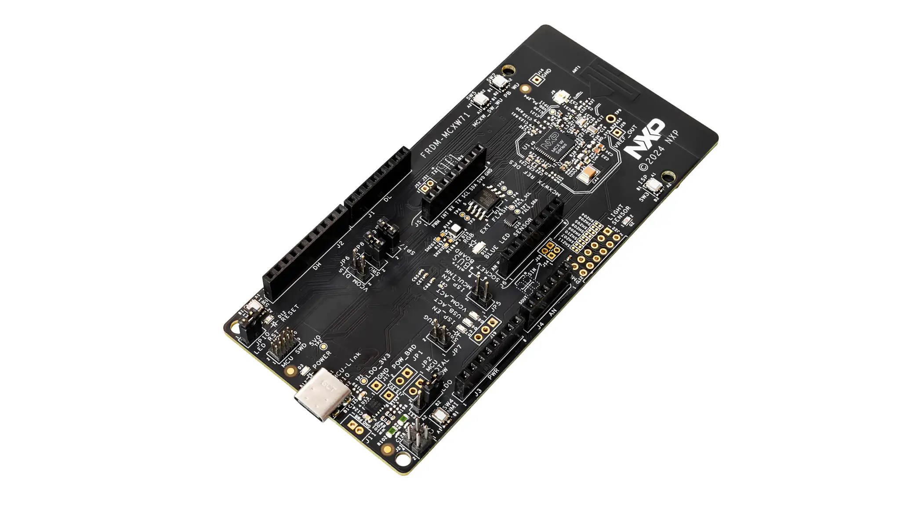

.. _frdm_mcxw71:

NXP FRDM-MCXW71
################

Overview
********

The FRDM-MCXW71 is a compact and scalable development board for rapid
prototyping of the MCX W71 wireless MCU. It offers easy evaluation of the MCX
W71's multiprotocol wireless support for Bluetooth LE, Zigbee, Thread and
Matter. The board includes an on-board MCU-Link debugger, industry standard
headers for easy access to the MCU’s I/Os, an accelerometer, a light sensor and
external SPI flash memory.

The MCX W71x family features a 96 MHz Arm® Cortex®-M33 core coupled with a
multiprotocol radio subsystem supporting Matter, Thread, Zigbee and Bluetooth
LE. The independent radio subsystem, with a dedicated core and memory, offloads
the main CPU, preserving it for the primary application and allowing firmware
updates to support future wireless standards.

Hardware
********

- MCXW71 Arm Cortex-M33 microcontroller running up to 96 MHz
- 1MB on-chip Flash memory unit
- 128 KB TCM RAM
- On-board MCU-Link debugger with CMSIS-DAP

For more information about the MCXW71 SoC and FRDM-MCXW71 board, see:

- `MCXW71 SoC Website`_
- `FRDM-MCXW71 Website`_

Supported Features
==================

The ``frdm_mcxw71`` board target in Zephyr currently supports the following features:

+-----------+------------+-------------------------------------+
| Interface | Controller | Driver/Component                    |
+===========+============+=====================================+
| NVIC      | on-chip    | nested vector interrupt controller  |
+-----------+------------+-------------------------------------+
| SYSTICK   | on-chip    | systick                             |
+-----------+------------+-------------------------------------+
| PINMUX    | on-chip    | pinctrl                             |
+-----------+------------+-------------------------------------+
| GPIO      | on-chip    | gpio                                |
+-----------+------------+-------------------------------------+
| LPUART    | on-chip    | serial port-polling;                |
|           |            | serial port-interrupt               |
+-----------+------------+-------------------------------------+

Programming and Debugging
*************************

Build and flash applications as usual (see :ref:`build_an_application` and
:ref:`application_run` for more details).

Configuring a Debug Probe
=========================

A debug probe is used for both flashing and debugging the board. This board is
configured by default to use the MCU-Link CMSIS-DAP Onboard Debug Probe.

Using J-Link
------------

There are two options. The onboard debug circuit can be updated with Segger
J-Link firmware by following the instructions in
:ref:`mcu-link-jlink-onboard-debug-probe`.
To be able to program the firmware, you need to put the board in ``DFU mode``
by shortening the jumper JP5.
The second option is to attach a :ref:`jlink-external-debug-probe` to the
10-pin SWD connector (J12) of the board.
For both options use the ``-r jlink`` option with west to use the jlink runner.

.. code-block:: console

   west flash -r jlink

Configuring a Console
=====================

Connect a USB cable from your PC to J10, and use the serial terminal of your choice
(minicom, putty, etc.) with the following settings:

- Speed: 115200
- Data: 8 bits
- Parity: None
- Stop bits: 1

Flashing
========

Here is an example for the :zephyr:code-sample:`hello_world` application.

.. zephyr-app-commands::
   :zephyr-app: samples/hello_world
   :board: frdm_mcxw71/mcxw716c
   :goals: flash

Open a serial terminal, reset the board (press the RESET button), and you should
see the following message in the terminal:

.. code-block:: console

   *** Booting Zephyr OS build v3.7.0-xxx-xxxx ***
   Hello World! frdm_mcxw71/mcxw716c

Debugging
=========

Here is an example for the :zephyr:code-sample:`hello_world` application.

.. zephyr-app-commands::
   :zephyr-app: samples/hello_world
   :board: frdm_mcxw71/mcxw716c
   :goals: debug

Open a serial terminal, step through the application in your debugger, and you
should see the following message in the terminal:

.. code-block:: console

   *** Booting Zephyr OS build v3.7.0-xxx-xxxx ***
   Hello World! frdm_mcxw71/mcxw716c

References
**********

.. _MCXW71 SoC Website:
   https://www.nxp.com/products/processors-and-microcontrollers/arm-microcontrollers/general-purpose-mcus/mcx-arm-cortex-m/mcx-w-series-microcontrollers/mcx-w71x-secure-and-ultra-low-power-mcus-for-matter-thread-zigbee-and-bluetooth-le:MCX-W71X

.. _FRDM-MCXW71 Website:
   https://www.nxp.com/design/design-center/development-boards-and-designs/general-purpose-mcus/frdm-development-board-for-mcx-w71x-wireless-mcus:FRDM-MCXW71
