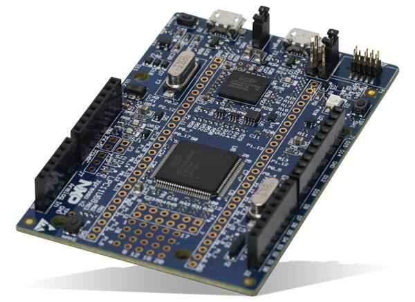

.. _lpcxpresso11u68:

NXP LPCXpresso11U68
###################

Overview
********

The LPCXpresso11u68 development board uses an NXP LPC11U68 MCU based
on an ARM Cortex-M0+ core.

Hardware
********

The LPCxpresso 11U68 board provides the following hardware components:

- LPC11U68 microcontroller in LQFP100 package
- ARM Cortex-M0+
- Memory:

  - 256KB of flash memory
  - 32KB of SRAM
  - 2x2KB of additional SRAM
  - 4 KB EEPROM
- USB:

  - USB 2.0 Full-Speed device controller
- DMA controller
- 5x USART
- 2x I2C
- 2x SSP with DMA support
- Board power supply: through USB bus or external power supply (3V and 5V)
- Arduino connectors compatible with the 'Arduino UNO' platform
- Tri-color user LED, Power On Led, Reset LED
- Three push buttons: target reset, ISP and user

More information can be found here:

- `LPC11UXX SoC Website`_
- `LPC11U6X Datasheet`_
- `LPC11U6X Reference Manual`_
- `LPCXPRESSO11U68 Website`_
- `LPCXPRESSO11U68 Schematics`_

Supported Features
==================

The lpcxpresso11U68 supports the following features:

+-----------+------------+-------------------------------------+
| Interface | Controller | Driver/Component                    |
+===========+============+=====================================+
| NVIC      | on-chip    | nested vector interrupt controller  |
+-----------+------------+-------------------------------------+
| SYSTICK   | on-chip    | systick                             |
+-----------+------------+-------------------------------------+
| IOCON     | on-chip    | pinmux                              |
+-----------+------------+-------------------------------------+
| CLOCK     | on-chip    | clock and reset control             |
+-----------+------------+-------------------------------------+
| GPIO      | on-chip    | gpio                                |
+-----------+------------+-------------------------------------+
| I2C       | on-chip    | i2c master/slave controller         |
+-----------+------------+-------------------------------------+
| UART      | on-chip    | serial port-polling;                |
|           |            | serial port interrupt               |
+-----------+------------+-------------------------------------+
| EEPROM    | on-chip    | eeprom                              |
+-----------+------------+-------------------------------------+

Other hardware is not yet supported on Zephyr.

Connections and IOs
===================

The IOCON controller can be used to configure the LPC11U68 pins.

+---------+-----------------+----------------------------+
| Name    | Function        | Usage                      |
+=========+=================+============================+
| PIO2_11 | UART            | USART RX                   |
+---------+-----------------+----------------------------+
| PIO2_12 | UART            | USART TX                   |
+---------+-----------------+----------------------------+
| PIO2_16 | GPIO            | GREEN LED                  |
+---------+-----------------+----------------------------+
| PIO2_17 | GPIO            | RED LED                    |
+---------+-----------------+----------------------------+
| PIO2_18 | GPIO            | BLUE_LED                   |
+---------+-----------------+----------------------------+
| PIO0_4  | I2C             | I2C SCL                    |
+---------+-----------------+----------------------------+
| PIO0_5  | I2C             | I2C SDA                    |
+---------+-----------------+----------------------------+

Programming and Debugging
*************************

Flashing
========

The LPCXpresso11U68 board can be flashed by using the on-board LPC-Link2 debug
probe (based on a NXP LPC43xx MCU). This MCU provides either a CMSIS-DAP or
a J-Link interface. It depends on the embedded firmware image. The default
OpenOCD configuration supports the CMSIS-DAP interface. If you want to
switch to J-Link, then you need to edit the
:zephyr_file:`boards/nxp/lpcxpresso11u68/support/openocd.cfg` file and to replace::

   source [find interface/cmsis-dap.cfg]

with::

   source [find interface/jlink.cfg]

.. note::
   The firmware image of the LPC-Link2 can be updated using the
   `LPCScrypt tool <https://www.nxp.com/design/microcontrollers-developer-resources/lpc-microcontroller-utilities/lpcscrypt-v2-1-1:LPCSCRYPT>`_.

.. note::
   The `Mbed project <https://os.mbed.com>`_ also provides some firmware images
   `here <https://os.mbed.com/teams/NXP/wiki/Updating-LPCXpresso-firmware>`_.
   In addition to a CMSIS-DAP interface, they also provide a convenient update
   mechanism through a pseudo USB disk.

Here are the steps to flash a firmware you built into a LPCXpresso11U68 board:

#. Connect the "Link" micro-B USB port to your host computer.
#. Next, simply run the ``west flash`` command

Debugging
=========

Please refer to the `Flashing`_ section and run the ``west debug`` command
instead of ``west flash``.

References
**********

- `LPC11UXX SoC Website`_
- `LPC11U6X Datasheet`_
- `LPC11U6X Reference Manual`_
- `LPCXPRESSO11U68 Website`_
- `LPCXPRESSO11U68 Schematics`_

.. _LPC11UXX SoC Website:
   https://www.nxp.com/products/processors-and-microcontrollers/arm-microcontrollers/general-purpose-mcus/lpc1100-cortex-m0-plus-m0/scalable-entry-level-32-bit-microcontroller-mcu-based-on-arm-cortex-m0-plus-and-cortex-m0-cores:LPC11U00

.. _LPC11U6X Datasheet:
   https://www.nxp.com/docs/en/data-sheet/LPC11U6X.pdf

.. _LPC11U6x Reference Manual:
   https://www.nxp.com/webapp/Download?colCode=UM10732

.. _LPCXPRESSO11U68 Website:
   https://www.nxp.com/design/microcontrollers-developer-resources/lpc-microcontroller-utilities/lpcxpresso-board-for-lpc11u68:OM13058

.. _LPCXPRESSO11U68 Schematics:
   https://www.nxp.com/downloads/en/schematics/LPC11U68_Xpresso_v2_Schematic_RevC_1.pdf
