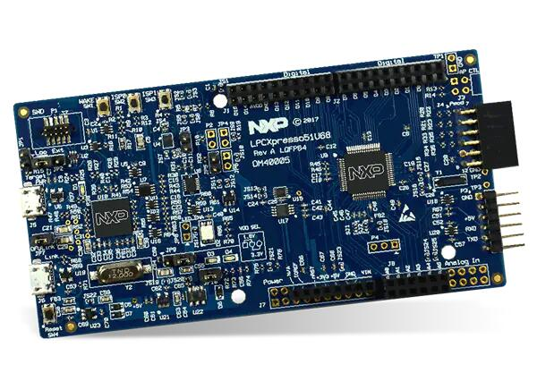

.. _lpcxpresso51u68:

NXP LPCXPRESSO51U68
###################

Overview
********

The LPCXpresso51u68 development board uses an NXP LPC51U68 MCU based
on an ARM CORTEX-M0+ core.

Hardware
********

- LPC51U68 M0+ running at up to 150 MHz
- Memory

  - 256KB of flash memory
  - 96KB of SRAM
- On-board high-speed USB based debug probe with CMSIS-DAP and J-Link protocol
  support, can debug the on-board LPC51U68 or an external target
- External debug probe option
- Tri-color LED, target reset, ISP & interrupt/user buttons for easy testing of
  software functionality
- Expansion options based on Arduino UNO and PMOD™, plus additional expansion
  port pins
- FTDI UART Connector

More information can be found here:

- `LPC51U68 SoC Website`_
- `LPC51U68 Datasheet`_

Supported Features
==================

The lpcxpresso51u68 support the following features:

+-----------+------------+-------------------------------------+
| Interface | Controller | Driver/Component                    |
+===========+============+=====================================+
| NVIC      | on-chip    | nested vector interrupt controller  |
+-----------+------------+-------------------------------------+
| SYSTICK   | on-chip    | systick                             |
+-----------+------------+-------------------------------------+
| IOCON     | on-chip    | pinmux                              |
+-----------+------------+-------------------------------------+
| CLOCK     | on-chip    | clock and reset control             |
+-----------+------------+-------------------------------------+
| GPIO      | on-chip    | gpio                                |
+-----------+------------+-------------------------------------+
| I2C       | on-chip    | i2c master/slave controller         |
+-----------+------------+-------------------------------------+
| UART      | on-chip    | serial port-polling;                |
|           |            | serial port interrupt               |
+-----------+------------+-------------------------------------+
| SPI       | on-chip    | SPI master                          |
+-----------+------------+-------------------------------------+

Other hardware is not yet supported on Zephyr.

Connections and IOs
===================

The IOCON controller can be used to configure the LPC51U68 pins.

+---------+-----------------+----------------------------+
| Name    | Function        | Usage                      |
+=========+=================+============================+
| PIO0_0  | UART            | USART RX                   |
+---------+-----------------+----------------------------+
| PIO0_1  | UART            | USART TX                   |
+---------+-----------------+----------------------------+
| PIO1_10 | GPIO            | GREEN LED                  |
+---------+-----------------+----------------------------+
| PIO0_29 | GPIO            | RED LED                    |
+---------+-----------------+----------------------------+
| PIO1_9  | GPIO            | BLUE_LED                   |
+---------+-----------------+----------------------------+
| PIO0_25 | I2C             | I2C SCL                    |
+---------+-----------------+----------------------------+
| PIO0_26 | I2C             | I2C SDA                    |
+---------+-----------------+----------------------------+
| PIO0_18 | SPI             | SPI MISO                   |
+---------+-----------------+----------------------------+
| PIO0_19 | SPI             | SPI SCK                    |
+---------+-----------------+----------------------------+
| PIO0_20 | SPI             | SPI MOSI                   |
+---------+-----------------+----------------------------+
| PIO1_1  | SPI             | SPI SSEL2                  |
+---------+-----------------+----------------------------+

Programming and Debugging
*************************

Build and flash applications as usual (see :ref:`build_an_application` and
:ref:`application_run` for more details).

Configuring a Debug Probe
=========================

A debug probe is used for both flashing and debugging the board. This board is
configured by default to use the LPC-Link2 CMSIS-DAP Onboard Debug Probe,
however the :ref:`pyocd-debug-host-tools` do not support this probe so you must
reconfigure the board for one of the following debug probes instead.

:ref:`lpclink2-jlink-onboard-debug-probe`
-----------------------------------------

Install the :ref:`jlink-debug-host-tools` and make sure they are in your search
path.

Follow the instructions in :ref:`lpclink2-jlink-onboard-debug-probe` to program
the J-Link firmware.

Configuring a Console
=====================

Connect a USB to FTDI RX, TX & GND pins to P3 Connector.

Use the following settings with your serial terminal of choice (minicom, putty,
etc.):

- Speed: 115200
- Data: 8 bits
- Parity: None
- Stop bits: 1

Flashing
========

Here is an example for the :zephyr:code-sample:`hello_world` application.

.. zephyr-app-commands::
   :zephyr-app: samples/hello_world
   :board: lpcxpresso51u68
   :goals: flash

.. code-block:: console

   ***** Booting Zephyr OS build zephyr-v2.6.0-934-g4c438c0c7d13 *****
   Hello World! lpcxpresso51u68

Debugging
=========

Here is an example for the :zephyr:code-sample:`hello_world` application.

.. zephyr-app-commands::
   :zephyr-app: samples/hello_world
   :board: lpcxpresso51u68
   :goals: debug

Open a serial terminal, step through the application in your debugger, and you
should see the following message in the terminal:

.. code-block:: console

   ***** Booting Zephyr OS build zephyr-v2.6.0-934-g4c438c0c7d13 *****
   Hello World! lpcxpresso51u68

.. _LPC51U68 SoC Website:
   https://www.nxp.com/products/processors-and-microcontrollers/arm-microcontrollers/general-purpose-mcus/high-performance-power-efficient-and-cost-sensitive-arm-cortex-m0-plus-mcus:LPC51U68

.. _LPC51U68 Datasheet:
   https://www.nxp.com/docs/en/data-sheet/LPC51U68.pdf
