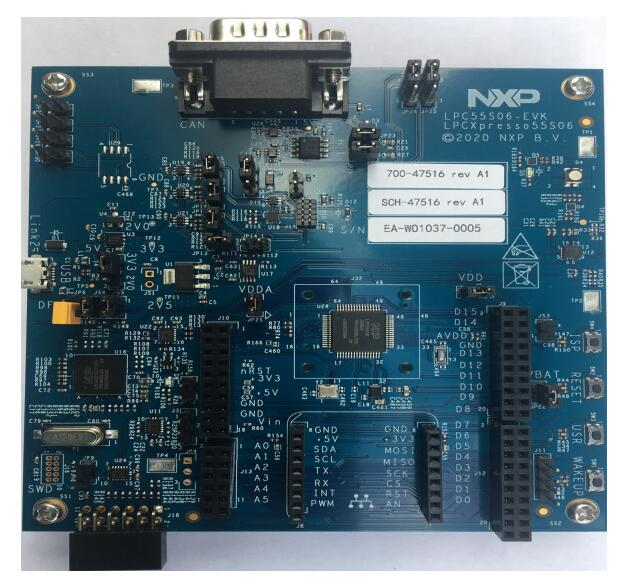

.. _lpcxpresso55s06:

NXP LPCXpresso55S06
###################

Overview
********

The LPCXpresso55S06 board provides the ideal platform for evaluation
of the LPC55S0x/LPC550x MCU family, based on the Arm® Cortex®-M33
architecture. Arduino® UNO compatible shield connectors are included,
with additional expansion ports around the Arduino footprint, along
with a PMod/host interface port and MikroElektronika Click module
site.

Hardware
********

- LPC55S06 Arm® Cortex®-M33 microcontroller running at up to 96 MHz
- 256 KB flash and 96 KB SRAM on-chip
- LPC-Link2 debug high speed USB probe with VCOM port
- MikroElektronika Click expansion option
- LPCXpresso expansion connectors compatible with Arduino UNO
- PMod compatible expansion / host connector
- Reset, ISP, wake, and user buttons for easy testing of software functionality
- Tri-color LED
- UART header for external serial to USB cable
- CAN Transceiver
- NXP FXOS8700CQ accelerometer

For more information about the LPC55S06 SoC and LPCXPresso55S06 board, see:

- `LPC55S06 SoC Website`_
- `LPC55S06 User Manual`_
- `LPCXpresso55S06 Website`_
- `LPCXpresso55S06 User Manual`_
- `LPCXpresso55S06 Development Board Design Files`_

Supported Features
==================

The lpcxpresso55s06 board configuration supports the hardware features listed
below.  For additional features not yet supported, please also refer to the
:ref:`lpcxpresso55s69` , which is the superset board in NXP's LPC55xx series.
NXP prioritizes enabling the superset board with NXP's Full Platform Support for
Zephyr.  Therefore, the lpcxpresso55s69 board may have additional features
already supported, which can also be re-used on this lpcxpresso55s06 board:

+-----------+------------+-------------------------------------+
| Interface | Controller | Driver/Component                    |
+===========+============+=====================================+
| NVIC      | on-chip    | nested vector interrupt controller  |
+-----------+------------+-------------------------------------+
| SYSTICK   | on-chip    | systick                             |
+-----------+------------+-------------------------------------+
| IOCON     | on-chip    | pinmux                              |
+-----------+------------+-------------------------------------+
| GPIO      | on-chip    | gpio                                |
+-----------+------------+-------------------------------------+
| USART     | on-chip    | serial port-polling;                |
|           |            | serial port-interrupt               |
+-----------+------------+-------------------------------------+
| CLOCK     | on-chip    | clock_control                       |
+-----------+------------+-------------------------------------+
| RNG       | on-chip    | entropy;                            |
|           |            | random                              |
+-----------+------------+-------------------------------------+
| IAP       | on-chip    | flash programming                   |
+-----------+------------+-------------------------------------+

Other hardware features are not currently enabled.

Currently available targets for this board are:

- *lpcxpresso55s06*

Connections and IOs
===================

The LPC55S06 SoC has IOCON registers, which can be used to configure
the functionality of a pin.

+---------+-----------------+----------------------------+
| Name    | Function        | Usage                      |
+=========+=================+============================+
| PIO0_5  | GPIO            | ISP SW4                    |
+---------+-----------------+----------------------------+
| PIO0_29 | USART           | USART RX                   |
+---------+-----------------+----------------------------+
| PIO0_30 | USART           | USART TX                   |
+---------+-----------------+----------------------------+
| PIO1_4  | GPIO            | RED LED                    |
+---------+-----------------+----------------------------+
| PIO1_6  | GPIO            | BLUE_LED                   |
+---------+-----------------+----------------------------+
| PIO1_7  | GPIO            | GREEN LED                  |
+---------+-----------------+----------------------------+
| PIO1_9  | GPIO            | USR SW3                    |
+---------+-----------------+----------------------------+
| PIO1_18 | GPIO            | Wakeup SW1                 |
+---------+-----------------+----------------------------+

System Clock
============

The LPC55S06 SoC is configured to use the internal FRO at 96MHz as a
source for the system clock. Other sources for the system clock are
provided in the SOC, depending on your system requirements.

Serial Port
===========

The LPC55S06 SoC has 8 FLEXCOMM interfaces for serial
communication. One is configured as USART for the console
and the remaining are not used.

Programming and Debugging
*************************

Build and flash applications as usual (see :ref:`build_an_application`
and :ref:`application_run` for more details).

Configuring a Debug Probe
=========================

A debug probe is used for both flashing and debugging the board. This
board is configured by default to use the LPC-Link2 CMSIS-DAP Onboard
Debug Probe, however the :ref:`pyocd-debug-host-tools` does not yet
support the LPC55S06 so you must reconfigure the board for one of the
J-Link debug probe instead.

First install the :ref:`jlink-debug-host-tools` and make sure they are
in your search path.

Then follow the instructions in
:ref:`lpclink2-jlink-onboard-debug-probe` to program the J-Link
firmware. Please make sure you have the latest firmware for this
board.

Configuring a Console
=====================

Connect a USB cable from your PC to J1 (LINK2), and use the serial
terminal of your choice (minicom, putty, etc.) with the following
settings:

- Speed: 115200
- Data: 8 bits
- Parity: None
- Stop bits: 1

Flashing
========

Here is an example for the :ref:`hello_world` application.

.. zephyr-app-commands::
   :zephyr-app: samples/hello_world
   :board: lpcxpresso55s06
   :goals: flash

Open a serial terminal, reset the board (press the RESET button), and you should
see the following message in the terminal:

.. code-block:: console

   ***** Booting Zephyr OS v3.0.0 *****
   Hello World! lpcxpresso55s06

Debugging
=========

Here is an example for the :ref:`hello_world` application.

.. zephyr-app-commands::
   :zephyr-app: samples/hello_world
   :board: lpcxpresso55s06
   :goals: debug

Open a serial terminal, step through the application in your debugger, and you
should see the following message in the terminal:

.. code-block:: console

   ***** Booting Zephyr OS zephyr-v3.0.0 *****
   Hello World! lpcxpresso55s06

.. _LPC55S06 SoC Website:
   https://www.nxp.com/products/processors-and-microcontrollers/arm-microcontrollers/general-purpose-mcus/lpc5500-cortex-m33/lpc550x-s0x-baseline-arm-cortex-m33-based-microcontroller-family:LPC550x

.. _LPC55S06 User Manual:
   https://www.nxp.com/docs/en/user-guide/UM11424.pdf

.. _LPCxpresso55S06 Website:
   https://www.nxp.com/design/development-boards/lpcxpresso-boards/lpcxpresso-development-board-for-lpc55s0x-0x-family-of-mcus:LPC55S06-EVK

.. _LPCXpresso55S06 User Manual:
   https://www.nxp.com/docs/en/user-guide/LPCXpresso55S06UM.pdf

.. _LPCXpresso55S06 Development Board Design Files:
   https://www.nxp.com/downloads/en/design-support/LPCXPRESSSO55S06-DESIGN-FILES.zip
