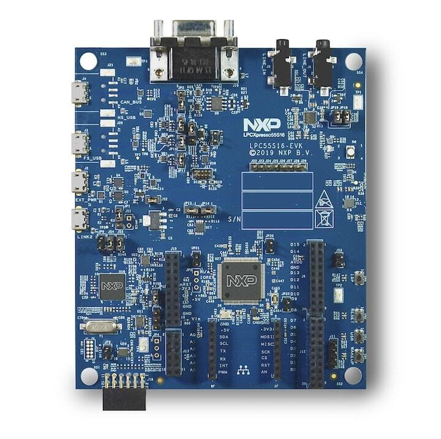

.. _lpcxpresso55s16:

NXP LPCXpresso55S16
###################

Overview
********

The LPCXpresso55S16 board provides the ideal platform for evaluation
of the LPC55S1x/LPC551x MCU family, based on the Arm® Cortex®-M33
architecture. Arduino® UNO compatible shield connectors are included,
with additional expansion ports around the Arduino footprint, along
with a PMod/host interface port and MikroElektronika Click module
site.

Hardware
********

- LPC55S16 Arm® Cortex®-M33 microcontroller running at up to 150 MHz
- 256 KB flash and 96 KB SRAM on-chip
- LPC-Link2 debug high speed USB probe with VCOM port
- I2C and SPI USB bridging to the LPC device via LPC-Link2 probe
- MikroElektronika Click expansion option
- LPCXpresso expansion connectors compatible with Arduino UNO
- PMod compatible expansion / host connector
- Reset, ISP, wake, and user buttons for easy testing of software functionality
- Tri-color LED
- Full-speed USB device / host port
- High-speed USB device / host port
- UART header for external serial to USB cable
- CAN Transceiver
- Stereo audio codec with in/out line
- NXP FXOS8700CQ accelerometer

For more information about the LPC55S16 SoC and LPCXPresso55S16 board, see:

- `LPC55S16 SoC Website`_
- `LPC55S16 Datasheet`_
- `LPC55S16 User Manual`_
- `LPCXpresso55S16 Website`_
- `LPCXpresso55S16 User Manual`_
- `LPCXpresso55S16 Development Board Design Files`_

Supported Features
==================

The lpcxpresso55s16 board configuration supports the hardware features listed
below.  For additional features not yet supported, please also refer to the
:ref:`lpcxpresso55s69` , which is the superset board in NXP's LPC55xx series.
NXP prioritizes enabling the superset board with NXP's Full Platform Support for
Zephyr.  Therefore, the lpcxpresso55s69 board may have additional features
already supported, which can also be re-used on this lpcxpresso55s16 board:

+-----------+------------+-------------------------------------+
| Interface | Controller | Driver/Component                    |
+===========+============+=====================================+
| NVIC      | on-chip    | nested vector interrupt controller  |
+-----------+------------+-------------------------------------+
| SYSTICK   | on-chip    | systick                             |
+-----------+------------+-------------------------------------+
| IOCON     | on-chip    | pinmux                              |
+-----------+------------+-------------------------------------+
| GPIO      | on-chip    | gpio                                |
+-----------+------------+-------------------------------------+
| I2C       | on-chip    | i2c                                 |
+-----------+------------+-------------------------------------+
| SPI       | on-chip    | spi                                 |
+-----------+------------+-------------------------------------+
| USART     | on-chip    | serial port-polling;                |
|           |            | serial port-interrupt               |
+-----------+------------+-------------------------------------+
| SENSOR    | off-chip   | fxos8700 trigger                    |
+-----------+------------+-------------------------------------+
| CLOCK     | on-chip    | clock_control                       |
+-----------+------------+-------------------------------------+
| CAN       | on-chip    | canbus                              |
+-----------+------------+-------------------------------------+
| RNG       | on-chip    | entropy;                            |
|           |            | random                              |
+-----------+------------+-------------------------------------+
| IAP       | on-chip    | flash programming                   |
+-----------+------------+-------------------------------------+

Other hardware features are not currently enabled.

Currently available targets for this board are:

- *lpcxpresso55s16*

Connections and IOs
===================

The LPC55S16 SoC has IOCON registers, which can be used to configure
the functionality of a pin.

+---------+-----------------+----------------------------+
| Name    | Function        | Usage                      |
+=========+=================+============================+
| PIO0_5  | GPIO            | ISP SW4                    |
+---------+-----------------+----------------------------+
| PIO0_26 | SPI             | SPI MOSI                   |
+---------+-----------------+----------------------------+
| PIO0_29 | USART           | USART RX                   |
+---------+-----------------+----------------------------+
| PIO0_30 | USART           | USART TX                   |
+---------+-----------------+----------------------------+
| PIO1_1  | SPI             | SPI SSEL1                  |
+---------+-----------------+----------------------------+
| PIO1_2  | SPI             | SPI SCK                    |
+---------+-----------------+----------------------------+
| PIO1_3  | SPI             | SPI MISO                   |
+---------+-----------------+----------------------------+
| PIO1_4  | GPIO            | RED LED                    |
+---------+-----------------+----------------------------+
| PIO1_6  | GPIO            | BLUE_LED                   |
+---------+-----------------+----------------------------+
| PIO1_7  | GPIO            | GREEN LED                  |
+---------+-----------------+----------------------------+
| PIO1_9  | GPIO            | USR SW3                    |
+---------+-----------------+----------------------------+
| PIO1_18 | GPIO            | Wakeup SW1                 |
+---------+-----------------+----------------------------+
| PIO1_20 | I2C             | I2C SCL                    |
+---------+-----------------+----------------------------+
| PIO1_21 | I2C             | I2C SDA                    |
+---------+-----------------+----------------------------+
| PIO1_26 | GPIO            | FXOS8700 INT1              |
+---------+-----------------+----------------------------+
| PIO1_22 | CAN             | CAN RXD                    |
+---------+-----------------+----------------------------+
| PIO1_27 | CAN             | CAN TXD                    |
+---------+-----------------+----------------------------+

System Clock
============

The LPC55S16 SoC is configured to use PLL1 clocked from the external 24MHz
crystal, running at 144MHz as a source for the system clock. When the flash
controller is enabled, the core clock will be reduced to 96MHz. The application
may reconfigure clocks after initialization, provided that the core clock is
always set to 96MHz when flash programming operations are performed.

Serial Port
===========

The LPC55S16 SoC has 8 FLEXCOMM interfaces for serial
communication. One is configured as USART for the console, one is
configured for I2C, and the remaining are not used.

Programming and Debugging
*************************

Build and flash applications as usual (see :ref:`build_an_application`
and :ref:`application_run` for more details).

Configuring a Debug Probe
=========================

A debug probe is used for both flashing and debugging the board. This
board is configured by default to use the LPC-Link2 CMSIS-DAP Onboard
Debug Probe, however the :ref:`pyocd-debug-host-tools` does not yet
support the LPC55S16 so you must reconfigure the board for one of the
J-Link debug probe instead.

First install the :ref:`jlink-debug-host-tools` and make sure they are
in your search path.

Then follow the instructions in
:ref:`lpclink2-jlink-onboard-debug-probe` to program the J-Link
firmware. Please make sure you have the latest firmware for this
board.

Configuring a Console
=====================

Connect a USB cable from your PC to J1 (LINK2), and use the serial
terminal of your choice (minicom, putty, etc.) with the following
settings:

- Speed: 115200
- Data: 8 bits
- Parity: None
- Stop bits: 1

Flashing
========

Here is an example for the :ref:`hello_world` application.

.. zephyr-app-commands::
   :zephyr-app: samples/hello_world
   :board: lpcxpresso55s16
   :goals: flash

Open a serial terminal, reset the board (press the RESET button), and you should
see the following message in the terminal:

.. code-block:: console

   ***** Booting Zephyr OS v2.2.0 *****
   Hello World! lpcxpresso55s16

Debugging
=========

Here is an example for the :ref:`hello_world` application.

.. zephyr-app-commands::
   :zephyr-app: samples/hello_world
   :board: lpcxpresso55s16
   :goals: debug

Open a serial terminal, step through the application in your debugger, and you
should see the following message in the terminal:

.. code-block:: console

   ***** Booting Zephyr OS zephyr-v2.2.0 *****
   Hello World! lpcxpresso55s16

.. _LPC55S16 SoC Website:
   https://www.nxp.com/products/processors-and-microcontrollers/arm-microcontrollers/general-purpose-mcus/lpc5500-cortex-m33/lpc551x-s1x-baseline-arm-cortex-m33-based-microcontroller-family:LPC551X-S1X

.. _LPC55S16 Datasheet:
    https://www.nxp.com/docs/en/nxp/data-sheets/LPC55S1x_LPC551x_DS.pdf

.. _LPC55S16 User Manual:
   https://www.nxp.com/webapp/Download?colCode=UM11295

.. _LPCxpresso55S16 Website:
   https://www.nxp.com/design/development-boards/lpcxpresso-boards/lpcxpresso55s16-development-board:LPC55S16-EVK

.. _LPCXpresso55S16 User Manual:
   https://www.nxp.com/webapp/Download?colCode=UMLPCXPRESSO55S16

.. _LPCXpresso55S16 Development Board Design Files:
   https://www.nxp.com/webapp/Download?colCode=LPCXPRESSSO55S16-DESIGN-FILES
