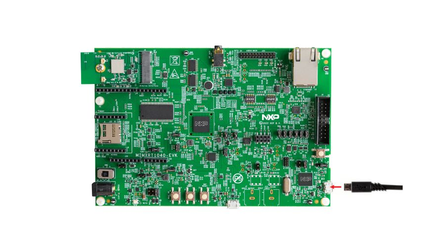

.. _mimxrt1040_evk:

NXP MIMXRT1040-EVK
##################

Overview
********

i.MX RT1040 crossover MCUs add additional flexibility with new packages and an
extended temperature range up to 125° C. The i.MX RT1040 MCU has a compact
9x9 mm package, as well as the 11x11 mm package that supports implementing a
2-layer PCB design. The i.MX RT1040 MCUs run on the Arm® Cortex®-M7 core at
600 MHz.

Hardware
********

- MIMXRT1042XJM5B MCU (600 MHz, 512 KB TCM)

- Memory

  - 256 MBit SDRAM (Winbond W9825G6KH)
  - 64 Mbit QSPI Flash (Winbond W25Q64JVSSIQ)

- Display

  - LCD connector
  - Touch connector

- Ethernet

  - 10/100 Mbit/s Ethernet PHY

- USB

  - USB 2.0 OTG connector

- Audio

  - 3.5 mm audio stereo headphone jack
  - Board-mounted microphone

- Power

  - 5 V DC jack

- Debug

  - JTAG 20-pin connector
  - OpenSDA with DAPLink

- Expansion port

  - Arduino interface

- CAN bus connector

For more information about the MIMXRT1040 SoC and MIMXRT1040-EVK board, see
these references:

- `i.MX RT1040 Website`_
- `i.MX RT1040 Datasheet`_
- `i.MX RT1040 Reference Manual`_
- `MIMXRT1040-EVK Website`_
- `MIMXRT1040-EVK User Guide`_
- `MIMXRT1040-EVK Design Files`_

External Memory
===============

This platform has the following external memories:

+----------------+------------+-------------------------------------+
| Device         | Controller | Status                              |
+================+============+=====================================+
| W9825G6KH      | SEMC       | Enabled via device configuration    |
|                |            | data block, which sets up SEMC at   |
|                |            | boot time                           |
+----------------+------------+-------------------------------------+
| W25Q64JVSSIQ   | FLEXSPI    | Enabled via flash configurationn    |
|                |            | block, which sets up FLEXSPI at     |
|                |            | boot time. Supported for XIP only.  |
+----------------+------------+-------------------------------------+

Supported Features
==================

The mimxrt1040_evk board configuration supports the hardware features listed
below.  For additional features not yet supported, please also refer to the
:ref:`mimxrt1064_evk` , which is the superset board in NXP's i.MX RT10xx family.
NXP prioritizes enabling the superset board with NXP's Full Platform Support for
Zephyr.  Therefore, the mimxrt1064_evk board may have additional features
already supported, which can also be re-used on this mimxrt1040_evk board:

+-----------+------------+-------------------------------------+
| Interface | Controller | Driver/Component                    |
+===========+============+=====================================+
| NVIC      | on-chip    | nested vector interrupt controller  |
+-----------+------------+-------------------------------------+
| SYSTICK   | on-chip    | systick                             |
+-----------+------------+-------------------------------------+
| GPIO      | on-chip    | gpio                                |
+-----------+------------+-------------------------------------+
| UART      | on-chip    | serial port-polling;                |
|           |            | serial port-interrupt               |
+-----------+------------+-------------------------------------+
| PWM       | on-chip    | pwm                                 |
+-----------+------------+-------------------------------------+
| ADC       | on-chip    | adc                                 |
+-----------+------------+-------------------------------------+
| SPI       | on-chip    | spi                                 |
+-----------+------------+-------------------------------------+
| DMA       | on-chip    | dma                                 |
+-----------+------------+-------------------------------------+
| I2C       | on-chip    | i2c                                 |
+-----------+------------+-------------------------------------+

The default configuration can be found in the defconfig file:

	:zephyr_file:`boards/nxp/mimxrt1040_evk/mimxrt1040_evk_defconfig`

Other hardware features are not currently supported by the port.

Connections and IOs
===================

The MIMXRT1040 SoC has five pairs of pinmux/gpio controllers.

+---------------+-----------------+---------------------------+
| Name          | Function        | Usage                     |
+===============+=================+===========================+
| GPIO_AD_B0_12 | LPUART1_TX      | UART Console              |
+---------------+-----------------+---------------------------+
| GPIO_AD_B0_13 | LPUART1_RX      | UART Console              |
+---------------+-----------------+---------------------------+
| WAKEUP        | GPIO            | SW0                       |
+---------------+-----------------+---------------------------+
| GPIO_AD_B0_08 | GPIO            | User LD1                  |
+---------------+-----------------+---------------------------+
| GPIO_AD_B0_10 | FLEXPWM1 PWM3A  | PWM Output                |
+---------------+-----------------+---------------------------+
| GPIO_AD_B0_14 | ADC0 IN3        | ADC0 Input                |
+---------------+-----------------+---------------------------+
| GPIO_AD_B0_15 | ADC0 IN4        | ADC0 Input                |
+---------------+-----------------+---------------------------+
| GPIO_SD_B0_02 | LPSPI1_SDO      | SPI Output                |
+---------------+-----------------+---------------------------+
| GPIO_SD_B0_03 | LPSPI1_SDI      | SPI Input                 |
+---------------+-----------------+---------------------------+
| GPIO_SD_B0_00 | LPSPI1_SCK      | SPI Clock                 |
+---------------+-----------------+---------------------------+
| GPIO_SD_B0_00 | LPSPI1_SCK      | SPI Clock                 |
+---------------+-----------------+---------------------------+
| GPIO_AD_B1_00 | LPI2C1_SCL      | I2C Clock                 |
+---------------+-----------------+---------------------------+
| GPIO_AD_B1_01 | LPI2C1_SDA      | I2C Data                  |
+---------------+-----------------+---------------------------+

.. note::
        In order to use the SPI peripheral on this board, resistors R350, R346,
        and R360 must be populated with zero ohm resistors.

System Clock
============

The MIMXRT1040 SoC is configured to use SysTick as the system clock source,
running at 600MHz.

When power management is enabled, the 32 KHz low frequency
oscillator on the board will be used as a source for the GPT timer to
generate a system clock. This clock enables lower power states, at the
cost of reduced resolution

Serial Port
===========

The MIMXRT1040 SoC has eight UARTs. ``LPUART1`` is configured for the console,
and the remaining UARTs are not used.

Programming and Debugging
*************************

Build and flash applications as usual (see :ref:`build_an_application` and
:ref:`application_run` for more details).

Configuring a Debug Probe
=========================

Programming and Debugging
*************************

Build and flash applications as usual (see :ref:`build_an_application` and
:ref:`application_run` for more details).

Configuring a Debug Probe
=========================

A debug probe is used for both flashing and debugging the board. This board is
configured by default to use the :ref:`opensda-daplink-onboard-debug-probe`,
however the :ref:`pyocd-debug-host-tools` do not yet support programming the
external flashes on this board so you must reconfigure the board for one of the
following debug probes instead.

Option 1: :ref:`opensda-jlink-onboard-debug-probe` (Recommended)
----------------------------------------------------------------

Install the :ref:`jlink-debug-host-tools` and make sure they are in your search
path.

Check that jumpers J9 and J10 are **on** to ensure SWD signals are connected to
the OpenSDA microcontroller. Then, follow the instructions in `NXP AN13206`_ to
program a JLink based firmware to the LPC4322 based debugger on this board.

Once the JLink based firmware is present on this board, the SOC will no longer
be powered via the USB connection to J1. Move J40 to short pins 3 and 4 in
order to use J48 for USB power, and connect another USB cable to power the SoC.
LED D16 should illuminate to indicate the board is powered, and it should now be
possible to program the SoC.

Option 2: :ref:`jlink-external-debug-probe`
-------------------------------------------

Install the :ref:`jlink-debug-host-tools` and make sure they are in your search
path.

The board can be programmed using the :ref:`jlink-external-debug-probe`,
provided the onboard debug circuit's SWD signals are isolated from the MCU.
To do so, ensure that jumpers J9 and J10 are **off** (they are on by default
when the board ships from the factory). The external probe's 20 pin connector
can then be connected to J2 to program the SOC.

Configuring a Console
=====================

Regardless of your choice in debug probe, we will use the OpenSDA
microcontroller as a usb-to-serial adapter for the serial console. Check that
jumpers J11 and J13 are **on** (they are on by default when boards ship from
the factory) to connect UART signals to the OpenSDA microcontroller.

Connect a USB cable from your PC to J1.

Use the following settings with your serial terminal of choice (minicom, putty,
etc.):

- Speed: 115200
- Data: 8 bits
- Parity: None
- Stop bits: 1

Flashing
========

Here is an example for the :ref:`hello_world` application.

.. zephyr-app-commands::
   :zephyr-app: samples/hello_world
   :board: mimxrt1040_evk
   :goals: flash

Open a serial terminal, reset the board (press the SW1 button), and you should
see the following message in the terminal:

.. code-block:: console

   ***** Booting Zephyr OS Booting Zephyr OS build v3.3.0-rc3-66 *****
   Hello World! mimxrt1040_evk

Debugging
=========

Here is an example for the :ref:`hello_world` application.

.. zephyr-app-commands::
   :zephyr-app: samples/hello_world
   :board: mimxrt1040_evk
   :goals: debug

Open a serial terminal, step through the application in your debugger, and you
should see the following message in the terminal:

.. code-block:: console

   ***** Booting Zephyr OS Booting Zephyr OS build v3.3.0-rc3-66 *****
   Hello World! mimxrt1040_evk

Troubleshooting
===============

USER_LED D8
-----------
The MIMXRT1040-EVK board ships with the wireless module in the M.2 connector,
and with jumper J80 shorted.  This causes a conflict with the USER_LED D8,
and the LED will not turn off.  Samples and applications using USER_LED D8,
like blinky, require removal of J80 jumper.

Boot Header
-----------

If the debug probe fails to connect with the following error, it's possible
that the boot header in QSPI is invalid or corrupted. The boot header is
configured by :kconfig:option:`CONFIG_NXP_IMXRT_BOOT_HEADER`.

.. code-block:: console

   Remote debugging using :2331
   Remote communication error.  Target disconnected.: Connection reset by peer.
   "monitor" command not supported by this target.
   "monitor" command not supported by this target.
   You can't do that when your target is `exec'
   (gdb) Could not connect to target.
   Please check power, connection and settings.

You can fix it by erasing and reprogramming the QSPI with the following
steps:

#. Set the SW4 DIP switches to OFF-OFF-OFF-ON to boot into the ROM bootloader.

#. Reset by pressing SW1

#. Run ``west debug`` or ``west flash`` again with a known working Zephyr
   application.

#. Set the SW4 DIP switches to OFF-OFF-ON-OFF to boot from QSPI.

#. Reset by pressing SW1

WiFi Module
-----------

If the debugger fails to connect with the following error, it's possible
the M.2 WiFi module is interfering with the debug signals

.. code-block:: console

   Remote debugging using :2331
   Remote communication error.  Target disconnected.: Connection reset by peer.
   "monitor" command not supported by this target.
   "monitor" command not supported by this target.
   You can't do that when your target is `exec'
   (gdb) Could not connect to target.
   Please check power, connection and settings.

To resolve this, you may remove the M.2 WiFi module from the board when
flashing or debugging it, or remove jumper J80.

.. _MIMXRT1040-EVK Website:
   https://www.nxp.com/design/development-boards/i-mx-evaluation-and-development-boards/i-mx-rt1040-evaluation-kit:MIMXRT1040-EVK

.. _MIMXRT1040-EVK User Guide:
   https://www.nxp.com/webapp/Download?colCode=MIMXRT1040-EVKUM

.. _MIMXRT1040-EVK Design Files:
   https://www.nxp.com/webapp/Download?colCode=MIMXRT1040-EVK-DESIGNFILES

.. _i.MX RT1040 Website:
   https://www.nxp.com/products/processors-and-microcontrollers/arm-microcontrollers/i-mx-rt-crossover-mcus/i-mx-rt1040-crossover-mcu-with-arm-cortex-m7-core:i.MX-RT1040

.. _i.MX RT1040 Datasheet:
   https://www.nxp.com/docs/en/data-sheet/IMXRT1040CEC.pdf

.. _i.MX RT1040 Reference Manual:
   https://www.nxp.com/webapp/Download?colCode=IMXRT1040RM

.. _NXP AN13206:
   https://www.nxp.com/docs/en/application-note/AN13206.pdf
