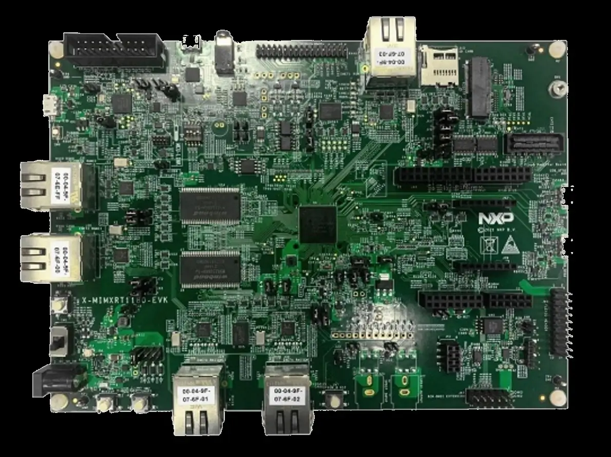

.. _mimxrt1180_evk:

NXP MIMXRT1180-EVK
##################

Overview
********

The dual core i.MX RT1180 runs on the Cortex-M33 core at 240 MHz and on the
Cortex-M7 at 792 MHz. The i.MX RT1180 MCU offers support over a wide
temperature range and is qualified for consumer, industrial and automotive
markets.

Hardware
********

- MIMXRT1189CVM8B MCU

  - 240MHz Cortex-M33 & 792Mhz Cortex-M7
  - 1.5MB SRAM with 512KB of TCM for Cortex-M7 and 256KB of TCM for Cortex-M4

- Memory

  - 512 Mbit SDRAM
  - 128 Mbit QSPI Flash
  - 512 Mbit HYPER RAM
  - TF socket for SD card

- Ethernet

  - 1000 Mbit/s Ethernet PHY

- USB

  - 2* USB 2.0 OTG connector

- Audio

  - 3.5 mm audio stereo headphone jack
  - Board-mounted microphone
  - Left and right speaker out connectors

- Power

  - 5 V DC jack

- Debug

  - JTAG 20-pin connector
  - MCU-Link with DAPLink

- Expansion port

  - Arduino interface

- CAN bus connector

For more information about the MIMXRT1180 SoC and MIMXRT1180-EVK board, see
these references:

- `i.MX RT1180 Website`_
- `MIMXRT1180-EVK Website`_

External Memory
===============

This platform has the following external memories:

+--------------------+------------+-------------------------------------+
| Device             | Controller | Status                              |
+====================+============+=====================================+
| W9825G6KH          | SEMC       | Enabled via device configuration    |
|                    |            | data block, which sets up SEMC at   |
|                    |            | boot time                           |
+--------------------+------------+-------------------------------------+
| W25Q128JWSIQ       | FLEXSPI    | Enabled via flash configurationn    |
|                    |            | block, which sets up FLEXSPI at     |
|                    |            | boot time.                          |
+--------------------+------------+-------------------------------------+

Supported Features
==================

NXP considers the MIMXRT1180-EVK as the superset board for the i.MX RT118x
family of MCUs.  This board is a focus for NXP's Full Platform Support for
Zephyr, to better enable the entire RT118x family.  NXP prioritizes enabling
this board with new support for Zephyr features.  The mimxrt1180_evk board
configuration supports the following hardware features:

+-----------+------------+-------------------------------------+
| Interface | Controller | Driver/Component                    |
+===========+============+=====================================+
| NVIC      | on-chip    | nested vector interrupt controller  |
+-----------+------------+-------------------------------------+
| SYSTICK   | on-chip    | systick                             |
+-----------+------------+-------------------------------------+
| GPIO      | on-chip    | gpio                                |
+-----------+------------+-------------------------------------+
| GPT       | on-chip    | counter                             |
+-----------+------------+-------------------------------------+
| UART      | on-chip    | serial port-polling;                |
|           |            | serial port-interrupt               |
+-----------+------------+-------------------------------------+
| I2C       | on-chip    | i2c                                 |
+-----------+------------+-------------------------------------+
| ACMP      | on-chip    | analog comparator                   |
+-----------+------------+-------------------------------------+

The default configuration can be found in the defconfig file:
:zephyr_file:`boards/nxp/mimxrt1180_evk/mimxrt1180_evk_mimxrt1189_cm33_defconfig`

Other hardware features are not currently supported by the port.

Connections and I/Os
====================

The MIMXRT1180 SoC has six pairs of pinmux/gpio controllers.

+---------------+-----------------+---------------------------+
| Name          | Function        | Usage                     |
+===============+=================+===========================+
| GPIO_AON_04   | GPIO            | SW8                       |
+---------------+-----------------+---------------------------+
| GPIO_AD_27    | GPIO            | LED                       |
+---------------+-----------------+---------------------------+
| GPIO_AON_08   | LPUART1_TX      | UART Console              |
+---------------+-----------------+---------------------------+
| GPIO_AON_09   | LPUART1_RX      | UART Console              |
+---------------+-----------------+---------------------------+

System Clock
============

The MIMXRT1180 SoC is configured to use SysTick as the system clock source,
running at 240MHz. When targeting the M7 core, SysTick will also be used,
running at 792MHz

Serial Port
===========

The MIMXRT1180 SoC has 12 UARTs. One is configured for the console and the
remaining are not used.

Programming and Debugging
*************************

Build and flash applications as usual (see :ref:`build_an_application` and
:ref:`application_run` for more details).

Configuring a Debug Probe
=========================

A debug probe is used for both flashing and debugging the board. This board is
configured by default to use the :ref:`mcu-link-cmsis-onboard-debug-probe`,
however the :ref:`pyocd-debug-host-tools` do not yet support programming the
external flashes on this board so you must reconfigure the board for one of the
following debug probes instead.

.. _Using J-Link RT1180:

Using J-Link
------------

Please ensure used JLINK above V7.94g and jumper JP5 installed if using
external jlink plus on J37 as debugger.

When debugging cm33 core, need to ensure the SW5 on "0100" mode.
When debugging cm7 core, need to ensure the SW5 on "0001" mode.
(Only support run cm7 image when debugging due to default boot core on board is cm33 core)

Install the :ref:`jlink-debug-host-tools` and make sure they are in your search
path.

There are two options: the onboard debug circuit can be updated with Segger
J-Link firmware, or :ref:`jlink-external-debug-probe` can be attached to the
EVK.

Using Linkserver
----------------

Please ensure used linkserver above V1.5.30 and jumper JP5 uninstalled.

When debugging cm33 core, need to ensure the SW5 on "0100" mode.
When debugging cm7 core, need to ensure the SW5 on "0001" mode.
(Only support run cm7 image when debugging due to default boot core on board is cm33 core)

Configuring a Console
=====================

Regardless of your choice in debug probe, we will use the MCU-Link
microcontroller as a usb-to-serial adapter for the serial console. Check that
jumpers JP5 and JP3 are **on** (they are on by default when boards ship from
the factory) to connect UART signals to the MCU-Link microcontroller.

Connect a USB cable from your PC to J53.

Use the following settings with your serial terminal of choice (minicom, putty,
etc.):

- Speed: 115200
- Data: 8 bits
- Parity: None
- Stop bits: 1

Flashing
========

Here is an example for the :ref:`hello_world` application on cm33 core.

Before power on the board, make sure SW5 is set to 0100b

.. zephyr-app-commands::
   :zephyr-app: samples/hello_world
   :board: mimxrt1180_evk/mimxrt1189/cm33
   :goals: flash

Power off the board, then power on the board and
open a serial terminal, reset the board (press the SW3 button), and you should
see the following message in the terminal:

.. code-block:: console

   ***** Booting Zephyr OS v3.7.0-xxx-xxxxxxxxxxxxx *****
   Hello World! mimxrt1180_evk/mimxrt1189/cm33

Debugging
=========

Here is an example for the :ref:`hello_world` application.

.. zephyr-app-commands::
   :zephyr-app: samples/hello_world
   :board: mimxrt1180_evk/mimxrt1189/cm33
   :goals: debug

Open a serial terminal, step through the application in your debugger, and you
should see the following message in the terminal:

.. code-block:: console

   ***** Booting Zephyr OS v3.7.0-xxx-xxxxxxxxxxxxx *****
   Hello World! mimxrt1180_evk/mimxrt1189/cm33

.. _MIMXRT1180-EVK Website:
   https://www.nxp.com/design/design-center/development-boards-and-designs/i-mx-evaluation-and-development-boards/i-mx-rt1180-evaluation-kit:MIMXRT1180-EVK

.. _i.MX RT1180 Website:
   https://www.nxp.com/products/processors-and-microcontrollers/arm-microcontrollers/i-mx-rt-crossover-mcus/i-mx-rt1180-crossover-mcu-with-tsn-switch-and-edgelock:i.MX-RT1180
