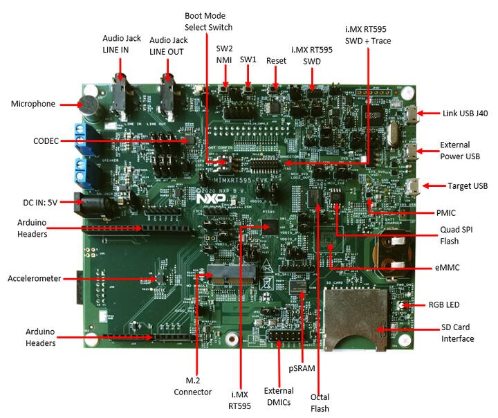

.. _mimxrt595_evk:

NXP MIMXRT595-EVK
##################

Overview
********

i.MX RT500 crossover MCUs are part of the edge computing family and are optimized
for low-power HMI applications by combining a graphics engine and a streamlined
Cadence Tensilica Fusion F1 DSP core with a next-generation Arm Cortex-M33
core. These devices are designed to unlock the potential of display-based applications
with a secure, power-optimized embedded processor.

i.MX RT500 MCUs provides up to 5MB of on-chip SRAM and several high-bandwidth interfaces
to access off-chip flash, including an Octal/Quad SPI interface with an on-the-fly
decryption engine.

Hardware
********

- MIMXRT595SFFOC Cortex-M33 (275 MHz) core processor with Cadence Tensilica Fusion F1 DSP
- Onboard, high-speed USB, Link2 debug probe with CMSIS-DAP protocol (supporting Cortex M33 debug only)
- USB2.0 high-speed host and device with micro USB connector and external crystal
- Octal/Quad/pSRAM external memories via FlexSPI
- 5 MB system SRAM
- Full size SD card slot (SDIO)
- On-board eMMC chip
- On-board 5 V inputs NXP PCA9420UK PMIC providing 1.2 V, 1.8 V, 3.3 V
- User LEDs
- Reset and User buttons
- MIPI-DSI connector
- Single row headers for ARDUINO signals and MikroBus connector
- FlexIO connector for MikroElektronica TFT Proto 5 inch capacitive touch display
- One motion sensor combo accelero-/magneto-meter NXP FXOS8700CQ
- Stereo audio codec with line-In/ line-Out/ and Microphone
- Pmod/host expansion connector
- NXP TFA9896 audio digital amplifier
- Support for up to eight off-board digital microphones via 12-pin header
- Two on-board digital microphones

For more information about the MIMXRT595 SoC and MIMXRT595-EVK board, see
these references:

- `i.MX RT595 Website`_
- `i.MX RT595 Datasheet`_
- `i.MX RT595 Reference Manual`_
- `MIMXRT595-EVK Website`_
- `MIMXRT595-EVK User Guide`_
- `MIMXRT595-EVK Schematics`_
- `MIMXRT595-EVK Debug Firmware`_

Supported Features
==================

NXP considers the MIMXRT595-EVK as a superset board for the i.MX RT5xx
family of MCUs.  This board is a focus for NXP's Full Platform Support for
Zephyr, to better enable the entire RT5xx family.  NXP prioritizes enabling
this board with new support for Zephyr features.  The mimxrt595_evk board
configuration supports the hardware features below.  Another very similar
board is the :ref:`mimxrt685_evk`, and that board may have additional features
already supported, which can also be re-used on this mimxrt595_evk board:

+-----------+------------+-------------------------------------+
| Interface | Controller | Driver/Component                    |
+===========+============+=====================================+
| NVIC      | on-chip    | nested vector interrupt controller  |
+-----------+------------+-------------------------------------+
| SYSTICK   | on-chip    | systick                             |
+-----------+------------+-------------------------------------+
| OS_TIMER  | on-chip    | os timer                            |
+-----------+------------+-------------------------------------+
| IOCON     | on-chip    | pinmux                              |
+-----------+------------+-------------------------------------+
| GPIO      | on-chip    | gpio                                |
+-----------+------------+-------------------------------------+
| USART     | on-chip    | serial port-polling;                |
|           |            | serial port-interrupt               |
+-----------+------------+-------------------------------------+
| CLOCK     | on-chip    | clock_control                       |
+-----------+------------+-------------------------------------+
| I2C       | on-chip    | i2c                                 |
+-----------+------------+-------------------------------------+
| SPI       | on-chip    | spi                                 |
+-----------+------------+-------------------------------------+
| CTIMER    | on-chip    | counter                             |
+-----------+------------+-------------------------------------+
| WDT       | on-chip    | watchdog                            |
+-----------+------------+-------------------------------------+
| FLASH     | on-chip    | OctalSPI Flash                      |
+-----------+------------+-------------------------------------+
| TRNG      | on-chip    | entropy                             |
+-----------+------------+-------------------------------------+
| USB       | on-chip    | USB device                          |
+-----------+------------+-------------------------------------+
| FLEXSPI   | on-chip    | flash programming                   |
+-----------+------------+-------------------------------------+
| RTC       | on-chip    | counter                             |
+-----------+------------+-------------------------------------+
| PM        | on-chip    | power management; uses SoC sleep,   |
|           |            | deep sleep and deep-powerdown modes |
+-----------+------------+-------------------------------------+
| SDHC      | on-chip    | disk access (works with eMMC & SD)  |
+-----------+------------+-------------------------------------+
| I2S       | on-chip    | i2s                                 |
+-----------+------------+-------------------------------------+
| DISPLAY   | on-chip    | LCDIF; MIPI-DSI. Tested with        |
|           |            | :ref:`rk055hdmipi4m`,               |
|           |            | :ref:`rk055hdmipi4ma0`, and         |
|           |            | :ref:`g1120b0mipi` display shields  |
+-----------+------------+-------------------------------------+
| DMIC      | on-chip    | dmic                                |
+-----------+------------+-------------------------------------+

The default configuration can be found in the defconfig file:

   :zephyr_file:`boards/nxp/mimxrt595_evk/mimxrt595_evk_mimxrt595s_cm33_defconfig`

Other hardware features are not currently supported by the port.

Connections and IOs
===================

The MIMXRT595 SoC has IOCON registers, which can be used to configure the
functionality of a pin.

+---------+-----------------+----------------------------+
| Name    | Function        | Usage                      |
+=========+=================+============================+
| PIO0_2  | USART0          | USART RX                   |
+---------+-----------------+----------------------------+
| PIO0_1  | USART0          | USART TX                   |
+---------+-----------------+----------------------------+
| PIO0_14 | GPIO            | GREEN LED                  |
+---------+-----------------+----------------------------+
| PIO0_25 | GPIO            | SW0                        |
+---------+-----------------+----------------------------+
| PIO0_10 | GPIO            | SW1                        |
+---------+-----------------+----------------------------+
| PIO4_30 | USART12         | USART TX                   |
+---------+-----------------+----------------------------+
| PIO4_31 | USART12         | USART RX                   |
+---------+-----------------+----------------------------+
| PIO0_29 | I2C             | I2C SCL                    |
+---------+-----------------+----------------------------+
| PIO0_30 | I2C             | I2C SDA                    |
+---------+-----------------+----------------------------+
| PIO0_22 | GPIO            | FXOS8700 TRIGGER           |
+---------+-----------------+----------------------------+
| PIO1_5  | SPI             | SPI MOSI                   |
+---------+-----------------+----------------------------+
| PIO1_4  | SPI             | SPI MISO                   |
+---------+-----------------+----------------------------+
| PIO1_3  | SPI             | SPI SCK                    |
+---------+-----------------+----------------------------+
| PIO1_6  | SPI             | SPI SSEL                   |
+---------+-----------------+----------------------------+
| PIO0_5  | SCT0            | SCT0 GPI0                  |
+---------+-----------------+----------------------------+
| PIO0_6  | SCT0            | SCT0 GPI1                  |
+---------+-----------------+----------------------------+

System Clock
============

The MIMXRT595 EVK is configured to use the OS Event timer
as a source for the system clock.

Serial Port
===========

The MIMXRT595 SoC has 13 FLEXCOMM interfaces for serial communication. One is
configured as USART for the console and the remaining are not used.

Fusion F1 DSP Core
==================

You can build a Zephyr application for the RT500 DSP core by targeting the F1
SOC. Xtensa toolchain supporting RT500 DSP core is included in Zephyr SDK.
To build the hello_world sample for the RT500 DSP core:

.. code-block:: shell

   $ west build -b mimxrt595_evk/mimxrt595s/f1 samples/hello_world

For detailed instructions on how to debug DSP firmware, please refer to
this document: `Getting Started with Xplorer for EVK-MIMXRT595`_

Programming and Debugging
*************************

Build and flash applications as usual (see :ref:`build_an_application` and
:ref:`application_run` for more details).

Configuring a Debug Probe
=========================

A debug probe is used for both flashing and debugging the board. This board is
configured by default to use the LPC-Link2.

.. tabs::

    .. group-tab:: LPCLink2 JLink Onboard

        1. Install the :ref:`jlink-debug-host-tools` and make sure they are in your search path.
        2. To connect the SWD signals to onboard debug circuit, install jumpers JP17, JP18 and JP19,
           if not already done (these jumpers are installed by default).
        3. Follow the instructions in :ref:`lpclink2-jlink-onboard-debug-probe` to program the
           J-Link firmware. Please make sure you have the latest firmware for this board.

    .. group-tab:: JLink External

        1. Install the :ref:`jlink-debug-host-tools` and make sure they are in your search path.

        2. To disconnect the SWD signals from onboard debug circuit, **remove** jumpers J17, J18,
           and J19 (these are installed by default).

        3. Connect the J-Link probe to J2 10-pin header.

        See :ref:`jlink-external-debug-probe` for more information.

    .. group-tab:: Linkserver

        1. Install the :ref:`linkserver-debug-host-tools` and make sure they are in your search path.
        2. To update the debug firmware, please follow the instructions on `MIMXRT595-EVK Debug Firmware`

Configuring a Console
=====================

Connect a USB cable from your PC to J40, and use the serial terminal of your choice
(minicom, putty, etc.) with the following settings:

- Speed: 115200
- Data: 8 bits
- Parity: None
- Stop bits: 1

Flashing
========

Here is an example for the :zephyr:code-sample:`hello_world` application. This example uses the
:ref:`jlink-debug-host-tools` as default.

.. zephyr-app-commands::
   :zephyr-app: samples/hello_world
   :board: mimxrt595_evk/mimxrt595s/cm33
   :goals: flash

Open a serial terminal, reset the board (press the RESET button), and you should
see the following message in the terminal:

.. code-block:: console

   *** Booting Zephyr OS v2.7 ***
   Hello World! mimxrt595_evk

Debugging
=========

Here is an example for the :zephyr:code-sample:`hello_world` application. This example uses the
:ref:`jlink-debug-host-tools` as default.

.. zephyr-app-commands::
   :zephyr-app: samples/hello_world
   :board: mimxrt595_evk/mimxrt595s/cm33
   :goals: debug

Open a serial terminal, step through the application in your debugger, and you
should see the following message in the terminal:

.. code-block:: console

   *** Booting Zephyr OS v2.7 ***
   Hello World! mimxrt595_evk

Troubleshooting
===============

If the debug probe fails to connect with the following error, it's possible
that the image in flash is interfering and causing this issue.

.. code-block:: console

   Remote debugging using :2331
   Remote communication error.  Target disconnected.: Connection reset by peer.
   "monitor" command not supported by this target.
   "monitor" command not supported by this target.
   You can't do that when your target is `exec'
   (gdb) Could not connect to target.
   Please check power, connection and settings.

You can fix it by erasing and reprogramming the flash with the following
steps:

#. Set the SW7 DIP switches to ON-ON-ON to prevent booting from flash.

#. Reset by pressing SW3

#. Run ``west debug`` or ``west flash`` again with a known working Zephyr
   application (example "Hello World").

#. Set the SW5 DIP switches to OFF-OFF-ON to boot from flash.

#. Reset by pressing SW3

.. _MIMXRT595-EVK Website:
   https://www.nxp.com/design/development-boards/i-mx-evaluation-and-development-boards/i-mx-rt595-evaluation-kit:MIMXRT595-EVK

.. _MIMXRT595-EVK User Guide:
   https://www.nxp.com/webapp/Download?colCode=MIMXRT595EVKHUG

.. _MIMXRT595-EVK Debug Firmware:
   https://www.nxp.com/docs/en/application-note/AN13206.pdf

.. _MIMXRT595-EVK Schematics:
   https://www.nxp.com/downloads/en/schematics/MIMXRT595-EVK-DESIGN-FILES.zip

.. _i.MX RT595 Website:
   https://www.nxp.com/products/processors-and-microcontrollers/arm-microcontrollers/i-mx-rt-crossover-mcus/i-mx-rt500-crossover-mcu-with-arm-cortex-m33-dsp-and-gpu-cores:i.MX-RT500

.. _i.MX RT595 Datasheet:
   https://www.nxp.com/docs/en/data-sheet/IMXRT500EC.pdf

.. _i.MX RT595 Reference Manual:
   https://www.nxp.com/webapp/Download?colCode=IMXRT500RM

.. _Getting Started with Xplorer for EVK-MIMXRT595:
   https://www.nxp.com/docs/en/supporting-information/GSXEVKMIMXRT595.pdf
