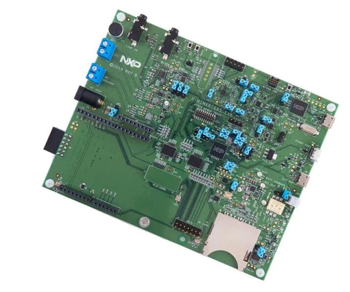

.. _mimxrt685_evk:

NXP MIMXRT685-EVK
##################

Overview
********

The i.MX RT600 is a crossover MCU family optimized for 32-bit immersive audio
playback and voice user interface applications combining a high-performance
Cadence Tensilica HiFi 4 audio DSP core with a next-generation Cortex-M33
core. The i.MX RT600 family of crossover MCUs is designed to unlock the
potential of voice-assisted end nodes with a secure, power-optimized embedded
processor.

The i.MX RT600 family provides up to 4.5MB of on-chip SRAM and several
high-bandwidth interfaces to access off-chip flash, including an Octal/Quad SPI
interface with an on-the-fly decryption engine.

Hardware
********

- MIMXRT685SFVKB Cortex-M33 (300 MHz, 128 KB TCM) core processor with Cadence Xtensa HiFi4 DSP
- Onboard, high-speed USB, Link2 debug probe with CMSIS-DAP protocol (supporting Cortex M33 debug only)
- High speed USB port with micro A/B connector for the host or device functionality
- UART, I2C and SPI port bridging from i.MX RT685 target to USB via the on-board debug probe
- 512 MB Macronix Octal SPI Flash operating at 1.8 V
- 4.5 MB Apmemory PSRAM
- Full size SD card slot (SDIO)
- NXP PCA9420UK PMIC
- User LEDs
- Reset and User buttons
- Arduino and PMod/Host expansion connectors
- NXP FXOS8700CQ accelerometer
- Stereo audio codec with line in/out and electret microphone
- Stereo NXP TFA9894 digital amplifiers, with option for external +5V power for higher performance speakers
- Support for up to eight off-board digital microphones via 12-pin header
- Two on-board DMICS

For more information about the MIMXRT685 SoC and MIMXRT685-EVK board, see
these references:

- `i.MX RT685 Website`_
- `i.MX RT685 Datasheet`_
- `i.MX RT685 Reference Manual`_
- `MIMXRT685-EVK Website`_
- `MIMXRT685-EVK User Guide`_
- `MIMXRT685-EVK Schematics`_

Supported Features
==================

NXP considers the MIMXRT685-EVK as a superset board for the i.MX RT6xx
family of MCUs.  This board is a focus for NXP's Full Platform Support for
Zephyr, to better enable the entire RT6xx family.  NXP prioritizes enabling
this board with new support for Zephyr features.  The mimxrt685_evk board
configuration supports the hardware features below.  Another very similar
board is the :ref:`mimxrt595_evk`, and that board may have additional features
already supported, which can also be re-used on this mimxrt685_evk board:

+-----------+------------+-------------------------------------+
| Interface | Controller | Driver/Component                    |
+===========+============+=====================================+
| NVIC      | on-chip    | nested vector interrupt controller  |
+-----------+------------+-------------------------------------+
| SYSTICK   | on-chip    | systick                             |
+-----------+------------+-------------------------------------+
| OS_TIMER  | on-chip    | os timer                            |
+-----------+------------+-------------------------------------+
| IOCON     | on-chip    | pinmux                              |
+-----------+------------+-------------------------------------+
| GPIO      | on-chip    | gpio                                |
+-----------+------------+-------------------------------------+
| FLASH     | on-chip    | OctalSPI Flash                      |
+-----------+------------+-------------------------------------+
| USART     | on-chip    | serial port-polling;                |
|           |            | serial port-interrupt               |
+-----------+------------+-------------------------------------+
| I2C       | on-chip    | i2c                                 |
+-----------+------------+-------------------------------------+
| SPI       | on-chip    | spi                                 |
+-----------+------------+-------------------------------------+
| I2S       | on-chip    | i2s                                 |
+-----------+------------+-------------------------------------+
| CLOCK     | on-chip    | clock_control                       |
+-----------+------------+-------------------------------------+
| HWINFO    | on-chip    | Unique device serial number         |
+-----------+------------+-------------------------------------+
| RTC       | on-chip    | counter                             |
+-----------+------------+-------------------------------------+
| PWM       | on-chip    | pwm                                 |
+-----------+------------+-------------------------------------+
| WDT       | on-chip    | watchdog                            |
+-----------+------------+-------------------------------------+
| SDHC      | on-chip    | disk access                         |
+-----------+------------+-------------------------------------+
| USB       | on-chip    | USB device                          |
+-----------+------------+-------------------------------------+
| ADC       | on-chip    | adc                                 |
+-----------+------------+-------------------------------------+
| CTIMER    | on-chip    | counter                             |
+-----------+------------+-------------------------------------+
| TRNG      | on-chip    | entropy                             |
+-----------+------------+-------------------------------------+
| FLEXSPI   | on-chip    | flash programming                   |
+-----------+------------+-------------------------------------+

The default configuration can be found in
:zephyr_file:`boards/nxp/mimxrt685_evk/mimxrt685_evk_mimxrt685s_cm33_defconfig`

Other hardware features are not currently supported by the port.

Connections and IOs
===================

The MIMXRT685 SoC has IOCON registers, which can be used to configure the
functionality of a pin.

+---------+-----------------+----------------------------+
| Name    | Function        | Usage                      |
+=========+=================+============================+
| PIO0_2  | USART           | USART RX                   |
+---------+-----------------+----------------------------+
| PIO0_1  | USART           | USART TX                   |
+---------+-----------------+----------------------------+
| PIO0_14 | GPIO            | GREEN LED                  |
+---------+-----------------+----------------------------+
| PIO1_1  | GPIO            | SW0                        |
+---------+-----------------+----------------------------+
| PIO0_17 | I2C             | I2C SDA                    |
+---------+-----------------+----------------------------+
| PIO0_18 | I2C             | I2C SCL                    |
+---------+-----------------+----------------------------+
| PIO1_5  | GPIO            | FXOS8700 TRIGGER           |
+---------+-----------------+----------------------------+
| PIO1_5  | SPI             | SPI MOSI                   |
+---------+-----------------+----------------------------+
| PIO1_4  | SPI             | SPI MISO                   |
+---------+-----------------+----------------------------+
| PIO1_3  | SPI             | SPI SCK                    |
+---------+-----------------+----------------------------+
| PIO1_6  | SPI             | SPI SSEL                   |
+---------+-----------------+----------------------------+
| PIO0_23 | I2S             | I2S DATAOUT                |
+---------+-----------------+----------------------------+
| PIO0_22 | I2S             | I2S TX WS                  |
+---------+-----------------+----------------------------+
| PIO0_21 | I2S             | I2S TX SCK                 |
+---------+-----------------+----------------------------+
| PIO0_9  | I2S             | I2S DATAIN                 |
+---------+-----------------+----------------------------+
| PIO0_29 | USART           | USART TX                   |
+---------+-----------------+----------------------------+
| PIO0_30 | USART           | USART RX                   |
+---------+-----------------+----------------------------+
| PIO1_11 | FLEXSPI0B_DATA0 | OctalSPI Flash             |
+---------+-----------------+----------------------------+
| PIO1_12 | FLEXSPI0B_DATA1 | OctalSPI Flash             |
+---------+-----------------+----------------------------+
| PIO1_13 | FLEXSPI0B_DATA2 | OctalSPI Flash             |
+---------+-----------------+----------------------------+
| PIO1_14 | FLEXSPI0B_DATA3 | OctalSPI Flash             |
+---------+-----------------+----------------------------+
| PIO1_29 | FLEXSPI0B_SCLK  | OctalSPI Flash             |
+---------+-----------------+----------------------------+
| PIO2_12 | PIO2_12         | OctalSPI Flash             |
+---------+-----------------+----------------------------+
| PIO2_17 | FLEXSPI0B_DATA4 | OctalSPI Flash             |
+---------+-----------------+----------------------------+
| PIO2_18 | FLEXSPI0B_DATA5 | OctalSPI Flash             |
+---------+-----------------+----------------------------+
| PIO2_19 | FLEXSPI0B_SS0_N | OctalSPI Flash             |
+---------+-----------------+----------------------------+
| PIO2_22 | FLEXSPI0B_DATA6 | OctalSPI Flash             |
+---------+-----------------+----------------------------+
| PIO2_23 | FLEXSPI0B_DATA7 | OctalSPI Flash             |
+---------+-----------------+----------------------------+
| PIO0_27 | SCT0_OUT7       | PWM                        |
+---------+-----------------+----------------------------+
| PIO1_30 | SD0_CLK         | SD card                    |
+---------+-----------------+----------------------------+
| PIO1_31 | SD0_CMD         | SD card                    |
+---------+-----------------+----------------------------+
| PIO2_0  | SD0_D0          | SD card                    |
+---------+-----------------+----------------------------+
| PIO2_1  | SD0_D1          | SD card                    |
+---------+-----------------+----------------------------+
| PIO2_2  | SD0_D2          | SD card                    |
+---------+-----------------+----------------------------+
| PIO2_3  | SD0_D3          | SD card                    |
+---------+-----------------+----------------------------+
| PIO2_4  | SD0_WR_PRT      | SD card                    |
+---------+-----------------+----------------------------+
| PIO2_9  | SD0_CD          | SD card                    |
+---------+-----------------+----------------------------+
| PIO2_10 | SD0_RST         | SD card                    |
+---------+-----------------+----------------------------+

System Clock
============

The MIMXRT685 EVK is configured to use the OS Event timer
as a source for the system clock.

Serial Port
===========

The MIMXRT685 SoC has 8 FLEXCOMM interfaces for serial communication. One is
configured as USART for the console and the remaining are not used.

Programming and Debugging
*************************

Build and flash applications as usual (see :ref:`build_an_application` and
:ref:`application_run` for more details).

Configuring a Debug Probe
=========================

A debug probe is used for both flashing and debugging the board. This board is
configured by default to use the LPC-Link2.

.. tabs::

    .. group-tab:: LinkServer CMSIS-DAP

        1. Install the :ref:`linkserver-debug-host-tools` and make sure they are in your
           search path.  LinkServer works with the default CMSIS-DAP firmware included in
           the on-board debugger.
        2. Make sure the jumpers JP17, JP18 and JP19 are installed.

        linkserver is the default runner for this board

        .. code-block:: console

           west flash
           west debug

    .. group-tab:: LPCLink2 JLink Onboard

        1. Install the :ref:`jlink-debug-host-tools` and make sure they are in your search path.
        2. To connect the SWD signals to onboard debug circuit, install jumpers JP17, JP18 and JP19,
           if not already done (these jumpers are installed by default).
        3. Follow the instructions in :ref:`lpclink2-jlink-onboard-debug-probe` to program the
           J-Link firmware. Please make sure you have the latest firmware for this board.

        .. code-block:: console

           west flash -r jlink
           west debug -r jlink

    .. group-tab:: JLink External

        1. Install the :ref:`jlink-debug-host-tools` and make sure they are in your search path.

        2. To disconnect the SWD signals from onboard debug circuit, **remove** jumpers J17, J18,
           and J19 (these are installed by default).

        3. Connect the J-Link probe to J2 10-pin header.

        See :ref:`jlink-external-debug-probe` for more information.

        .. code-block:: console

           west flash -r jlink
           west debug -r jlink

Configuring a Console
=====================

Connect a USB cable from your PC to J16, and use the serial terminal of your choice
(minicom, putty, etc.) with the following settings:

- Speed: 115200
- Data: 8 bits
- Parity: None
- Stop bits: 1

Flashing
========

Here is an example for the :zephyr:code-sample:`hello_world` application. This example uses the
:ref:`linkserver-debug-host-tools` as default.

.. zephyr-app-commands::
   :zephyr-app: samples/hello_world
   :board: mimxrt685_evk/mimxrt685s/cm33
   :goals: flash

Open a serial terminal, reset the board (press the RESET button), and you should
see the following message in the terminal:

.. code-block:: console

   ***** Booting Zephyr OS v1.14.0 *****
   Hello World! mimxrt685_evk

Debugging
=========

Here is an example for the :zephyr:code-sample:`hello_world` application. This example uses the
:ref:`linkserver-debug-host-tools` as default.

.. zephyr-app-commands::
   :zephyr-app: samples/hello_world
   :board: mimxrt685_evk/mimxrt685s/cm33
   :goals: debug

Open a serial terminal, step through the application in your debugger, and you
should see the following message in the terminal:

.. code-block:: console

   ***** Booting Zephyr OS zephyr-v2.3.0 *****
   Hello World! mimxrt685_evk

Troubleshooting
===============

If the debug probe fails to connect with the following error, it's possible
that the image in flash is interfering and causing this issue.

.. code-block:: console

   Remote debugging using :2331
   Remote communication error.  Target disconnected.: Connection reset by peer.
   "monitor" command not supported by this target.
   "monitor" command not supported by this target.
   You can't do that when your target is `exec'
   (gdb) Could not connect to target.
   Please check power, connection and settings.

You can fix it by erasing and reprogramming the flash with the following
steps:

#. Set the SW5 DIP switches to ON-ON-ON to prevent booting from flash.

#. Reset by pressing SW3

#. Run ``west debug`` or ``west flash`` again with a known working Zephyr
   application (example "Hello World").

#. Set the SW5 DIP switches to ON-OFF-ON to boot from flash.

#. Reset by pressing SW3

.. _MIMXRT685-EVK Website:
   https://www.nxp.com/design/development-boards/i-mx-evaluation-and-development-boards/i-mx-rt600-evaluation-kit:MIMXRT685-EVK

.. _MIMXRT685-EVK User Guide:
   https://www.nxp.com/webapp/Download?colCode=UM11159

.. _MIMXRT685-EVK Schematics:
   https://www.nxp.com/downloads/en/design-support/RT685-DESIGNFILES.zip

.. _i.MX RT685 Website:
   https://www.nxp.com/products/processors-and-microcontrollers/arm-microcontrollers/i-mx-rt-crossover-mcus/i-mx-rt600-crossover-mcu-with-arm-cortex-m33-and-dsp-cores:i.MX-RT600

.. _i.MX RT685 Datasheet:
   https://www.nxp.com/docs/en/data-sheet/RT600.pdf

.. _i.MX RT685 Reference Manual:
   https://www.nxp.com/webapp/Download?colCode=UM11147
