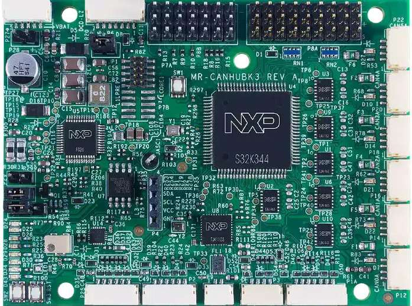

.. _mr_canhubk3:

NXP MR-CANHUBK3
###############

Overview
********

`NXP MR-CANHUBK3`_ is an evaluation board for mobile robotics applications such
as autonomous mobile robots (AMR) and automated guided vehicles (AGV). It
features an `NXP S32K344`_ general-purpose automotive microcontroller based on
an Arm Cortex-M7 core (Lock-Step).



Hardware
********

- NXP S32K344
    - Arm Cortex-M7 (Lock-Step), 160 MHz (Max.)
    - 4 MB of program flash, with ECC
    - 320 KB RAM, with ECC
    - Ethernet 100 Mbps, CAN FD, FlexIO, QSPI
    - 12-bit 1 Msps ADC, 16-bit eMIOS timer

- `NXP FS26 Safety System Basis Chip`_

- Interfaces:
    - Console UART
    - 6x CAN FD
    - 100Base-T1 Ethernet
    - JST-GH connectors and I/O headers for I2C, SPI, GPIO,
      PWM, etc.

More information about the hardware and design resources can be found at
`NXP MR-CANHUBK3`_ website.

Supported Features
==================

The ``mr_canhubk3`` board configuration supports the following hardware features:

============  ==========  ================================
Interface     Controller  Driver/Component
============  ==========  ================================
SIUL2         on-chip     | pinctrl
                          | gpio
                          | external interrupt controller
WKPU          on-chip     interrupt controller
LPUART        on-chip     serial
QSPI          on-chip     flash
FLEXCAN       on-chip     can
LPI2C         on-chip     i2c
ADC SAR       on-chip     adc
LPSPI         on-chip     spi
WDT           FS26 SBC    watchdog
EMAC          on-chip     ethernet
                          mdio
eMIOS         on-chip     pwm
EDMA          on-chip     dma
============  ==========  ================================

The default configuration can be found in the Kconfig file
:zephyr_file:`boards/nxp/mr_canhubk3/mr_canhubk3_defconfig`.

Connections and IOs
===================

Each GPIO port is divided into two banks: low bank, from pin 0 to 15, and high
bank, from pin 16 to 31. For example, ``PTA2`` is the pin 2 of ``gpioa_l`` (low
bank), and ``PTA20`` is the pin 4 of ``gpioa_h`` (high bank).

The GPIO controller provides the option to route external input pad interrupts
to either the SIUL2 EIRQ or WKPU interrupt controllers, as supported by the SoC.
By default, GPIO interrupts are routed to SIUL2 EIRQ interrupt controller,
unless they are explicity configured to be directed to the WKPU interrupt
controller, as outlined in :zephyr_file:`dts/bindings/gpio/nxp,s32-gpio.yaml`.

To find information about which GPIOs are compatible with each interrupt
controller, refer to the device reference manual.

.. note::

   It is important to highlight that the current board configuration lacks
   support for wake-up events and power-management features. WKPU functionality
   is restricted solely to serving as an interrupt controller.

LEDs
----

The MR-CANHUBK3 board has one user RGB LED:

=======================  =====  =====  ===================================
Devicetree node          Color  Pin    Pin Functions
=======================  =====  =====  ===================================
led0 / user_led1_red     Red    PTE14  FXIO D7 / EMIOS0 CH19
led1 / user_led1_green   Green  PTA27  FXIO D5 / EMIOS1 CH10 / EMIOS2 CH10
led2 / user_led1_blue    Blue   PTE12  FXIO D8 / EMIOS1 CH5
=======================  =====  =====  ===================================

In addition to the RGB LED, the MR-CANHUBK3 board has six red LEDs, each located
next to one of the CAN connectors:

=======================  =====  =====  ===================================
Devicetree node          Color  Pin    Pin Functions
=======================  =====  =====  ===================================
can_led0                 Red    PTC18  FXIO D6 / FXIO D12 / EMIOS2 CH12
can_led1                 Red    PTE5   FXIO D7 / EMIOS1 CH5 / EMIOS0 CH 19
can_led2                 Red    PTD20  EMIOS1 CH17 / EMIOS2 CH0
can_led3                 Red    PTB24  FXIO D5 / EMIOS1 CH20 / EMIOS2 CH20
can_led4                 Red    PTB26  FXIO D7 / EMIOS1 CH22 / EMIOS2 CH22
can_led5                 Red    PTD31  FXIO D6 / EMIOS2 CH22
=======================  =====  =====  ===================================

The user can control the LEDs in any way. An output of ``0`` illuminates the LED.

Buttons
-------

The MR-CANHUBK3 board has two user buttons:

=======================  =====  =====  ==============
Devicetree node          Label  Pin    Pin Functions
=======================  =====  =====  ==============
sw0 / user_button_1      SW1    PTD15  EIRQ31
sw0 / user_button_2      SW2    PTA25  EIRQ5 / WKPU34
=======================  =====  =====  ==============

System Clock
============

The Arm Cortex-M7 (Lock-Step) are configured to run at 160 MHz.

Serial Console
==============

By default, the serial console is provided through ``lpuart2`` on the 7-pin
DCD-LZ debug connector ``P6``.

=========  =====  ============
Connector  Pin    Pin Function
=========  =====  ============
P6.2       PTA9   LPUART2_TX
P6.3       PTA8   LPUART2_RX
=========  =====  ============

CAN
===

CAN is provided through FLEXCAN interface with 6 instances.

===============  =======  ===============  =============
Devicetree node  Pin      Pin Function     Bus Connector
===============  =======  ===============  =============
flexcan0         | PTA6   | PTA6_CAN0_RX   P12/P13
                 | PTA7   | PTA7_CAN0_TX
flexcan1         | PTC9   | PTC9_CAN0_RX   P14/P15
                 | PTC8   | PTC8_CAN0_TX
flexcan2         | PTE25  | PTE25_CAN0_RX  P16/P17
                 | PTE24  | PTE24_CAN0_TX
flexcan3         | PTC29  | PTC29_CAN0_RX  P18/019
                 | PTC28  | PTC28_CAN0_TX
flexcan4         | PTC31  | PTC31_CAN0_RX  P20/P21
                 | PTC30  | PTC30_CAN0_TX
flexcan5         | PTC11  | PTC11_CAN0_RX  P22/P23
                 | PTC10  | PTC10_CAN0_TX
===============  =======  ===============  =============

.. note::
   There is limitation by HAL SDK, so CAN only has support maximum 64 message buffers (MBs)
   and support maximum 32 message buffers for concurrent active instances with 8 bytes
   payload. We need to pay attention to configuration options:

   1. :kconfig:option:`CONFIG_CAN_MAX_MB` must be less or equal than the
      maximum number of message buffers that is according to the table below.

   2. :kconfig:option:`CONFIG_CAN_MAX_FILTER` must be less or equal than
      :kconfig:option:`CONFIG_CAN_MAX_MB`.

===============  ==========  ================  ================
Devicetree node  Payload     Hardware support  Software support
===============  ==========  ================  ================
flexcan0         | 8 bytes   | 96 MBs          | 64 MBs
                 | 16 bytes  | 63 MBs          | 42 MBs
                 | 32 bytes  | 36 MBs          | 24 MBs
                 | 64 bytes  | 21 MBs          | 14 MBs
flexcan1         | 8 bytes   | 64 MBs          | 64 MBs
                 | 16 bytes  | 42 MBs          | 42 MBs
                 | 32 bytes  | 24 MBs          | 24 MBs
                 | 64 bytes  | 14 MBs          | 14 MBs
flexcan2         | 8 bytes   | 64 MBs          | 64 MBs
                 | 16 bytes  | 42 MBs          | 42 MBs
                 | 32 bytes  | 24 MBs          | 24 MBs
                 | 64 bytes  | 14 MBs          | 14 MBs
flexcan3         | 8 bytes   | 32 MBs          | 32 MBs
                 | 16 bytes  | 21 MBs          | 21 MBs
                 | 32 bytes  | 12 MBs          | 12 MBs
                 | 64 bytes  | 7 MBs           | 7 MBs
flexcan4         | 8 bytes   | 32 MBs          | 32 MBs
                 | 16 bytes  | 21 MBs          | 21 MBs
                 | 32 bytes  | 12 MBs          | 12 MBs
                 | 64 bytes  | 7 MBs           | 7 MBs
flexcan5         | 8 bytes   | 32 MBs          | 32 MBs
                 | 16 bytes  | 21 MBs          | 21 MBs
                 | 32 bytes  | 12 MBs          | 12 MBs
                 | 64 bytes  | 7 MBs           | 7 MBs
===============  ==========  ================  ================

.. note::
   A CAN bus usually requires 120 Ohm termination at both ends of the bus. This may be
   accomplished using one of the included CAN termination boards. For more details, refer
   to the section ``6.3 CAN Connectors`` in the Hardware User Manual of `NXP MR-CANHUBK3`_.

I2C
===

I2C is provided through LPI2C interface with 2 instances ``lpi2c0`` and ``lpi2c1``
on corresponding connectors ``P4``, ``P3``.

=========  =====  ============
Connector  Pin    Pin Function
=========  =====  ============
P3.2       PTD9   LPI2C1_SCL
P3.3       PTD8   LPI2C1_SDA
P4.3       PTD14  LPI2C0_SCL
P4.4       PTD13  LPI2C0_SDA
=========  =====  ============

ADC
===

ADC is provided through ADC SAR controller with 3 instances. ADC channels are divided into
3 groups (precision, standard and external).

.. note::
   All channels of an instance only run on 1 group channel at the same time.

FS26 SBC Watchdog
=================

On normal operation after the board is powered on, there is a window of 256 ms
on which the FS26 watchdog must be serviced with a good token refresh, otherwise
the watchdog will signal a reset to the MCU. This board configuration enables
the FS26 watchdog driver that handles this initialization.

.. note::

   The FS26 can also be started in debug mode (watchdog disabled) following
   these steps:

   1. Power off the board.
   2. Remove the jumper ``JP1`` (pins 1-2 open), which is connected by default.
   3. Power on the board.
   4. Reconnect the jumper ``JP1`` (pins 1-2 shorted).

External Flash
==============

The on-board MX25L6433F 64M-bit multi-I/O Serial NOR Flash memory is connected
to the QSPI controller port A1. This board configuration selects it as the
default flash controller.

Ethernet
========

This board has a single instance of Ethernet Media Access Controller (EMAC)
interfacing with a `NXP TJA1103`_ 100Base-T1 Ethernet PHY. Currently, there is
limited driver for this PHY that allows for overiding the default pin strapping configuration for
the PHY (RMII, master, autonomous mode enabled, polarity correction enabled)
to slave mode.

The 100Base-T1 signals are available in connector ``P9`` and can be converted to
100Base-T using a Ethernet media converter such as `RDDRONE-T1ADAPT`_.

Programming and Debugging
*************************

Applications for the ``mr_canhubk3`` board can be built in the usual way as
documented in :ref:`build_an_application`.

This board configuration supports `Lauterbach TRACE32`_, `SEGGER J-Link`_ and `pyOCD`_
West runners for flashing and debugging applications. Follow the steps described
in :ref:`lauterbach-trace32-debug-host-tools`, :ref:`jlink-debug-host-tools` and
:ref:`pyocd-debug-host-tools`,
to setup the flash and debug host tools for these runners, respectively. The
default runner is J-Link.

Flashing
========

Run the ``west flash`` command to flash the application using SEGGER J-Link.
Alternatively, run ``west flash -r trace32`` to use Lauterbach TRACE32, or
``west flash -r pyocd``` to use pyOCD.

The Lauterbach TRACE32 runner supports additional options that can be passed
through command line:

.. code-block:: console

   west flash -r trace32 --startup-args elfFile=<elf_path> loadTo=<flash/sram>
      eraseFlash=<yes/no> verifyFlash=<yes/no>

Where:

- ``<elf_path>`` is the path to the Zephyr application ELF in the output
  directory
- ``loadTo=flash`` loads the application to the SoC internal program flash
  (:kconfig:option:`CONFIG_XIP` must be set), and ``loadTo=sram`` load the
  application to SRAM. Default is ``flash``.
- ``eraseFlash=yes`` erases the whole content of SoC internal flash before the
  application is downloaded to either Flash or SRAM. This routine takes time to
  execute. Default is ``no``.
- ``verifyFlash=yes`` verify the SoC internal flash content after programming
  (use together with ``loadTo=flash``). Default is ``no``.

For example, to erase and verify flash content:

.. code-block:: console

   west flash -r trace32 --startup-args elfFile=build/zephyr/zephyr.elf loadTo=flash eraseFlash=yes verifyFlash=yes

Debugging
=========

Run the ``west debug`` command to start a GDB session using SEGGER J-Link.
Alternatively, run ``west debug -r trace32`` or ``west debug -r pyocd``
to launch the Lauterbach TRACE32 or pyOCD software debugging interface respectively.

References
**********

.. target-notes::

.. _NXP MR-CANHUBK3:
   https://www.nxp.com/design/development-boards/automotive-development-platforms/s32k-mcu-platforms/s32k344-evaluation-board-for-mobile-robotics-incorporating-100baset1-and-six-can-fd:MR-CANHUBK344

.. _NXP S32K344:
   https://www.nxp.com/products/processors-and-microcontrollers/s32-automotive-platform/s32k-auto-general-purpose-mcus/s32k3-microcontrollers-for-automotive-general-purpose:S32K3

.. _NXP FS26 Safety System Basis Chip:
   https://www.nxp.com/products/power-management/pmics-and-sbcs/safety-sbcs/safety-system-basis-chip-with-low-power-fit-for-asil-d:FS26

.. _NXP TJA1103:
   https://www.nxp.com/products/interfaces/ethernet-/automotive-ethernet-phys/asil-b-compliant-100base-t1-ethernet-phy:TJA1103

.. _RDDRONE-T1ADAPT:
   https://www.nxp.com/products/interfaces/ethernet-/automotive-ethernet-phys/ethernet-media-converter-for-drones-rovers-mobile-robotics-and-automotive:RDDRONE-T1ADAPT

.. _Lauterbach TRACE32:
   https://www.lauterbach.com

.. _SEGGER J-Link:
   https://wiki.segger.com/NXP_S32K3xx

.. _pyOCD:
   https://pyocd.io/
