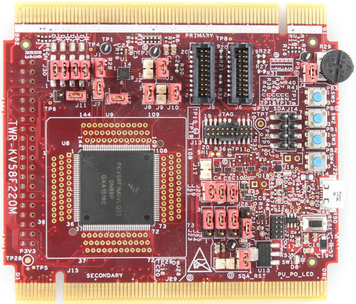

.. _twr_kv58f220m:

NXP TWR-KV58F220M
#################

Overview
********

The TWR-KV58F220M is a development board for NXP Kinetis KV5x 32-bit
MCU-based platforms. The onboard OpenSDAv2 serial and debug adapter,
running an open source bootloader, offers options for serial
communication, flash programming, and run-control debugging.

   TWR-KV58F220M (Credit: NXP)

Hardware
********

- MKV58F1M0VLQ24 MCU (up to 240 MHz, 1 MB flash memory, 256 KB RAM,
  and 144 Low profile Quad Flat Package (LQFP))
- 1.8 V or 3.3 V MCU operation
- 6-axis FXOS8700CQ digital accelerometer and magnetometer
- Four user LEDs
- Four user push-buttons
- Potentiometer
- Two general purpose TWRPI headers
- Motor pin header

For more information about the KV5x SoC and the TWR-KV58F220M board, see
these NXP reference documents:

- `KV5x Website`_
- `KV5x Datasheet`_
- `KV5x Reference Manual`_
- `TWR-KV58F220M Website`_
- `TWR-KV58F220M User Guide`_
- `TWR-KV58F220M Schematics`_

Supported Features
==================

The twr_kv58f220m board configuration supports the following hardware
features:

+-----------+------------+-------------------------------------+
| Interface | Controller | Driver/Component                    |
+===========+============+=====================================+
| NVIC      | on-chip    | nested vector interrupt controller  |
+-----------+------------+-------------------------------------+
| SYSTICK   | on-chip    | systick                             |
+-----------+------------+-------------------------------------+
| PINMUX    | on-chip    | pinmux                              |
+-----------+------------+-------------------------------------+
| GPIO      | on-chip    | gpio                                |
+-----------+------------+-------------------------------------+
| UART      | on-chip    | serial port-polling;                |
|           |            | serial port-interrupt               |
+-----------+------------+-------------------------------------+
| FLASH     | on-chip    | soc flash                           |
+-----------+------------+-------------------------------------+
| I2C       | on-chip    | i2c                                 |
+-----------+------------+-------------------------------------+
| SENSOR    | off-chip   | fxos8700 polling;                   |
|           |            | fxos8700 trigger                    |
+-----------+------------+-------------------------------------+
| SPI       | on-chip    | spi                                 |
+-----------+------------+-------------------------------------+
| ADC       | on-chip    | adc                                 |
+-----------+------------+-------------------------------------+

The default configuration can be found in the defconfig file:
:zephyr_file:`boards/nxp/twr_kv58f220m/twr_kv58f220m_defconfig`.

Other hardware features are not currently supported by the port.

System Clock
============

The KV58 SoC is configured to use the 50 MHz external oscillator on the
board with the on-chip PLL to generate a 237.5 MHz system clock.

Serial Port
===========

The KV58 SoC has six UARTs. UART0 is configured for the console. The
remaining UARTs are not used.

Accelerometer and magnetometer
==============================

The TWR-KV58F220M board by default only supports polling the FXOS8700
accelerometer and magnetometer for sensor values
(``CONFIG_FXOS8700_TRIGGER_NONE=y``).

In order to support FXOS8700 triggers (interrupts), shunts must be placed on
the jumpers ``J2`` and ``J9``. A trigger option also must be enabled in Kconfig
(either ``CONFIG_FXOS8700_TRIGGER_GLOBAL_THREAD=y`` or
``CONFIG_FXOS8700_TRIGGER_OWN_THREAD=y``).

Programming and Debugging
*************************

Build and flash applications as usual (see :ref:`build_an_application` and
:ref:`application_run` for more details).

Configuring a Debug Probe
=========================

This board integrates an OpenSDA debug probe. However, it can currently only be
used for flashing the KV58 SoC by copying the compiled firmware to the USB Mass
Storage Device. The board cannot be debugged using the OpenSDA probe, since
pyOCD does not support the target. The OpenSDA J-Link firmware (as of release
2019-06-03) also cannot be used, since the flash algorithm for the KV58 seems to
be broken at the time of writing.

An external J-Link debug probe connected to the JTAG header J13 is used to debug
the target.

Install the :ref:`jlink-debug-host-tools` and make sure they are in your search
path.

.. zephyr-app-commands::
   :zephyr-app: samples/hello_world
   :tool: all
   :board: twr_kv58f220m
   :goals: build

Configuring a Console
=====================

Even though the OpenSDA probe cannot be used for debugging, we will use it as a
USB-to-serial adapter for the serial console.

Connect a USB cable from your PC to J22.

Use the following settings with your serial terminal of choice (minicom, putty,
etc.):

- Speed: 115200
- Data: 8 bits
- Parity: None
- Stop bits: 1

Flashing
========

Here is an example for the :ref:`hello_world` application.

.. zephyr-app-commands::
   :zephyr-app: samples/hello_world
   :board: twr_kv58f220m
   :goals: flash

Open a serial terminal, reset the board (press the SW1 button), and you should
see the following message in the terminal:

.. code-block:: console

   ***** Booting Zephyr OS v1.14.0-xxx-gxxxxxxxxxxxx *****
   Hello World! twr_kv58f220m

Debugging
=========

Here is an example for the :ref:`hello_world` application.

.. zephyr-app-commands::
   :zephyr-app: samples/hello_world
   :board: twr_kv58f220m
   :goals: debug

Open a serial terminal, step through the application in your debugger, and you
should see the following message in the terminal:

.. code-block:: console

   ***** Booting Zephyr OS v1.14.0-xxx-gxxxxxxxxxxxx *****
   Hello World! twr_kv58f220m

.. _TWR-KV58F220M Website:
   https://www.nxp.com/TWR-KV58F220M

.. _TWR-KV58F220M User Guide:
   https://www.nxp.com/webapp/Download?colCode=TWRKV58F220MUG

.. _TWR-KV58F220M Schematics:
   https://www.nxp.com/webapp/Download?colCode=TWR-KV58F220M-SCH

.. _KV5x Website:
   https://www.nxp.com/products/processors-and-microcontrollers/arm-based-processors-and-mcus/general-purpose-mcus/kv-series-cortex-m4-m0-plus-m7/kinetis-kv5x-240-mhz-motor-control-and-power-conversion-ethernet-mcus-based-on-arm-cortex-m7:KV5x

.. _KV5x Datasheet:
   https://www.nxp.com/docs/en/data-sheet/KV5XP144M240.pdf

.. _KV5x Reference Manual:
   https://www.nxp.com/webapp/Download?colCode=KV5XP144M240RM
