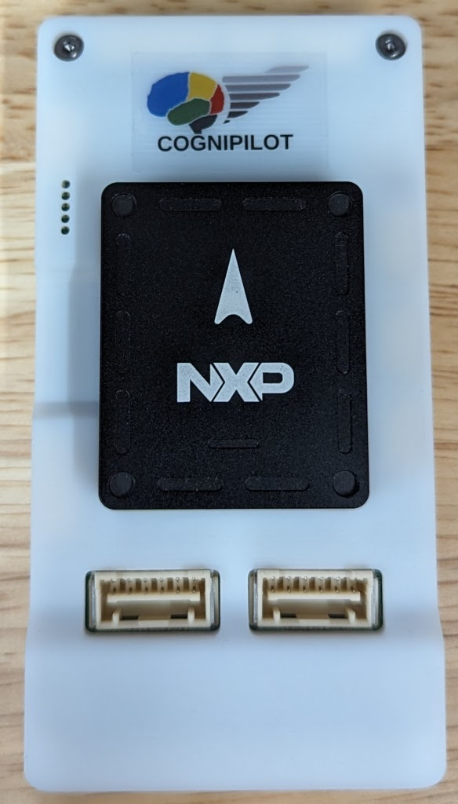

.. _VMU RT1170:

NXP VMU RT1170
##################

Overview
********

The VMU RT1170 features an i.MX RT1176 dual core MCU with the
Cortex-M7 core at 1 GHz and a Cortex-M4 at 400 MHz.
The i.MX RT1176 MCU offers support over a wide temperature range
and is qualified for consumer, industrial and automotive markets.
The VMU RT1170 is the default VMU for CogniPilot's Cerebri, a
Zephyr RTOS based Autopilot.

Hardware
********

- MIMXRT1176DVMAA MCU

  - 1GHz Cortex-M7 & 400Mhz Cortex-M4
  - 2MB SRAM with 512KB of TCM for Cortex-M7 and 256KB of TCM for Cortex-M4

- Memory

  - 512 Mbit Octal Flash
  - TF socket for SD card

- Ethernet

  - 2 wire 100BASE-T1

- USB

  - USB 2.0 connector

- Power

  - Redundant dual picoflex power ports

- Debug

  - 10 pin debug and shell adapter board to 20 Pin JTAG debugger and USB-C shell

- Sensor

  - BMI088 6-axis IMU
  - BMM150 Magnetometer
  - Dual BMP388 Barometer
  - Dual ICM-42688 6-axis IMU
  - IST8310 3-axis Magnetometer
  - U-blox NEO-M8N GNSS module

- UART JST-GH connectors

- I2C JST-GH connectors

- CAN bus JST-GH connectors

For more information about the MIMXRT1176 SoC and VMU RT1170 board, see
these references:

- `VMU RT1170 Website`_
- `VMU RT1170 User Guide`_
- `VMU RT1170 Schematics`_
- `i.MX RT1170 Datasheet`_
- `i.MX RT1170 Reference Manual`_

Supported Features
==================

VMU-RT1170 is a "Vehicle Management Unit" based on the general i.MX RT1170
family of processors. The VMU RT1170 board configuration supports the
following hardware features:

+-----------+------------+-------------------------------------+
| Interface | Controller | Driver/Component                    |
+===========+============+=====================================+
| NVIC      | on-chip    | nested vector interrupt controller  |
+-----------+------------+-------------------------------------+
| SYSTICK   | on-chip    | systick                             |
+-----------+------------+-------------------------------------+
| GPIO      | on-chip    | gpio                                |
+-----------+------------+-------------------------------------+
| COUNTER   | on-chip    | counter                             |
+-----------+------------+-------------------------------------+
| CAN       | on-chip    | flexcan                             |
+-----------+------------+-------------------------------------+
| SPI       | on-chip    | spi                                 |
+-----------+------------+-------------------------------------+
| I2C       | on-chip    | i2c                                 |
+-----------+------------+-------------------------------------+
| PWM       | on-chip    | pwm                                 |
+-----------+------------+-------------------------------------+
| ADC       | on-chip    | adc                                 |
+-----------+------------+-------------------------------------+
| UART      | on-chip    | serial port-polling;                |
|           |            | serial port-interrupt               |
+-----------+------------+-------------------------------------+
| DMA       | on-chip    | dma                                 |
+-----------+------------+-------------------------------------+
| GPT       | on-chip    | gpt                                 |
+-----------+------------+-------------------------------------+
| WATCHDOG  | on-chip    | watchdog                            |
+-----------+------------+-------------------------------------+
| ENET      | on-chip    | ethernet                            |
+-----------+------------+-------------------------------------+
| SAI       | on-chip    | i2s                                 |
+-----------+------------+-------------------------------------+
| USB       | on-chip    | USB Device                          |
+-----------+------------+-------------------------------------+
| HWINFO    | on-chip    | Unique device serial number         |
+-----------+------------+-------------------------------------+
| DISPLAY   | on-chip    | display                             |
+-----------+------------+-------------------------------------+
| ACMP      | on-chip    | analog comparator                   |
+-----------+------------+-------------------------------------+
| CAAM RNG  | on-chip    | entropy                             |
+-----------+------------+-------------------------------------+
| FLEXSPI   | on-chip    | flash programming                   |
+-----------+------------+-------------------------------------+

The default configuration can be found in
:zephyr_file:`boards/nxp/vmu_rt1170/vmu_rt1170_defconfig`

Other hardware features are not currently supported by the port.

Connections and I/Os
====================

The MIMXRT1170 SoC has six pairs of pinmux/gpio controllers.

+---------------------------+----------------+------------------+
| Name                      | Function       | Usage            |
+---------------------------+----------------+------------------+
| WAKEUP                    | GPIO           | SW7              |
+---------------------------+----------------+------------------+
| GPIO_AD_04                | GPIO           | LED              |
+---------------------------+----------------+------------------+
| GPIO_AD_24                | LPUART1_TX     | UART Console     |
+---------------------------+----------------+------------------+
| GPIO_AD_25                | LPUART1_RX     | UART Console     |
+---------------------------+----------------+------------------+
| GPIO_LPSR_00              | CAN3_TX        | flexcan          |
+---------------------------+----------------+------------------+
| GPIO_LPSR_01              | CAN3_RX        | flexcan          |
+---------------------------+----------------+------------------+
| GPIO_AD_29                | SPI1_CS0       | spi              |
+---------------------------+----------------+------------------+
| GPIO_AD_28                | SPI1_CLK       | spi              |
+---------------------------+----------------+------------------+
| GPIO_AD_30                | SPI1_SDO       | spi              |
+---------------------------+----------------+------------------+
| GPIO_AD_31                | SPI1_SDI       | spi              |
+---------------------------+----------------+------------------+
| GPIO_AD_08                | LPI2C1_SCL     | i2c              |
+---------------------------+----------------+------------------+
| GPIO_AD_09                | LPI2C1_SDA     | i2c              |
+---------------------------+----------------+------------------+
| GPIO_LPSR_05              | LPI2C5_SCL     | i2c              |
+---------------------------+----------------+------------------+
| GPIO_LPSR_04              | LPI2C5_SDA     | i2c              |
+---------------------------+----------------+------------------+
| GPIO_AD_04                | FLEXPWM1_PWM2  | pwm              |
+---------------------------+----------------+------------------+
| GPIO_AD_32                | ENET_MDC       | Ethernet         |
+---------------------------+----------------+------------------+
| GPIO_AD_33                | ENET_MDIO      | Ethernet         |
+---------------------------+----------------+------------------+
| GPIO_DISP_B2_02           | ENET_TX_DATA00 | Ethernet         |
+---------------------------+----------------+------------------+
| GPIO_DISP_B2_03           | ENET_TX_DATA01 | Ethernet         |
+---------------------------+----------------+------------------+
| GPIO_DISP_B2_04           | ENET_TX_EN     | Ethernet         |
+---------------------------+----------------+------------------+
| GPIO_DISP_B2_05           | ENET_REF_CLK   | Ethernet         |
+---------------------------+----------------+------------------+
| GPIO_DISP_B2_06           | ENET_RX_DATA00 | Ethernet         |
+---------------------------+----------------+------------------+
| GPIO_DISP_B2_07           | ENET_RX_DATA01 | Ethernet         |
+---------------------------+----------------+------------------+
| GPIO_DISP_B2_08           | ENET_RX_EN     | Ethernet         |
+---------------------------+----------------+------------------+
| GPIO_DISP_B2_09           | ENET_RX_ER     | Ethernet         |
+---------------------------+----------------+------------------+
| GPIO_AD_17_SAI1_MCLK      | SAI_MCLK       | SAI              |
+---------------------------+----------------+------------------+
| GPIO_AD_21_SAI1_TX_DATA00 | SAI1_TX_DATA   | SAI              |
+---------------------------+----------------+------------------+
| GPIO_AD_22_SAI1_TX_BCLK   | SAI1_TX_BCLK   | SAI              |
+---------------------------+----------------+------------------+
| GPIO_AD_23_SAI1_TX_SYNC   | SAI1_TX_SYNC   | SAI              |
+---------------------------+----------------+------------------+
| GPIO_AD_17_SAI1_MCLK      | SAI1_MCLK      | SAI              |
+---------------------------+----------------+------------------+
| GPIO_AD_20_SAI1_RX_DATA00 | SAI1_RX_DATA00 | SAI              |
+---------------------------+----------------+------------------+

Serial Port
===========

The MIMXRT1170 SoC has 12 UARTs.

Programming and Debugging
*************************

Build and flash applications as usual (see :ref:`build_an_application` and
:ref:`application_run` for more details).

Configuring a Debug Probe
=========================

A debug probe is used for both flashing and debugging the board.

Using J-Link
------------

Install the :ref:`jlink-debug-host-tools` and make sure they are in your search
path.

Connect the J-Link debugger through the debug adapter board.

Configuring a Console
=====================

Use the USB-C from the debug adapter board to access the console with
the following settings for your serial terminal of choice (screen, minicom, putty,
etc.):

- Speed: 115200
- Data: 8 bits
- Parity: None
- Stop bits: 1

Flashing
========

Here is an example for the :ref:`hello_world` application.

.. zephyr-app-commands::
   :zephyr-app: samples/hello_world
   :board: vmu_rt1170
   :goals: flash

You should see the following message in the terminal:

.. code-block:: console

   ***** Booting Zephyr OS v3.4.0-xxxx-xxxxxxxxxxxxx *****
   Hello World! vmu_rt1170

Debugging
=========

Here is an example for the :ref:`hello_world` application.

.. zephyr-app-commands::
   :zephyr-app: samples/hello_world
   :board: vmu_rt1170
   :goals: debug

Open a serial terminal, step through the application in your debugger, and you
should see the following message in the terminal:

.. code-block:: console

   ***** Booting Zephyr OS v3.4.0-xxxx-xxxxxxxxxxxxx *****
   Hello World! vmu_rt1170

.. _VMU RT1170 Website:
   https://www.nxp.com/part/VMU-RT1170

.. _VMU RT1170 User Guide:
   https://cognipilot.org/cerebri/boards/nxp_vmu_rt1170/

.. _VMU RT1170 Schematics:
   https://github.com/CogniPilot/NXP-VMU_RT117x-HW

.. _i.MX RT1170 Datasheet:
   https://www.nxp.com/docs/en/data-sheet/IMXRT1170CEC.pdf

.. _i.MX RT1170 Reference Manual:
   https://www.nxp.com/webapp/Download?colCode=IMXRT1170RM
