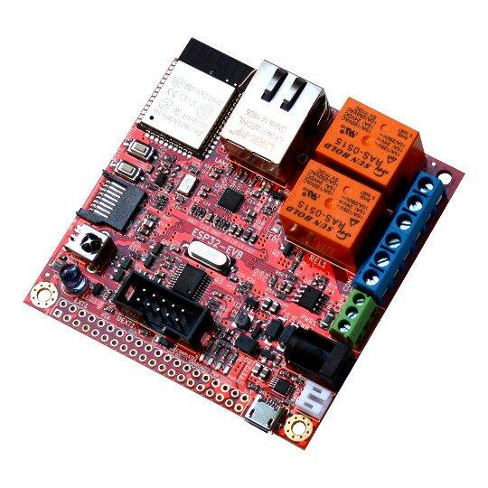

.. _olimex_esp32_evb:

Olimex ESP32-EVB
################

Overview
********

The Olimex ESP32-EVB is an OSHW certified, open-source IoT board based on the
Espressif ESP32-WROOM-32E/UE module. It has a wired 100Mbit/s Ethernet Interface,
Bluetooth LE, WiFi, infrared remote control, and CAN connectivity. Two relays
allows switching power appliances on and off.

The board can operate from a single LiPo backup battery as it has an internal
LiPo battery charger. There is no step-up converter, so relays, CAN, and USB
power does not work when running off battery.

   ESP32-EVB (Credit: Olimex)

Hardware
********

- ESP32-WROOM-32E/UE module with 4MB flash.
- On-board programmer, CH340T USB-to-UART
- WiFi, Bluetooth LE connectivity.
- 100Mbit/s Ethernet interface, Microchip LAN8710A PHY.
- MicroSD card slot.
- 2 x 10A/250VAC (15A/120VAC 15A/24VDC) relays with connectors and status LEDs.
- CAN interface, Microchip MCP2562-E high-speed CAN transceiver.
- IR receiver and transmitter, up to 5 meters distance.
- BL4054B LiPo battery charger with status LEDs for stand-alone operation during
  power outages.
- Power jack for external 5VDC power supply.
- Univeral EXTension (UEXT) connector for connecting UEXT modules.
- User push button.
- 40 pin GPIO connector with all ESP32 pins.

For more information about the ESP32-EVB and the ESP32-WROOM-32E/UE module, see
these reference documents:

- `ESP32-EVB Website`_
- `ESP32-EVB Schematic`_
- `ESP32-EVB GitHub Repository`_
- `ESP32-WROOM32-E/UE Datasheet`_

Supported Features
******************

The olimex_esp32_evb board configuration supports the following hardware
features:

+-----------+------------+-------------------------------------+
| Interface | Controller | Driver/Component                    |
+===========+============+=====================================+
| EFUSE     | on-chip    | hwinfo, device ID                   |
+-----------+------------+-------------------------------------+
| FLASH     | module     | External flash                      |
+-----------+------------+-------------------------------------+
| GPIO      | on-chip    | gpio                                |
+-----------+------------+-------------------------------------+
| I2C       | on-chip    | I2C                                 |
+-----------+------------+-------------------------------------+
| INTERRUPT | on-chip    | interrupt controller                |
+-----------+------------+-------------------------------------+
| IO_MUX    | on-chip    | pinctrl                             |
+-----------+------------+-------------------------------------+
| SPI       | on-chip    | spi                                 |
+-----------+------------+-------------------------------------+
| TIMG      | on-chip    | counter                             |
+-----------+------------+-------------------------------------+
| TRNG      | on-chip    | entropy                             |
+-----------+------------+-------------------------------------+
| TWAI      | on-chip    | CAN controller                      |
+-----------+------------+-------------------------------------+
| UART      | on-chip    | uart                                |
+-----------+------------+-------------------------------------+
| WDT       | on-chip    | watchdog                            |
+-----------+------------+-------------------------------------+
| WiFi      | on-chip    | WiFi                                |
+-----------+------------+-------------------------------------+

The default configuration can be found in
:zephyr_file:`boards/olimex/olimex_esp32_evb/olimex_esp32_evb_appcpu_defconfig`
and
:zephyr_file:`boards/olimex/olimex_esp32_evb/olimex_esp32_evb_procpu_defconfig`

Other hardware features are not currently supported by the port.

System requirements
*******************

Prerequisites
=============

Espressif HAL requires WiFi and Bluetooth binary blobs in order work. Run the command
below to retrieve those files.

.. code-block:: console

   west blobs fetch hal_espressif

.. note::

   It is recommended running the command above after :file:`west update`.

Building & Flashing
*******************

Simple boot
===========

The board could be loaded using the single binary image, without 2nd stage bootloader.
It is the default option when building the application without additional configuration.

.. note::

   Simple boot does not provide any security features nor OTA updates.

MCUboot bootloader
==================

User may choose to use MCUboot bootloader instead. In that case the bootloader
must be build (and flash) at least once.

There are two options to be used when building an application:

1. Sysbuild
2. Manual build

.. note::

   User can select the MCUboot bootloader by adding the following line
   to the board default configuration file.

   .. code:: cfg

      CONFIG_BOOTLOADER_MCUBOOT=y

Sysbuild
========

The sysbuild makes possible to build and flash all necessary images needed to
bootstrap the board with the ESP32 SoC.

To build the sample application using sysbuild use the command:

.. zephyr-app-commands::
   :tool: west
   :app: samples/hello_world
   :board: olimex_esp32_evb
   :goals: build
   :west-args: --sysbuild
   :compact:

By default, the ESP32 sysbuild creates bootloader (MCUboot) and application
images. But it can be configured to create other kind of images.

Build directory structure created by sysbuild is different from traditional
Zephyr build. Output is structured by the domain subdirectories:

.. code-block::

  build/
  ├── hello_world
  │   └── zephyr
  │       ├── zephyr.elf
  │       └── zephyr.bin
  ├── mcuboot
  │    └── zephyr
  │       ├── zephyr.elf
  │       └── zephyr.bin
  └── domains.yaml

.. note::

   With ``--sysbuild`` option the bootloader will be re-build and re-flash
   every time the pristine build is used.

For more information about the system build please read the :ref:`sysbuild` documentation.

Manual build
============

During the development cycle, it is intended to build & flash as quickly possible.
For that reason, images can be build one at a time using traditional build.

The instructions following are relevant for both manual build and sysbuild.
The only difference is the structure of the build directory.

.. note::

   Remember that bootloader (MCUboot) needs to be flash at least once.

Build and flash applications as usual (see :ref:`build_an_application` and
:ref:`application_run` for more details).

.. zephyr-app-commands::
   :zephyr-app: samples/hello_world
   :board: olimex_esp32_evb/esp32/procpu
   :goals: build

The usual ``flash`` target will work with the ``olimex_esp32_evb`` board
configuration. Here is an example for the :ref:`hello_world`
application.

.. zephyr-app-commands::
   :zephyr-app: samples/hello_world
   :board: olimex_esp32_evb/esp32/procpu
   :goals: flash

Open the serial monitor using the following command:

.. code-block:: shell

   west espressif monitor

After the board has automatically reset and booted, you should see the following
message in the monitor:

.. code-block:: console

   ***** Booting Zephyr OS vx.x.x-xxx-gxxxxxxxxxxxx *****
   Hello World! olimex_esp32_evb

Debugging
*********

As with much custom hardware, the ESP32 modules require patches to
OpenOCD that are not upstreamed yet. Espressif maintains their own fork of
the project. The custom OpenOCD can be obtained at `OpenOCD ESP32`_

The Zephyr SDK uses a bundled version of OpenOCD by default. You can overwrite that behavior by adding the
``-DOPENOCD=<path/to/bin/openocd> -DOPENOCD_DEFAULT_PATH=<path/to/openocd/share/openocd/scripts>``
parameter when building.

Here is an example for building the :ref:`hello_world` application.

.. zephyr-app-commands::
   :zephyr-app: samples/hello_world
   :board: olimex_esp32_evb/esp32/procpu
   :goals: build flash
   :gen-args: -DOPENOCD=<path/to/bin/openocd> -DOPENOCD_DEFAULT_PATH=<path/to/openocd/share/openocd/scripts>

You can debug an application in the usual way. Here is an example for the :ref:`hello_world` application.

.. zephyr-app-commands::
   :zephyr-app: samples/hello_world
   :board: olimex_esp32_evb/esp32/procpu
   :goals: debug

References
**********

.. _ESP32-EVB Website:
   https://www.olimex.com/Products/IoT/ESP32/ESP32-EVB/open-source-hardware

.. _ESP32-EVB Schematic:
   https://github.com/OLIMEX/ESP32-EVB/raw/master/HARDWARE/REV-I/ESP32-EVB_Rev_I.pdf

.. _ESP32-EVB GitHub Repository:
   https://github.com/OLIMEX/ESP32-EVB

.. _ESP32-WROOM32-E/UE Datasheet:
   https://www.espressif.com/sites/default/files/documentation/esp32-wroom-32e_esp32-wroom-32ue_datasheet_en.pdf

.. _OpenOCD ESP32:
   https://github.com/espressif/openocd-esp32/releases
