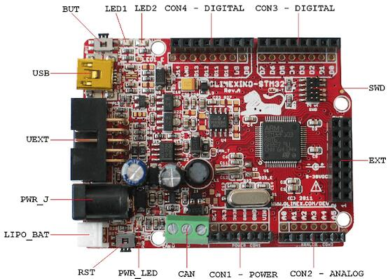

.. zephyr:board:: olimexino_stm32

Overview
********

The OLIMEXINO-STM32 board is based on the STMicroelectronics STM32F103RB ARM
Cortex-M3 CPU.

More information about the board can be found at the
`OLIMEXINO-STM32 website`_ and `OLIMEXINO-STM32 user manual`_.
The `ST STM32F103xB Datasheet`_ contains the processor's
information and the datasheet.

Supported Features
==================

The olimexino_stm32 board configuration supports the following
hardware features:

+-----------+------------+-------------------------+
| Interface | Controller | Driver/Component        |
+===========+============+=========================+
| NVIC      | on-chip    | nested vectored         |
|           |            | interrupt controller    |
+-----------+------------+-------------------------+
| SYSTICK   | on-chip    | system clock            |
+-----------+------------+-------------------------+
| UART      | on-chip    | serial port             |
+-----------+------------+-------------------------+
| GPIO      | on-chip    | gpio                    |
+-----------+------------+-------------------------+
| I2C       | on-chip    | i2c                     |
+-----------+------------+-------------------------+
| SPI       | on-chip    | spi                     |
+-----------+------------+-------------------------+
| USB       | on-chip    | USB device              |
+-----------+------------+-------------------------+
| WATCHDOG  | on-chip    | independent watchdog    |
+-----------+------------+-------------------------+
| CAN       | on-chip    | Controller Area Network |
+-----------+------------+-------------------------+

Other hardware features have not been enabled yet for this board.

Pin Mapping
===========

     OLIMEXINO-STM32 connectors

LED
---

* LED1 (green) = PA5
* LED2 (yellow) = PA1
* PWR_LED (red) = power

Push buttons
------------

* BUT = PC9 / TIM3CH4 / BOOT0
* RST = NRST

External Connectors
-------------------

SWD

+-------+--------------+-------------------------+
| PIN # | Signal Name  | STM32F103RB Functions   |
+=======+==============+=========================+
| 1     | VCC          | N/A                     |
+-------+--------------+-------------------------+
| 2     | TMS / SWDIO  | JTMS / SWDIO / PA13     |
+-------+--------------+-------------------------+
| 3     | GND          | N/A                     |
+-------+--------------+-------------------------+
| 4     | TCK / SWCLK  | JTCK / SWCLK / PA14     |
+-------+--------------+-------------------------+
| 5     | GND          | N/A                     |
+-------+--------------+-------------------------+
| 6     | TDO / SWO    | JTDO /TIM2_CH2 / PB3 /  |
|       |              | TRACESWO / SPI1_SCK     |
+-------+--------------+-------------------------+
| 7     | Cut off      | N/A                     |
+-------+--------------+-------------------------+
| 8     | TDI          | JTDI / TIM2_CH1_ETR /   |
|       |              | PA15 / SPI1_NSS         |
+-------+--------------+-------------------------+
| 9     | GND          | N/A                     |
+-------+--------------+-------------------------+
| 10    | RESET        | NRST                    |
+-------+--------------+-------------------------+

UEXT

+-------+--------------+-------------------------+
| PIN # | Signal Name  | STM32F103RB Functions   |
+=======+==============+=========================+
| 1     | VCC          | N/A                     |
+-------+--------------+-------------------------+
| 2     | GND          | N/A                     |
+-------+--------------+-------------------------+
| 3     | D7 (TXD1)    | PA9 / USART1_TX /       |
|       |              | TIM1_CH2                |
+-------+--------------+-------------------------+
| 4     | D8 (RXD1)    | PA10 / USART1_RX /      |
|       |              | TIM1_CH3                |
+-------+--------------+-------------------------+
| 5     | D29 (SCL2)   | PB10 / I2C2_SCL /       |
|       |              | USART3_TX / TIM2_CH3    |
+-------+--------------+-------------------------+
| 6     | D30 (SDA2)   | PB11 / I2C2_SDA /       |
|       |              | USART3_RX / TIM2_CH4    |
+-------+--------------+-------------------------+
| 7     | D12 (MISO1)  | PA6 / SPI1_MISO /       |
|       |              | ADC12_IN6 / TIM3_CH1 /  |
|       |              | TIM1_BKIN               |
+-------+--------------+-------------------------+
| 8     | D11 (MOSI1)  | PA7 / SPI1_MOSI /       |
|       |              | ADC12_IN7 / TIM3_CH2 /  |
|       |              | TIM1_CH1N               |
+-------+--------------+-------------------------+
| 9     | D13 (SCK /   | PA5 / SPI1_SCK /        |
|       | LED1)        | ADC12_IN5               |
+-------+--------------+-------------------------+
| 10    | UEXT_#CS     | N/A                     |
+-------+--------------+-------------------------+

EXT

+-------+--------------+-------------------------+
| PIN # | Signal Name  | STM32F103RB Functions   |
+=======+==============+=========================+
| 1     | D23_EXT      | PC15 / OSC32_OUT        |
+-------+--------------+-------------------------+
| 2     | D24 (CANTX)  | PB9 / TIM4_CH4 /        |
|       |              | I2C1_SDA / CANTX        |
+-------+--------------+-------------------------+
| 3     | D25 (MMC_CS) | PD2 / TIM3_ETR          |
+-------+--------------+-------------------------+
| 4     | D26          | PC10 / USART3_TX        |
+-------+--------------+-------------------------+
| 5     | D27          | PB0 / ADC12_IN8 /       |
|       |              | TIM3_CH3 / TIM1_CH2N    |
+-------+--------------+-------------------------+
| 6     | D28          | PB1 / ADC12_IN9 /       |
|       |              | TIM3_CH4 / TIM1_CH3N    |
+-------+--------------+-------------------------+
| 7     | D29 (SCL2)   | PB10 / I2C2_SCL /       |
|       |              | USART3_TX / TIM2_CH3    |
+-------+--------------+-------------------------+
| 8     | D30 (SDA2)   | PB11 / I2C2_SDA /       |
|       |              | USART3_RX / TIM2_CH4    |
+-------+--------------+-------------------------+
| 9     | D31 (#SS2)   | PB12 / SPI2_NSS /       |
|       |              | I2C2_SMBAI / USART3_CK /|
|       |              | TIM1_BKIN               |
+-------+--------------+-------------------------+
| 10    | D32 (SCK2)   | PB13 / SPI2_SCK/        |
|       |              | USART3_CTS / TIM1_CH1N  |
+-------+--------------+-------------------------+
| 11    | D33 (MISO2)  | PB14 / SPI2_MISO /      |
|       |              | USART3_RTS / TIM1_CH2N  |
+-------+--------------+-------------------------+
| 12    | D34 (MOSI2)  | PB15 / SPI2_MOSI /      |
|       |              | TIM1_CH3N               |
+-------+--------------+-------------------------+
| 13    | D35          | PC6 / TIM3_CH1          |
+-------+--------------+-------------------------+
| 14    | D36          | PC7 / TIM3_CH2          |
+-------+--------------+-------------------------+
| 15    | D37          | PC8 / TIM3_CH3          |
+-------+--------------+-------------------------+
| 16    | GND          | N/A                     |
+-------+--------------+-------------------------+

Arduino Headers
---------------

CON1 power

+-------+--------------+-------------------------+
| PIN # | Signal Name  | STM32F103RB Functions   |
+=======+==============+=========================+
| 1     | RESET        | NRST                    |
+-------+--------------+-------------------------+
| 2     | VCC (3V3)    | N/A                     |
+-------+--------------+-------------------------+
| 3     | VDD (3V3A)   | N/A                     |
+-------+--------------+-------------------------+
| 4     | GND          | N/A                     |
+-------+--------------+-------------------------+
| 5     | GND          | N/A                     |
+-------+--------------+-------------------------+
| 6     | VIN          | N/A                     |
+-------+--------------+-------------------------+

CON2 analog

+-------+--------------+-------------------------+
| PIN # | Signal Name  | STM32F103RB Functions   |
+=======+==============+=========================+
| 1     | D15 (A0)     | PC0 / ADC12_IN10        |
+-------+--------------+-------------------------+
| 2     | D16 (A1)     | PC1 / ADC12_IN11        |
+-------+--------------+-------------------------+
| 3     | D17 (A2)     | PC2 / ADC12_IN12        |
+-------+--------------+-------------------------+
| 4     | D18 (A3)     | PC3 / ADC12_IN13        |
+-------+--------------+-------------------------+
| 5     | D19 (A4)     | PC4 / ADC12_IN14        |
+-------+--------------+-------------------------+
| 6     | D20 (A5)     | PC5 / ADC12_IN15        |
+-------+--------------+-------------------------+

CON3 digital

+-------+--------------+-------------------------+
| PIN # | Signal Name  | STM32F103RB Functions   |
+=======+==============+=========================+
| 1     | D0 (RXD2)    | PA3 / USART2_RX /       |
|       |              | ADC12_IN3 / TIM2_CH4    |
+-------+--------------+-------------------------+
| 2     | D1 (TXD2)    | PA2 / USART2_TX /       |
|       |              | ADC12_IN2 / TIM2_CH3    |
+-------+--------------+-------------------------+
| 3     | D2           | PA0 / WKUP /            |
|       |              | USART2_CTS / ADC12_IN0 /|
|       |              | TIM2_CH1                |
+-------+--------------+-------------------------+
| 4     | D3 (LED2)    | PA1 / USART2_RTS /      |
|       |              | ADC12_IN1 / TIM2_CH2    |
+-------+--------------+-------------------------+
| 5     | D4           | PB5 / I2C1_SMBAI /      |
|       |              | TIM3_CH2 / SPI1_MOSI    |
+-------+--------------+-------------------------+
| 6     | D5           | PB6 / I2C1_SCL /        |
|       |              | TIM4_CH1 / USART1_TX    |
+-------+--------------+-------------------------+
| 7     | D6           | PA8 / USART1_CK /       |
|       |              | TIM1_CH1 / MCO          |
+-------+--------------+-------------------------+
| 8     | D7 (TXD1)    | PA9 / USART1_TX /       |
|       |              | TIM1_CH2                |
+-------+--------------+-------------------------+

CON4 digital

+-------+--------------+-------------------------+
| PIN # | Signal Name  | STM32F103RB Functions   |
+=======+==============+=========================+
| 1     | D8 (RXD1)    | PA10 / USART1_RX /      |
|       |              | TIM1_CH3                |
+-------+--------------+-------------------------+
| 2     | D9           | PB7 / I2C1_SDA /        |
|       |              | TIM4_CH2 / USART1_RX    |
+-------+--------------+-------------------------+
| 3     | D10 (#SS1)   | PA4 / SPI1_NSS /        |
|       |              | USART2_CK / ADC12_IN4   |
+-------+--------------+-------------------------+
| 4     | D11 (MOSI1)  | PA7 / SPI1_MOSI /       |
|       |              | ADC12_IN7 / TIM3_CH2 /  |
|       |              | TIM1_CH1N               |
+-------+--------------+-------------------------+
| 5     | D12 (MISO1)  | PA6 / SPI1_MISO /       |
|       |              | ADC12_IN6 / TIM3_CH1 /  |
|       |              | TIM1_BKIN               |
+-------+--------------+-------------------------+
| 6     | D13 (SCK1 /  | PA5 / SPI1_SCK /        |
|       | LED1)        | ADC12_IN5               |
+-------+--------------+-------------------------+
| 7     | GND          | N/A                     |
+-------+--------------+-------------------------+
| 8     | D14 (CANRX)  | PB8 / TIM4_CH3 /        |
|       |              | I2C1_SCL / CANRX        |
+-------+--------------+-------------------------+

CAN

+-------+-------------+
| PIN # | Signal Name |
+=======+=============+
| 1     | GND         |
+-------+-------------+
| 2     | CAN L       |
+-------+-------------+
| 3     | CAN H       |
+-------+-------------+

System Clock
============

OLIMEXINO-STM32 has two external oscillators. The frequency of
the slow clock is 32.768 kHz. The frequency of the main clock
is 8 MHz. The processor can setup HSE to drive the master clock,
which can be set as high as 72 MHz.

Serial Port
===========

OLIMEXINO-STM32 board has up to 3 U(S)ARTs. The Zephyr console output is
assigned to USART1. Default settings are 115200 8N1.

SPI
===

OLIMEXINO-STM32 board has up to 2 SPIs. The default SPI mapping for Zephyr is:

- SPI1_NSS  : PA4
- SPI1_SCK  : PA5
- SPI1_MISO : PA6
- SPI1_MOSI : PA7

I2C
===

The OLIMEXINO-STM32 board supports two I2C devices. The default I2C mapping for
Zephyr is:

- I2C1_SCL : PB6
- I2C1_SDA : PB7
- I2C2_SCL : PB10
- I2C2_SDA : PB11

USB
===

OLIMEXINO-STM32 board has a USB 2.0 full-speed device interface available
through its mini USB connector.

- USB_DM : PA11
- USB_DP : PA12

CAN
===

OLIMEXINO-STM32 board has a CAN interface with transceiver on board.
CAN is accessible through a screw terminal.

- CAN_RX : PB8
- CAN_TX : PB9

Jumpers
=======

The Zephyr kernel uses the OLIMEXINO-STM32 default jumper
settings. Note that all jumpers on the board are SMD type.
You will need to solder, unsolder, or cut them in order to
reconfigure them.

The default jumper settings for the OLIMEXIMO-STM32E are:

+---------------+------------+---------------+
| Jumper Name   | Open       | Close         |
+===============+============+===============+
|  LED1_E       |            |      x        |
+---------------+------------+---------------+
|  LED2_E       |            |      x        |
+---------------+------------+---------------+
|  D23_E        |     x      |               |
+---------------+------------+---------------+
|  R-T          |     x      |               |
+---------------+------------+---------------+
|  P10_E        |            |      x        |
+---------------+------------+---------------+

+---------------+------------+---------------+
| Jumper Name   | D10        | D4            |
+===============+============+===============+
|  D10/D4       |            |      x        |
+---------------+------------+---------------+

Flashing Zephyr onto OLIMEXINO-STM32
************************************

Flashing the Zephyr kernel onto OLIMEXINO-STM32 requires the
`stm32flash tool`_.

Building stm32flash command line tool
=====================================

To build the stm32flash tool, follow the steps below:

#. Checkout the stm32flash tool's code from the repository.

  .. code-block:: console

     $ git clone http://git.code.sf.net/p/stm32flash/code stm32flash
     $ cd stm32flash

#. Build the stm32flash tool.

  .. code-block:: console

     $ make

#. The resulting binary is available at :file:`stm32flash`.

Flashing an Application to OLIMEXINO-STM32
==========================================

To upload an application to the OLIMEXINO-STM32 board a TTL(3.3V)
serial adapter is required. This tutorial uses the
:zephyr:code-sample:`button` sample application.

#. Connect the serial cable to the UEXT lines of the UART
   interface (pin #3=TX and pin #4=RX).

#. Power the OLIMEXINO-STM32 via the mini USB.

#. Reset the board while holding the button (BUT).

#. To build the application and flash it, enter:

   .. zephyr-app-commands::
      :zephyr-app: samples/basic/button
      :board: olimexino_stm32
      :goals: flash

#. Run your favorite terminal program to listen for output.

   .. code-block:: console

      $ minicom -D /dev/ttyUSB0 -b 115200

   The :code:`-b` option sets baud rate ignoring the value
   from config.

#. Press the Reset button and you should see the output of
   button application in your terminal. The state of the BUT
   button's GPIO line is monitored and printed to the serial
   console. When the input button gets pressed, the interrupt
   handler prints information about this event along with its
   timestamp.

.. note::
   Make sure your terminal program is closed before flashing
   the binary image, or it will interfere with the flashing
   process.

.. _OLIMEXINO-STM32 website:
   https://www.olimex.com/Products/Duino/STM32/OLIMEXINO-STM32/

.. _OLIMEXINO-STM32 user manual:
   https://www.olimex.com/Products/Duino/STM32/OLIMEXINO-STM32/resources/OLIMEXINO-STM32.pdf

.. _ST STM32F103xB Datasheet:
   https://www.st.com/resource/en/datasheet/stm32f103tb.pdf

.. _stm32flash tool:
   https://sourceforge.net/p/stm32flash/wiki/Home/
