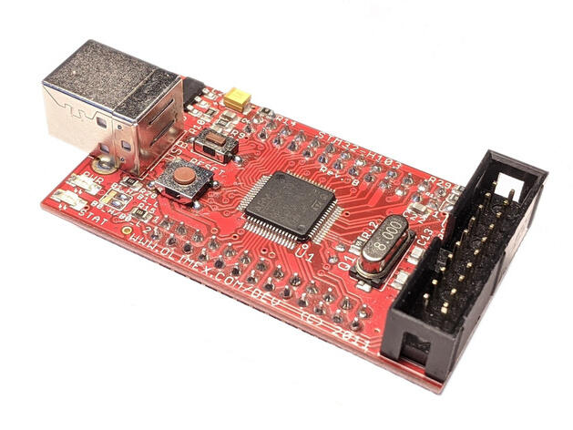
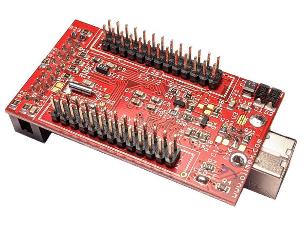

.. _olimex_stm32_h103:

OLIMEX-STM32-H103
#################

Overview
********

The OLIMEX-STM32-H103 is a simple development board based on the
STMicroelectronics STM32F103RBT6 ARM Cortex-M3 CPU, with all the MCU pins
populated and accessible through two male 26-pin connectors.

   OLIMEX-STM32-H103

Hardware
********

Information about the board can be found at the
`OLIMEX-STM32-H103 website`_ and `OLIMEX-STM32-H103 user manual`_.
The `OLIMEX-STM32-H103 schematic`_ is also available.

The `ST STM32F103RB Datasheet`_ contains the processor's
information and the datasheet.

Supported Features
==================

The OLIMEX STM32-H103 supports the following hardware features:

+-----------+------------+----------------------+
| Interface | Controller | Driver/Component     |
+===========+============+======================+
| NVIC      | on-chip    | nested vectored      |
|           |            | interrupt controller |
+-----------+------------+----------------------+
| SYSTICK   | on-chip    | system clock         |
+-----------+------------+----------------------+
| UART      | on-chip    | serial port          |
+-----------+------------+----------------------+
| GPIO      | on-chip    | gpio                 |
+-----------+------------+----------------------+
| I2C       | on-chip    | i2c                  |
+-----------+------------+----------------------+
| PWM       | on-chip    | pwm                  |
+-----------+------------+----------------------+
| SPI       | on-chip    | spi                  |
+-----------+------------+----------------------+
| USB       | on-chip    | USB device           |
+-----------+------------+----------------------+
| ADC       | on-chip    | adc                  |
+-----------+------------+----------------------+

Other hardware features have not been enabled yet for this board.

Connections and IOs
===================

System Clock
------------

The on-board 8 MHz crystal is used to produce a 72 MHz system clock with PLL.

Zephyr Console
--------------

UART2 is used as Zephyr's console. Default settings are 115200 8N1.

On-Board LEDs
-------------

The board has one on-board green LED that is connected to PC12, which
is active low.

There is also a red power LED neither connected nor controlled by the MCU.

On-Board Button
---------------

The board has one user button connected to PA0.

USB
---

USB is not enabled by default.

PC4 can be configured as a GPIO input to detect power on the USB port. It is
possible to disconnect it by desoldering the appropriate pad in the PCB.

PC11 can be used to disconnect the pull-up resistor on the USB-DP line by
setting it high.

External Connectors
-------------------

JTAG/SWD debug

+-------+----------------------+-------+--------------+
| PIN # | Signal Name          | PIN # | Signal Name  |
+=======+======================+=======+==============+
| 1     | TVCC +3.3V           | 2     | TVCC 3.3V    |
+-------+----------------------+-------+--------------+
| 3     | PB4 / TRST           | 4     | GND          |
+-------+----------------------+-------+--------------+
| 5     | PA15 / TDI           | 6     | GND          |
+-------+----------------------+-------+--------------+
| 7     | PA13 / TMS / SWDIO   | 8     | GND          |
+-------+----------------------+-------+--------------+
| 9     | PA14 / TCK / SWCLK   | 10    | GND          |
+-------+----------------------+-------+--------------+
| 11    | NC                   | 12    | GND          |
+-------+----------------------+-------+--------------+
| 13    | PB3 / TDO            | 14    | GND          |
+-------+----------------------+-------+--------------+
| 15    | RST                  | 16    | GND          |
+-------+----------------------+-------+--------------+
| 17    | NC                   | 18    | GND          |
+-------+----------------------+-------+--------------+
| 19    | NC                   | 20    | GND          |
+-------+----------------------+-------+--------------+

EXTENSION 1

+-------+-----------------------+-------+-----------------------+
| PIN # | Name / STM32F103 Port | PIN # | Name / STM32F103 Port |
+=======+=======================+=======+=======================+
| 1     | PA11 / **USB_DM**     | 2     | PA8                   |
+-------+-----------------------+-------+-----------------------+
| 3     | PA12 / **USB_DP**     | 4     | PA9                   |
+-------+-----------------------+-------+-----------------------+
| 5     | +3.3V                 | 6     | GND                   |
+-------+-----------------------+-------+-----------------------+
| 7     | PA10                  | 8     | PC10                  |
+-------+-----------------------+-------+-----------------------+
| 9     | PC11 / **USB_DISC**   | 10    | PC12 / **LED**        |
+-------+-----------------------+-------+-----------------------+
| 11    | PD2                   | 12    | PB5                   |
+-------+-----------------------+-------+-----------------------+
| 13    | PB6                   | 14    | PA6                   |
+-------+-----------------------+-------+-----------------------+
| 15    | PB7                   | 16    | PB8                   |
+-------+-----------------------+-------+-----------------------+
| 17    | PB9                   | 18    | PA5                   |
+-------+-----------------------+-------+-----------------------+
| 19    | PC0                   | 20    | PC1                   |
+-------+-----------------------+-------+-----------------------+
| 21    | PB0                   | 22    | PA7                   |
+-------+-----------------------+-------+-----------------------+
| 23    | VBAT                  | 24    | PC13                  |
+-------+-----------------------+-------+-----------------------+
| 25    | RST                   | 26    | PB1                   |
+-------+-----------------------+-------+-----------------------+

EXTENSION 2

+-------+------------------------+-------+-----------------------+
| PIN # | Name / STM32F103 Port  | PIN # | Name / STM32F103 Port |
+=======+========================+=======+=======================+
| 1     | VDDA                   | 2     | PC2                   |
+-------+------------------------+-------+-----------------------+
| 3     | GNDA                   | 4     | PA0 / **BUTTON**      |
+-------+------------------------+-------+-----------------------+
| 5     | +3.3V                  | 6     | GND                   |
+-------+------------------------+-------+-----------------------+
| 7     | PA2 / **USART2_TX**    | 8     | PA1                   |
+-------+------------------------+-------+-----------------------+
| 9     | PC3                    | 10    | PA3 / **USART2_RX**   |
+-------+------------------------+-------+-----------------------+
| 11    | PA4                    | 12    | PC4 / **USB_POWER**   |
+-------+------------------------+-------+-----------------------+
| 13    | PC5                    | 14    | PB10                  |
+-------+------------------------+-------+-----------------------+
| 15    | P11                    | 16    | PB13                  |
+-------+------------------------+-------+-----------------------+
| 17    | PB12                   | 18    | PB14                  |
+-------+------------------------+-------+-----------------------+
| 19    | PB15                   | 20    | PC6                   |
+-------+------------------------+-------+-----------------------+
| 21    | PC7                    | 22    | PC8                   |
+-------+------------------------+-------+-----------------------+
| 23    | +5V USB                | 24    | PC9                   |
+-------+------------------------+-------+-----------------------+
| 25    | GND                    | 26    | VIN                   |
+-------+------------------------+-------+-----------------------+

Programming and Debugging
*************************

This board does not include any embedded debug tool interface, instead you
will have to use an external probe connected to the available 20-pin JTAG
connector to program and debug the board. Both JTAG and SWD are supported.

By default when using ``west debug`` ST-Link will be used with OpenOCD's
SWD transport, but it is also possible to use JTAG with the Olimex ARM-USB-OCD-H
probe, for instance. For the latter, you should replace the file ``openocd.cfg``
by ``openocd_olimex_jtag.cfg``, located in the board's support directory.

The ``blackmagicprobe`` can also be used to program the device.

Flashing
========

Here is an example for the :zephyr:code-sample:`button` application.

.. zephyr-app-commands::
   :zephyr-app: samples/basic/button
   :board: olimex_stm32_h103
   :goals: build flash

Debugging
=========

You can debug an application in the usual way.  Here is an example for the
:zephyr:code-sample:`hello_world` application.

.. zephyr-app-commands::
   :zephyr-app: samples/hello_world
   :board: olimex_stm32_h103
   :maybe-skip-config:
   :goals: debug

References
**********

- `OLIMEX-STM32-H103 website`_
- `OLIMEX-STM32-H103 user manual`_
- `OLIMEX-STM32-H103 schematic`_

.. _OLIMEX-STM32-H103 website:
   https://www.olimex.com/Products/ARM/ST/STM32-H103/

.. _OLIMEX-STM32-H103 user manual:
   https://www.olimex.com/Products/ARM/ST/STM32-H103/resources/STM32-H103.pdf

.. _OLIMEX-STM32-H103 schematic:
   https://www.olimex.com/Products/ARM/ST/STM32-H405/resources/STM32-H405_sch.pdf

.. _ST STM32F103RB Datasheet:
   https://www.st.com/resource/en/datasheet/stm32f103rb.pdf

.. _STM32f103RB:
   https://www.st.com/en/microcontrollers-microprocessors/stm32f103rb.html
