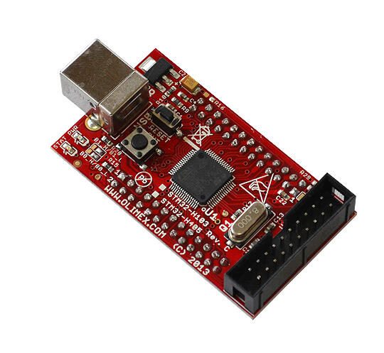
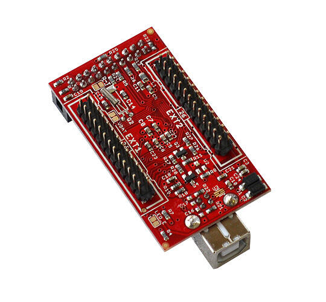

.. _olimex_stm32_h405:

OLIMEX-STM32-H405
#################

Overview
********

The OLIMEX-STM32-H405 board is based on the STMicroelectronics STM32F405RG ARM
Cortex-M4 CPU.

     OLIMEX-STM32-H405 top

     OLIMEX-STM32-H405 bottom

Hardware
********

Information about the board can be found at the
`OLIMEX-STM32-H405 website`_ and `OLIMEX-STM32-H405 user manual`_.
The `ST STM32F405RG Datasheet`_ contains the processor's
information and the datasheet.

Supported Features
==================

The olimex_stm32_h405 board configuration supports the following
hardware features:

+-----------+------------+-------------------------+
| Interface | Controller | Driver/Component        |
+===========+============+=========================+
| NVIC      | on-chip    | nested vectored         |
|           |            | interrupt controller    |
+-----------+------------+-------------------------+
| SYSTICK   | on-chip    | system clock            |
+-----------+------------+-------------------------+
| UART      | on-chip    | serial port             |
+-----------+------------+-------------------------+
| GPIO      | on-chip    | gpio                    |
+-----------+------------+-------------------------+
| USB       | on-chip    | USB device              |
+-----------+------------+-------------------------+
| WATCHDOG  | on-chip    | independent watchdog    |
+-----------+------------+-------------------------+
| COUNTER   | on-chip    | rtc                     |
+-----------+------------+-------------------------+
| RNG       | on-chip    | random number generator |
+-----------+------------+-------------------------+

Other hardware features have not been enabled yet for this board.

Pin Mapping
===========

LED
---

* USER_LED (green) = PC12
* PWR_LED (red) = power

Push buttons
------------

* USER_BUTTON = PA0
* RST = NRST

External Connectors
-------------------

JTAG debug

+-------+--------------+-------+--------------+
| PIN # | Signal Name  | Pin # | Signal Name  |
+=======+==============+=======+==============+
| 1     | +3.3V        | 2     | +3.3V        |
+-------+--------------+-------+--------------+
| 3     | PB4 / TRST   | 4     | GND          |
+-------+--------------+-------+--------------+
| 5     | PA15 / TDI   | 6     | GND          |
+-------+--------------+-------+--------------+
| 7     | PA13 / TMS   | 8     | GND          |
+-------+--------------+-------+--------------+
| 9     | PA14 / TCK   | 10    | GND          |
+-------+--------------+-------+--------------+
| 11    | GND          | 12    | GND          |
+-------+--------------+-------+--------------+
| 13    | PB3 / TDO    | 14    | GND          |
+-------+--------------+-------+--------------+
| 15    | GND          | 16    | GND          |
+-------+--------------+-------+--------------+
| 17    | RST          | 18    | GND          |
+-------+--------------+-------+--------------+
| 19    | GND          | 20    | GND          |
+-------+--------------+-------+--------------+

USB Type B

+-------+------------------+
| PIN # | Signal Name      |
+=======+==================+
| 1     | +5V_USB          |
+-------+------------------+
| 2     | PA11 / USBDM     |
+-------+------------------+
| 3     | PA12 / USBDP     |
+-------+------------------+
| 4     | GND              |
+-------+------------------+

EXT1 header

+-------+------------------+-------+------------------+
| PIN # | Signal Name      | Pin # | Signal Name      |
+=======+==================+=======+==================+
| 1     |                  | 2     |                  |
+-------+------------------+-------+------------------+
| ...   | ...              | ...   | ...              |
+-------+------------------+-------+------------------+
| 9     | PC11 (USB DISC)  | 10    | PC12 (LED)       |
+-------+------------------+-------+------------------+
| ...   | ...              | ...   | ...              |
+-------+------------------+-------+------------------+
| 25    |                  | 26    |                  |
+-------+------------------+-------+------------------+

EXT2 header

+-------+------------------+-------+------------------+
| PIN # | Signal Name      | Pin # | Signal Name      |
+=======+==================+=======+==================+
| 1     |                  | 2     |                  |
+-------+------------------+-------+------------------+
| ...   | ...              | ...   | ...              |
+-------+------------------+-------+------------------+
| 5     |                  | 6     | GND              |
+-------+------------------+-------+------------------+
| 7     | PA2 / USART2_TX  | 8     |                  |
+-------+------------------+-------+------------------+
| 9     |                  | 10    | PA3 / USART2_RX  |
+-------+------------------+-------+------------------+
| ...   | ...              | ...   | ...              |
+-------+------------------+-------+------------------+
| 25    |                  | 26    |                  |
+-------+------------------+-------+------------------+

System Clock
============

OLIMEX-STM32-H405 has two external oscillators. The frequency of
the slow clock is 32.768 kHz. The frequency of the main clock
is 8 MHz. The processor can setup HSE to drive the master clock,
which can be set as high as 168 MHz.

Programming and Debugging
*************************
The OLIMEX-STM32-H405 board does not include an embedded debug tool
interface. You will need to use ST tools or an external JTAG probe.
In the following examples a ST-Link V2 USB dongle is used.

Flashing an application to the Olimex-STM32-H405
================================================

The sample application :ref:`hello_world` is being used in this tutorial.

Connect the ST-Link USB dongle to your host computer and to the JTAG port of
the OLIMEX-STM32-H405 board.

Now build and flash the application.

.. zephyr-app-commands::
   :zephyr-app: samples/hello_world
   :board: olimex_stm32_h405
   :goals: build flash

Run a serial host program to connect with your board:

.. code-block:: console

   $ minicom -D /dev/ttyACM0

After resetting the board, you should see the following message:

.. code-block:: console

   *** Booting Zephyr OS build v2.7.99-3008-g2341052abe7c  ***
   Hello World! olimex_stm32_h405

Debugging
=========

You can debug an application in the usual way. Here is an example for the
:ref:`hello_world` application.

.. zephyr-app-commands::
   :zephyr-app: samples/hello_world
   :board: olimex_stm32_h405
   :maybe-skip-config:
   :goals: debug

.. _OLIMEX-STM32-H405 website:
   https://www.olimex.com/Products/ARM/ST/STM32-H405/

.. _OLIMEX-STM32-H405 user manual:
   https://www.olimex.com/Products/ARM/ST/STM32-H405/resources/STM32-H405_UM.pdf

.. _ST STM32F405RG Datasheet:
   https://www.st.com/resource/en/reference_manual/dm00031020.pdf
