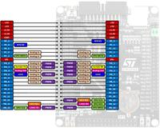
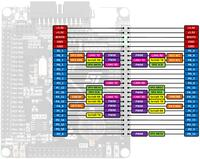
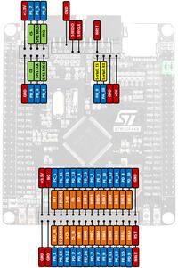

.. zephyr:board:: black_f407ve

Overview
********

The BLACK_F407VE board features an ARM Cortex-M4 based STM32F407xx MCU
with a wide range of connectivity support and configurations. There are
multiple version of this board like ``black_f407ve``.
Here are some highlights of the BLACK_F407VE board:

- STM32 microcontroller in LQFP100 package
- Extension header for all LQFP100 I/Os for quick connection to prototyping
  board and easy probing
- Flexible board power supply:

       - USB VBUS or external source (3.3V, 5V)
       - Power management access point

- Three LEDs:

       - 3.3 V power on (LD0)
       - Two user LEDs: green (LD1), green (LD2)

- Four push-buttons: RESET, K0, K1 and WK_UP
- Mini-AB connector

See also board descriptions at `STM32-base website`_,
`STM32F407VET6 black board`_ and `MCUDev Black STM32F407VET6`_

.. warning:: The +5V pins on this board are directly connected to the +5V pin
	     of the USB connector. There is no protection in place. Do not
	     power this board through USB and an external power supply at
	     the same time.

Hardware
********

BLACK_F407VE board provides the following hardware components:

- STM32F407VET6 in LQFP100 package
- ARM |reg| 32-bit Cortex |reg| -M4 CPU with FPU
- 168 MHz max CPU frequency
- VDD from 1.8 V to 3.6 V
- 8MHz system crystal
- 32.768KHz RTC crystal
- JTAG/SWD header
- 512 kB Flash
- 192+4 KB SRAM including 64-Kbyte of core coupled memory
- GPIO with external interrupt capability
- 3x12-bit ADC with 24 channels
- 2x12-bit D/A converters
- RTC battery CR1220
- Advanced-control Timer (2)
- General Purpose Timers (12)
- Watchdog Timers (2)
- USART (3), UART (2)
- I2C (3)
- I2S (2)
- SPI (3)
- SDIO (1)
- CAN (2)
- USB 2.0 OTG FS with on-chip PHY
- USB 2.0 OTG HS/FS with dedicated DMA, on-chip full-speed PHY and ULPI
- 10/100 Ethernet MAC with dedicated DMA
- CRC calculation unit
- True random number generator
- DMA Controller
- Micro SD
- 1x 10/100 Ethernet MAC
- 1x 8 to 12-bit Parallel Camera interface
- Micro USB for power and comms
- 2x jumpers for bootloader selection
- 2x16 FMSC LCD Interface
- NRF24L01 socket
- Dimensions: 85.1mm x 72.45mm

More information about STM32F407VE SOC can be found here:
       - `STM32F407VE on www.st.com`_

Supported Features
==================

The Zephyr black_f407ve board configuration supports the following hardware
features:

+-----------+------------+-------------------------------------+
| Interface | Controller | Driver/Component                    |
+===========+============+=====================================+
| NVIC      | on-chip    | nested vector interrupt controller  |
+-----------+------------+-------------------------------------+
| UART      | on-chip    | serial port-polling;                |
|           |            | serial port-interrupt               |
+-----------+------------+-------------------------------------+
| PINMUX    | on-chip    | pinmux                              |
+-----------+------------+-------------------------------------+
| GPIO      | on-chip    | gpio                                |
+-----------+------------+-------------------------------------+
| PWM       | on-chip    | pwm                                 |
+-----------+------------+-------------------------------------+
| USB       | on-chip    | usb                                 |
+-----------+------------+-------------------------------------+
| CAN       | on-chip    | CAN controller                      |
+-----------+------------+-------------------------------------+
| SPI       | on-chip    | spi                                 |
+-----------+------------+-------------------------------------+

.. note:: CAN feature requires CAN transceiver.
	  Zephyr default configuration uses CAN_2 exclusively, as
	  simultaneous use of CAN_1 and CAN_2 is not yet supported.

Other hardware features are not yet supported on Zephyr porting.

The default configuration can be found in
:zephyr_file:`boards/others/black_f407ve/black_f407ve_defconfig`

Pin Mapping
===========

BLACK_F407VE has 5 GPIO controllers. These controllers are responsible for pin
muxing, input/output, pull-up, etc.

Default Zephyr Peripheral Mapping:
----------------------------------

.. rst-class:: rst-columns

- UART_1_TX : PA9
- UART_1_RX : PA10
- UART_2_TX : PA2
- UART_2_RX : PA3
- USER_PB : PA0
- LD3 : PD13
- LD4 : PD12
- LD5 : PD14
- LD6 : PD15
- USB DM : PA11
- USB DP : PA12
- CAN1_RX : PD0
- CAN1_TX : PD1
- CAN2_RX : PB12
- CAN2_TX : PB13
- SPI1 MISO : PB4
- SPI1 MOSI : PB5
- SPI1 SCK : PB3
- SPI1 Flash CS : PB0
- SPI2 MISO : PC2
- SPI2 MOSI : PC3
- SPI2 SCK : PB10

System Clock
============

BLACK_F407VE System Clock could be driven by internal or external oscillator,
as well as main PLL clock. By default System clock is driven by PLL clock
at 168MHz, driven by 8MHz high speed external clock.

Serial Port
===========

BLACK_F407VE has up to 6 UARTs. The Zephyr console output is assigned to UART1.
Default settings are 115200 8N1.
Please note that ST-Link Virtual Com Port is not wired to chip serial port.
In order to enable console output you should use a serial cable and connect
it to UART1 pins (PA9/PA10).

Programming and Debugging
*************************

Applications for the ``black_f407ve`` board configuration can be built and
flashed in the usual way (see :ref:`build_an_application` and
:ref:`application_run` for more details).

Flashing
========

BLACK_F407VE board includes an ST-LINK/V2 embedded debug tool interface.
This interface is supported by the openocd version included in Zephyr SDK.

Flashing an application to BLACK_F407VE
---------------------------------------

Here is an example for the :zephyr:code-sample:`blinky` application.

Run a serial host program to connect with your board:

.. code-block:: console

   $ minicom -D /dev/ttyACM0

Build and flash the application:

.. zephyr-app-commands::
   :zephyr-app: samples/basic/blinky
   :board: black_f407ve
   :goals: build flash

You should see user led "LD1" blinking.

Debugging
=========

You can debug an application in the usual way.  Here is an example for the
:zephyr:code-sample:`hello_world` application.

.. zephyr-app-commands::
   :zephyr-app: samples/hello_world
   :board: black_f407ve
   :maybe-skip-config:
   :goals: debug

.. _STM32-base website:
   https://stm32-base.org/boards/STM32F407VET6-STM32-F4VE-V2.0.html

.. _STM32F407VE on www.st.com:
   https://www.st.com/en/microcontrollers/stm32f407ve.html

.. _STM32F407VET6 black board:
   https://os.mbed.com/users/hudakz/code/STM32F407VET6_Hello/

.. _MCUDev Black STM32F407VET6:
   https://github.com/mcauser/BLACK_F407VE
