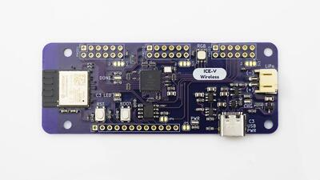
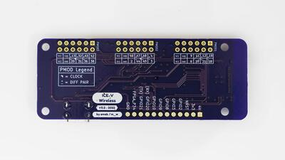
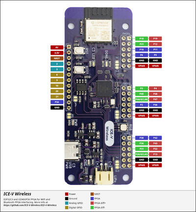

.. _icev_wireless:

ICE-V Wireless
##############

Overview
********

The ICE-V Wireless is a combined ESP32C3 and iCE40 FPGA board.

See the `ICE-V Wireless Github Project`_ for details.

   ICE-V Wireless

Hardware
********

This board combines an Espressif ESP32-C3-MINI-1 (which includes 4MB of flash in the module) with a
Lattice iCE40UP5k-SG48 FPGA to allow WiFi and Bluetooth control of the FPGA. ESP32 and FPGA I/O is
mostly uncommitted except for the pins used for SPI communication between ESP32 and FPGA. Several
of the ESP32C3 GPIO pins are available for additonal interfaces such as serial, ADC, I2C, etc.

For details on ESP32-C3 hardware please refer to the following resources:

* `ESP32-C3-MINI-1 Datasheet`_
* `ESP32-C3 Datasheet`_
* `ESP32-C3 Technical Reference Manual`_

For details on iCE40 hardware please refer to the following resources:

* `iCE40 UltraPlus Family Datasheet`_

Supported Features
==================

The ICE-V Wireless board configuration supports the following hardware
features:

+-----------+------------+------------------+
| Interface | Controller | Driver/Component |
+===========+============+==================+
| PMP       | on-chip    | arch/riscv       |
+-----------+------------+------------------+
| INTMTRX   | on-chip    | intc_esp32c3     |
+-----------+------------+------------------+
| PINMUX    | on-chip    | pinctrl_esp32    |
+-----------+------------+------------------+
| USB UART  | on-chip    | serial_esp32_usb |
+-----------+------------+------------------+
| GPIO      | on-chip    | gpio_esp32       |
+-----------+------------+------------------+
| UART      | on-chip    | uart_esp32       |
+-----------+------------+------------------+
| I2C       | on-chip    | i2c_esp32        |
+-----------+------------+------------------+
| SPI       | on-chip    | spi_esp32_spim   |
+-----------+------------+------------------+
| ADC       | on-chip    |                  |
+-----------+------------+------------------+

Other hardware features have not been enabled yet for this board.

Connections and IOs
===================

The ICE-V Wireless provides 1 row of reference, ESP32-C3, and iCE40 signals
brought out to J3, as well as 3 PMOD connectors for interfacing directly to
the iCE40 FPGA. Note that several of the iCE40 pins brought out to the PMOD
connectors are capable of operating as differential pairs.

   ICE-V Wireless (Back)

The J3 pins are 4V, 3.3V, NRST, GPIO2, GPIO3, GPIO8, GPIO9, GPIO10, GPIO20,
GPIO21, FPGA_P34, and GND. Note that GPIO2 and GPIO3 may be configured for
ADC operation.

For PMOD details, please refer to the `PMOD Specification`_ and the image
below.

Programming and Debugging
*************************

Programming and debugging for the ICE-V Wireless ESP32-C3 target is
incredibly easy 🎉 following the steps below.

Building and Flashing
*********************

Simple boot
===========

The board could be loaded using the single binary image, without 2nd stage bootloader.
It is the default option when building the application without additional configuration.

.. note::

   Simple boot does not provide any security features nor OTA updates.

MCUboot bootloader
==================

User may choose to use MCUboot bootloader instead. In that case the bootloader
must be built (and flashed) at least once.

There are two options to be used when building an application:

1. Sysbuild
2. Manual build

.. note::

   User can select the MCUboot bootloader by adding the following line
   to the board default configuration file.

   .. code:: cfg

      CONFIG_BOOTLOADER_MCUBOOT=y

Sysbuild
========

The sysbuild makes possible to build and flash all necessary images needed to
bootstrap the board with the ESP32 SoC.

To build the sample application using sysbuild use the command:

.. zephyr-app-commands::
   :tool: west
   :zephyr-app: samples/hello_world
   :board: icev_wireless
   :goals: build
   :west-args: --sysbuild
   :compact:

By default, the ESP32 sysbuild creates bootloader (MCUboot) and application
images. But it can be configured to create other kind of images.

Build directory structure created by sysbuild is different from traditional
Zephyr build. Output is structured by the domain subdirectories:

.. code-block::

  build/
  ├── hello_world
  │   └── zephyr
  │       ├── zephyr.elf
  │       └── zephyr.bin
  ├── mcuboot
  │    └── zephyr
  │       ├── zephyr.elf
  │       └── zephyr.bin
  └── domains.yaml

.. note::

   With ``--sysbuild`` option the bootloader will be re-build and re-flash
   every time the pristine build is used.

For more information about the system build please read the :ref:`sysbuild` documentation.

Manual build
============

During the development cycle, it is intended to build & flash as quickly possible.
For that reason, images can be built one at a time using traditional build.

The instructions following are relevant for both manual build and sysbuild.
The only difference is the structure of the build directory.

.. note::

   Remember that bootloader (MCUboot) needs to be flash at least once.

For the :code:`Hello, world!` application, follow the instructions below.

.. zephyr-app-commands::
   :zephyr-app: samples/hello_world
   :board: icev_wireless
   :goals: build flash

Open the serial monitor using the following command:

.. code-block:: console

   $ west espressif monitor

After the board has automatically reset and booted, you should see the following
message in the monitor:

.. code-block:: console

   ***** Booting Zephyr OS vx.x.x-xxx-gxxxxxxxxxxxx *****
   Hello World! icev_wireless

Debugging
*********

As with much custom hardware, the ESP32C3 modules require patches to
OpenOCD that are not upstreamed. Espressif maintains their own fork of
the project. The custom OpenOCD can be obtained by running the following extension:

.. code-block:: console

   west espressif install

.. note::

   By default, the OpenOCD will be downloaded and installed under $HOME/.espressif/tools/zephyr directory
   (%USERPROFILE%/.espressif/tools/zephyr on Windows).

The Zephyr SDK uses a bundled version of OpenOCD by default. You can overwrite that behavior by adding the
``-DOPENOCD=<path/to/bin/openocd> -DOPENOCD_DEFAULT_PATH=<path/to/openocd/share/openocd/scripts>``
parameter when building.

Here is an example for building the :zephyr:code-sample:`hello_world` application.

.. zephyr-app-commands::
   :zephyr-app: samples/hello_world
   :board: icev_wireless
   :goals: build flash
   :gen-args: -DOPENOCD=<path/to/bin/openocd> -DOPENOCD_DEFAULT_PATH=<path/to/openocd/share/openocd/scripts>

You can debug an application in the usual way. Here is an example for the
:zephyr:code-sample:`hello_world` application.

.. zephyr-app-commands::
   :zephyr-app: samples/hello_world
   :board: icev_wireless
   :maybe-skip-config:
   :goals: debug

References
**********

.. _ICE-V Wireless Github Project:
   https://github.com/ICE-V-Wireless/ICE-V-Wireless

.. _ESP32-C3-MINI-1 Datasheet:
   https://www.espressif.com/sites/default/files/documentation/esp32-c3-mini-1_datasheet_en.pdf

.. _ESP32-C3 Datasheet:
   https://www.espressif.com/sites/default/files/documentation/esp32-c3_datasheet_en.pdf

.. _ESP32-C3 Technical Reference Manual:
   https://www.espressif.com/sites/default/files/documentation/esp32-c3_technical_reference_manual_en.pdf

.. _iCE40 UltraPlus Family Datasheet:
   https://www.latticesemi.com/-/media/LatticeSemi/Documents/DataSheets/iCE/iCE40-UltraPlus-Family-Data-Sheet.ashx

.. _PMOD Specification:
   https://digilent.com/reference/_media/reference/pmod/pmod-interface-specification-1_2_0.pdf
