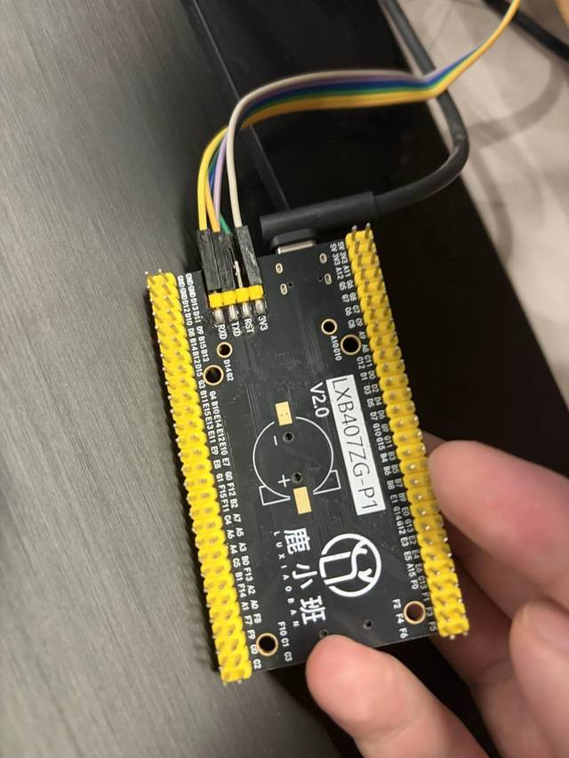

.. zephyr:board:: lxb407zgt6_p1

Overview
********

The LXB 407ZGT6-P1 is a low-cost core board based on the STM32F407ZGT6 MCU,
targeting embedded education and prototyping. It features an ARM Cortex-M4
core running at up to 168 MHz in a LQFP144 package.

The board is sold by LXB (鹿小班), an embedded education company, and is
available from Chinese marketplaces, e.g. `Taobao`_.

Here are some highlights of the LXB 407ZGT6-P1 board:

- STM32F407ZGT6 microcontroller in LQFP144 package
- Extension headers exposing all LQFP144 I/Os for easy prototyping
- Flexible power supply: USB VBUS or external 5 V
- One user LED (PC13, active low)
- One user button (PA15, active low, pull-up)
- SWD debug interface (PA13/PA14)
- USB OTG FS interface

Hardware
********

The LXB 407ZGT6-P1 board provides the following hardware components:

- STM32F407ZGT6 in LQFP144 package
- ARM 32-bit Cortex-M4 CPU with FPU
- 168 MHz max CPU frequency
- 8 MHz system crystal (HSE)
- 32.768 kHz RTC crystal (LSE)
- 1024 kB Flash
- 192 kB SRAM (128 kB SRAM + 64 kB CCM)
- One user LED
- One user button
- SWD debug header
- USART (6)
- I2C (3)
- SPI (3)
- SDIO (1)
- CAN (2)
- USB 2.0 OTG FS with on-chip PHY

More information about the STM32F407ZG SoC can be found here:

- `STM32F407ZG on www.st.com`_

Supported Features
==================

.. zephyr:board-supported-hw::

Pin Mapping
===========

The LXB 407ZGT6-P1 has 7 GPIO controllers. These controllers are responsible
for pin muxing, input/output, pull-up, etc.

Default Zephyr Peripheral Mapping:
----------------------------------

.. rst-class:: rst-columns

- UART_1_TX : PA9
- UART_1_RX : PA10
- USER_LED : PC13
- USER_BTN : PA15
- USB DM : PA11
- USB DP : PA12
- SDIO D0 : PC8
- SDIO D1 : PC9
- SDIO D2 : PC10
- SDIO D3 : PC11
- SDIO CK : PC12
- SDIO CMD : PD2

System Clock
============

The LXB 407ZGT6-P1 system clock can be driven by an internal or external
oscillator, as well as the main PLL clock. By default the system clock is
driven by the PLL clock at 168 MHz, sourced from the 8 MHz high-speed
external crystal (HSE).

Serial Port
===========

The LXB 407ZGT6-P1 has up to 6 UARTs. The Zephyr console output is assigned to
USART1. Default settings are 115200 8N1.

Programming and Debugging
*************************

.. zephyr:board-supported-runners::

Applications for the ``lxb407zgt6_p1`` board configuration can be built and
flashed in the usual way (see :ref:`build_an_application` and
:ref:`application_run` for more details).

Flashing
========

The board supports ST-Link, J-Link and DAP-Link probes through the SWD
interface.

Flashing an application to LXB 407ZGT6-P1
------------------------------------------

Here is an example for the :zephyr:code-sample:`blinky` application.

Build and flash the application:

.. zephyr-app-commands::
   :zephyr-app: samples/basic/blinky
   :board: lxb407zgt6_p1
   :goals: build flash

You should see the user LED blinking.

Debugging
=========

You can debug an application in the usual way. Here is an example for the
:zephyr:code-sample:`hello_world` application.

.. zephyr-app-commands::
   :zephyr-app: samples/hello_world
   :board: lxb407zgt6_p1
   :maybe-skip-config:
   :goals: debug

.. _STM32F407ZG on www.st.com:
   https://www.st.com/en/microcontrollers-microprocessors/stm32f407zg.html

.. _Taobao:
   https://e.tb.cn/h.8Q0sF81jEFlauSF
