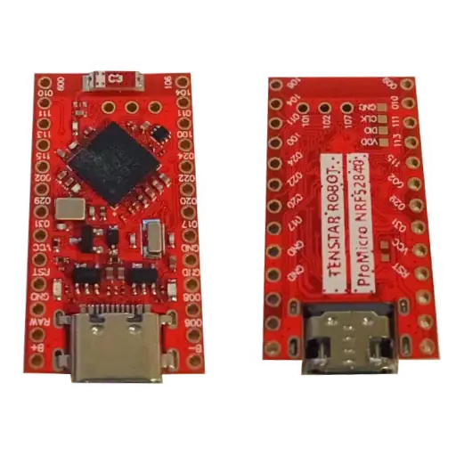

.. _promicro_nrf52840_nrf52840:

Pro Micro nRF52840
##################

More of a board type than a unique board, It is based on Nice!Nano.
Also referred to as Pro Micro, Promicro, SuperMini nRF52840 boards.

Overview
********

The hardware provides support for the Nordic
Semiconductor nRF52840 ARM Cortex-M4F CPU and the following devices:

* :abbr:`ADC (Analog to Digital Converter)`
* CLOCK
* FLASH
* :abbr:`GPIO (General Purpose Input Output)`
* :abbr:`I2C (Inter-Integrated Circuit)`
* :abbr:`MPU (Memory Protection Unit)`
* :abbr:`NVIC (Nested Vectored Interrupt Controller)`
* :abbr:`PWM (Pulse Width Modulation)`
* RADIO (Bluetooth Low Energy and 802.15.4)
* :abbr:`RTC (nRF RTC System Clock)`
* :abbr:`SPI (Serial Peripheral Interface)`
* :abbr:`UART (Universal asynchronous receiver-transmitter)`
* :abbr:`USB (Universal Serial Bus)`
* :abbr:`WDT (Watchdog Timer)`

     Tenstar Pro Micro nRF5284

More information about the original board can be found at the
`Nice!Nano website`_.

Information about clones can be found at `Clone Wiki`_.

Pinout and Schematic are available in the `Nice!Nano Documentation`_

Supported Features
==================

The ``promicro_nrf52840/nrf52840`` board target supports the following
hardware features:

+-----------+------------+----------------------+
| Interface | Controller | Driver/Component     |
+===========+============+======================+
| ADC       | on-chip    | adc                  |
+-----------+------------+----------------------+
| CLOCK     | on-chip    | clock_control        |
+-----------+------------+----------------------+
| FLASH     | on-chip    | flash                |
+-----------+------------+----------------------+
| GPIO      | on-chip    | gpio                 |
+-----------+------------+----------------------+
| I2C(M)    | on-chip    | i2c                  |
+-----------+------------+----------------------+
| MPU       | on-chip    | arch/arm             |
+-----------+------------+----------------------+
| NVIC      | on-chip    | arch/arm             |
+-----------+------------+----------------------+
| PWM       | on-chip    | pwm                  |
+-----------+------------+----------------------+
| RADIO     | on-chip    | Bluetooth,           |
|           |            | ieee802154           |
+-----------+------------+----------------------+
| RTC       | on-chip    | system clock         |
+-----------+------------+----------------------+
| SPI(M/S)  | on-chip    | spi                  |
+-----------+------------+----------------------+
| UART      | on-chip    | serial               |
+-----------+------------+----------------------+
| USB       | on-chip    | usb                  |
+-----------+------------+----------------------+
| WDT       | on-chip    | watchdog             |
+-----------+------------+----------------------+

Connections and IOs
===================

LED
---

* LED0   = P0.15, can be any color.

Programming and Debugging
*************************

Applications for the ``promicro_nrf52840/nrf52840`` board target can be
built in the usual way (see :ref:`build_an_application` for more details).

Flashing
========

The board is factory-programmed with Adafruit's UF2 booloader

#. Reset the board into the bootloader by bridging ground and RST 2 times
quickly

   The status LED should start a fade pattern, signalling the bootloader is
   running.

#. Compile a Zephyr application; we'll use :zephyr:code-sample:`blinky`.

   .. zephyr-app-commands::
      :app: zephyr/samples/basic/blinky
      :board: promicro_nrf52840/nrf52840/uf2
      :goals: build

#. Flash it onto the board. You may need to mount the device.

   .. code-block:: console

      west flash

   When this command exits, observe the red LED on the board blinking,

Debugging
=========

You may debug this board using the broken out pads on the back.
PyOCD and openOCD can be used to flash and debug this board.

Recovery
========

In case of a error resulting in a board's bootloader becoming inaccessible,
it is possible to flash anything directly using openOCD:

#. Setup OpenOCD correctly, here for WCH linkE in ARM mode:

   .. code-block:: console

      openocd -f interface/cmsis-dap.cfg -f target/nrf52.cfg

Note interface and target folders are from openOCD's tcl folder.

#. Connect to openOCD, for example with telnet or GDB:

   .. code-block:: console

      telnet localhost 4444

   .. code-block:: console

      target extended-remote localhost:3333

#. Erase flash:

   .. code-block:: console

      reset halt
      nrf5 mass_erase

or

   .. code-block:: console

      mon reset halt
      mon nrf5 mass_erase

#. Flash Bootloader

   .. code-block:: console

      flash write_image erase nice_nano_bootloader-0.9.2_s140_6.1.1.hex

or

   .. code-block:: console

      mon flash write_image erase nice_nano_bootloader-0.9.2_s140_6.1.1.hex

References
**********

.. target-notes::

.. _Nice!Nano website:
   https://nicekeyboards.com/docs/nice-nano/
.. _Clone Wiki:
   https://github.com/joric/nrfmicro/wiki/Alternatives
.. _Nice!Nano Documentation:
    https://nicekeyboards.com/docs/nice-nano/pinout-schematic
