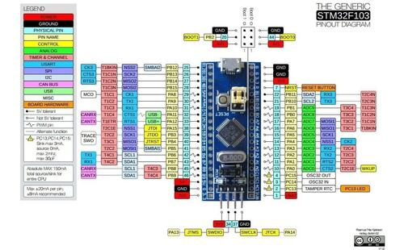

.. zephyr:board:: stm32_min_dev

Overview
********

The STM32 Minimum Development Board, is a popular and inexpensive
breadboard-friendly breakout board for the `STM32F103x8`_ CPU. There
are two variants of the board:

- Blue Pill Board
- Black Pill Board

Zephyr applications can use the stm32_min_dev@blue or stm32_min_dev@black board
configuration to use these boards.

As the name suggests, these boards have the bare minimum components required to
power on the CPU. For practical use, you'll need to add additional components
and circuits using a breadboard, for example.

Pin Mapping
===========

This port is a starting point for your own customizations and not a complete
port for a specific board. Most of the GPIOs on the STM32 SoC has been exposed
in the external header with silk screen labels that match the SoC's pin names.

Each board vendor has their own variations in pin mapping on their boards'
external connectors and placement of components. Many vendors use port PC13/PB12
for connecting an LED, so only this device is supported by our Zephyr port.
Additional device support is left for the user to implement.

More information on hooking up peripherals and lengthy how to articles can be
found at `EmbedJournal`_.

The pinout diagram of STM32 Minimum Development Blue Pill board can be seen
below. The Black Pill's one is similar:

     Pinout for STM32 Minimum Development Blue Pill Board

STLinkV2 connection:
====================

The board can be flashed by using STLinkV2 with the following connections.

+--------+---------------+
| Pin    | STLINKv2      |
+========+===============+
| G      | GND           |
+--------+---------------+
| CLK    | Clock         |
+--------+---------------+
| IO     | SW IO         |
+--------+---------------+
| V3     | VCC           |
+--------+---------------+

Boot Configuration
==================

The boot configuration for this board is configured through jumpers on B0 (Boot 0)
and B1 (Boot 1). The pins B0 and B1 are present in between logic 0 and 1 lines. The
silk screen on the PCB reads BX- or BX+ to indicate 0 and 1 logic lines for B0 and B1
respectively.

+--------+--------+-------------------+---------------------------------------------+
| Boot 1 | Boot 0 | Boot Mode         | Aliasing                                    |
+========+========+===================+=============================================+
| X      | 0      | Main Flash Memory | Main flash memory is selected as boot space |
+--------+--------+-------------------+---------------------------------------------+
| 0      | 1      | System Memory     | System memory is selected as boot space     |
+--------+--------+-------------------+---------------------------------------------+
| 1      | 1      | Embedded SRAM     | Embedded SRAM is selected as boot space     |
+--------+--------+-------------------+---------------------------------------------+

Supported Features
==================

.. zephyr:board-supported-hw::

Connections and IOs
===================

Default Zephyr Peripheral Mapping:
----------------------------------

- UART_1 TX/RX: PA9/PA10
- UART_2 TX/RX: PA2/PA3
- UART_3 TX/RX: PB10/PB11
- I2C_1 SCL/SDA : PB6/PB7
- I2C_2 SCL/SDA : PB10/PB11
- PWM_1_CH1: PA8
- SPI_1 NSS_OE/SCK/MISO/MOSI: PA4/PA5/PA6/PA7
- SPI_2 NSS_OE/SCK/MISO/MOSI: PB12/PB13/PB14/PB15
- USB_DC DM/DP: PA11/PA12
- ADC_1: PA0

System Clock
------------

The on-board 8Mhz crystal is used to produce a 72Mhz system clock with PLL.

Serial Port
-----------

STM32 Minimum Development Board has 3 U(S)ARTs. The Zephyr console output is
assigned to UART_1. Default settings are 115200 8N1.

On-Board LEDs
-------------

The board has one on-board LED that is connected to PB12/PC13 on the black/blue
variants respectively.

Programming and Debugging
*************************

Applications for the ``stm32_min_dev@(blue|black)`` board configuration can be
built and flashed in the usual way (see :ref:`build_an_application` and
:ref:`application_run` for more details).

Flashing
========

Here is an example for the :zephyr:code-sample:`blinky` application.

.. zephyr-app-commands::
   :zephyr-app: samples/basic/blinky
   :board: stm32_min_dev
   :goals: build flash

Debugging
=========

You can debug an application in the usual way.  Here is an example for the
:zephyr:code-sample:`hello_world` application.

.. zephyr-app-commands::
   :zephyr-app: samples/hello_world
   :board: stm32_min_dev
   :maybe-skip-config:
   :goals: debug

.. _STM32F103x8:
        https://www.st.com/resource/en/datasheet/stm32f103c8.pdf
.. _EmbedJournal:
        https://embedjournal.com/tag/stm32-min-dev/
