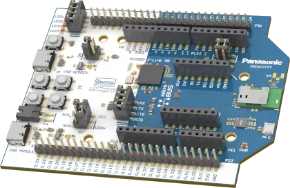

.. _pan1783_evb:

PAN1783, PAN1783A and PAN1783A-PA Evaluation Boards
###################################################

Overview
********

The PAN1783, PAN1783A and PAN1783A-PA Evaluation Boards (pan1783_evb,
pan1783a_evb, pan1783a_pa_evb) are development tools for the PAN1783,
PAN1783A and PAN1783A-PA Modules which are based on the nRF5340 chipset
from Nordic Semiconductor.

More information about the PAN1783, PAN1783A, PAN1783A-PA Modules and
Evaluation Boards can be found on the `product website`_.

PAN1783 EVB
***********

     PAN1783 EVB (Credit: Panasonic)

PAN1783A EVB
************

The PAN1783A EVB essentially looks like a PAN1783 EVB, except that it is
equipped with a UFL connector on X4.

PAN1783A-PA EVB
***************

The PAN1783A-PA EVB essentially resembles a PAN1783 EVB, with the addition
of a UFL connector on X4 and a power amplifier.

Usage
*****

For detailed information, you can find the
`pan1783_evb user guide`_ / `pan1783a_evb user guide`_ / `pan1783a_pa_evb user guide`_
for the Evaluation Boards in the `Panasonic Wireless Connectivity Development Hub`_.

The User Guide contains (amongst other things) detailed information about

* pin mapping
* powering options
* breakout pin header interface
* current consumption measurement
* software development

The schematics for the PAN1783/PAN1783A/PAN1783A-PA Evaluation Boards are
available in the `download section PAN1783`_ / `download section PAN1783A`_ / `download section PAN1783A-PA`_
of the `Panasonic Wireless Connectivity Development Hub`_.

Programming and Debugging
*************************

Please use the ``pan1783_evb_cpuapp``, ``pan1783a_evb_cpuapp`` or
``pan1783a_pa_evb_cpuapp`` for application core and ``pan1783_evb_cpunet``,
``pan1783a_evb_cpunet`` or ``pan1783a_pa_evb_cpunet`` board configuration
for network core when :ref:`build_an_application` and :ref:`application_run`.

.. target-notes::
.. _product website: https://industry.panasonic.eu/products/devices/wireless-connectivity/bluetooth-low-energy-modules
.. _Panasonic Wireless Connectivity Development Hub: https://pideu.panasonic.de/development-hub/
.. _pan1783_evb user guide: https://pideu.panasonic.de/development-hub/pan1783/evaluation_board/user_guide/
.. _pan1783a_evb user guide: https://pideu.panasonic.de/development-hub/pan1783a/evaluation_board/user_guide/
.. _pan1783a_pa_evb user guide: https://pideu.panasonic.de/development-hub/pan1783a_pa/evaluation_board/user_guide/
.. _download section PAN1783: https://pideu.panasonic.de/development-hub/pan1783/downloads/
.. _download section PAN1783A: https://pideu.panasonic.de/development-hub/pan1783a/downloads/
.. _download section PAN1783A-PA: https://pideu.panasonic.de/development-hub/pan1783a_pa/downloads/
