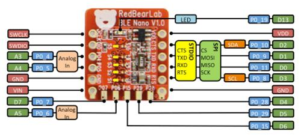
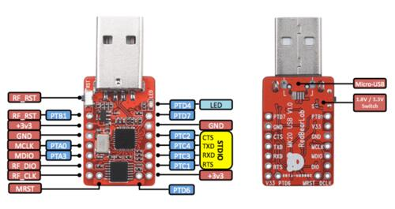

.. _nrf51_blenano:

Redbear Labs Nano
#################

Overview
********

The Nano is a development board equipped with Nordic's nRF51822 Bluetooth Low Energy SOC.
This board is available on `RedBear Store`_.

Hardware
********

nRF51 BLE Nano has two external oscillators. The frequency of the slow clock
is 32.768 kHz. The frequency of the main clock is 16 MHz.

Supported Features
==================

The nrf51_blenano board configuration supports the following nRF51
hardware features:

+-----------+------------+----------------------+
| Interface | Controller | Driver/Component     |
+===========+============+======================+
| NVIC      | on-chip    | nested vectored      |
|           |            | interrupt controller |
+-----------+------------+----------------------+
| RTC       | on-chip    | system clock         |
+-----------+------------+----------------------+
| UART      | on-chip    | serial port          |
+-----------+------------+----------------------+
| GPIO      | on-chip    | gpio                 |
+-----------+------------+----------------------+
| FLASH     | on-chip    | flash                |
+-----------+------------+----------------------+
| RADIO     | on-chip    | Bluetooth            |
+-----------+------------+----------------------+

Connections and IOs
====================

BLE nano pinout

DAPLink board

The DAPLink USB board acts as a dongle. DAPLink debug probes appear on the host computer as a USB disk.
It also regulates 5V from USB to 3.3V via the onboard LDO to power Nano.

More information about Nano and DAPLink can be found at the `RedBear Github`_.

Programming and Debugging
*************************

Applications for the ``nrf51_blenano`` board configuration can be built and
flashed in the usual way (see :ref:`build_an_application` and
:ref:`application_run` for more details).

Flashing
========

To flash an application, you'll need to connect your BLE Nano with the
DAPLink board, then attach that to your computer via USB.

.. warning::

   Be careful to mount the BLE Nano correctly! The side of the board
   with the VIN and GND pins should face **towards** the USB connector.
   The `RedBear Store`_ page links to a tutorial video that shows how to
   properly solder headers and assemble the DAPLink and BLE Nano boards.

Now build and flash applications as usual. Here is an example for the
:zephyr:code-sample:`hello_world` application.

.. zephyr-app-commands::
   :zephyr-app: samples/hello_world
   :board: nrf51_blenano
   :goals: build flash

Debugging
=========

After mounting the BLE Nano on its DAPLink board as described above,
you can debug an application in the usual way. Here is an example for
the :zephyr:code-sample:`hello_world` application.

.. zephyr-app-commands::
   :zephyr-app: samples/hello_world
   :board: nrf51_blenano
   :maybe-skip-config:
   :goals: debug

References
**********

.. target-notes::

.. _RedBear Store: https://redbear.cc/product/ble-nano-kit.html
.. _RedBear Github: https://github.com/redbear/nRF5x
