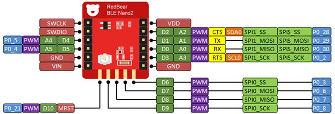
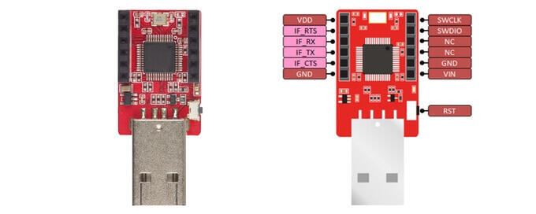

.. zephyr:board:: nrf52_blenano2

Overview
********

The Nano v2 is a development board equipped with Nordic's next generation nRF52832 Bluetooth Low Energy SOC.
This board was designed as a 'drop-in' replacement of BLE Nano with exactly the same form factor.

Hardware
********
- nRF52832 SoC is built around a 32-bit ARM Cortex-M4F CPU with 512kB flash + 64kB RAM
- 11 x Digital I/0
- 1 UART with hardware flow control ( 4 I/O pins occupied )
- 1 I2C ( 2 I/O pins occupied )

Supported Features
==================
The BLE Nano v2 board configuration supports the following hardware features:

+-----------+------------+--------------------------------------+
| Interface | Controller |      Driver/Component                |
+===========+============+======================================+
| NVIC      | on-chip    | nested vectored interrupt controller |
+-----------+------------+--------------------------------------+
| UART      | on-chip    | serial port                          |
+-----------+------------+--------------------------------------+
| GPIO      | on-chip    | gpio                                 |
+-----------+------------+--------------------------------------+
| FLASH     | on-chip    | flash                                |
+-----------+------------+--------------------------------------+
| RADIO     | on-chip    | Bluetooth                            |
+-----------+------------+--------------------------------------+
| I2C       | on-chip    | i2c                                  |
+-----------+------------+--------------------------------------+

Connections and IOs
====================

BLE nano v2 pinout

DAPLink board

The DAPLink USB board acts as a dongle. DAPLink debug probes appear on the host computer as a USB disk.
It also regulates 5V from USB to 3.3V via the onboard LDO to power Nano v2.

Programming and Debugging
*************************

Applications for the ``nrf52_blenano2`` board configuration can be built and
flashed in the usual way (see :ref:`build_an_application` and
:ref:`application_run` for more details).

Flashing
========

To flash an application, you'll need to connect your BLE Nano 2 with the
DAPLink board, then attach that to your computer via USB.

.. warning::

   Be careful to mount the BLE Nano 2 correctly! The side of the board
   with the VIN and GND pins should face **towards** the USB
   connector.

Now build and flash applications as usual. Here is an example for the
:zephyr:code-sample:`hello_world` application.

.. zephyr-app-commands::
   :zephyr-app: samples/hello_world
   :board: nrf52_blenano2
   :goals: build flash

Debugging
=========

After mounting the BLE Nano 2 on its DAPLink board as described above,
you can debug an application in the usual way.  Here is an example for
the :zephyr:code-sample:`hello_world` application.

.. zephyr-app-commands::
   :zephyr-app: samples/hello_world
   :board: nrf52_blenano2
   :maybe-skip-config:
   :goals: debug

References
**********

.. target-notes::

.. _Kickstarter: https://www.kickstarter.com/projects/redbearinc/bluetooth-5-ready-ble-module-nano-2-and-blend-2
.. _Github: https://github.com/redbear/nRF5x
.. _RedBear Forum: discuss.redbear.cc
