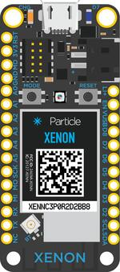

.. _particle_xenon:

Particle Xenon
##############

Overview
********

The Particle Xenon is a low-cost mesh-enabled development board based on the
Nordic Semiconductor nRF52840 SoC. The board was developed by Particle
Industries and has an SWD connector on it for programming.

It is equipped with a onboard LIPO circuit and conforms to the
Adafruit Feather formfactor.

The Particle Xenon board provides support for the Nordic Semiconductor nRF52840
ARM |reg| Cortex |reg|-M4F SoC with an integrated 2.4 GHz transceiver supporting
Bluetooth |reg| Low Energy and IEEE |reg| 802.15.4.

For more information about the Particle Xenon board:

- `Xenon Datasheet`_
- `Xenon Hardware Files`_

Hardware
********

On the front of the board are RGB-LED, LED and LIPO circuitry.
The RGB-LED is controlled by the nRF52840 via GPIO pins.

     Particle Xenon (Credit: Particle Industries)

Power supply
============

The board is optimized for low power applications and supports two
power source configurations, battery and micro USB connector.

It contains circuitry for LIPO usage and can be charged via the USB port.

Supported Features
==================

The particle_xenon board configuration supports the following
hardware features:

+-----------+------------+----------------------+
| Interface | Controller | Driver/Component     |
+===========+============+======================+
| NVIC      | on-chip    | nested vectored      |
|           |            | interrupt controller |
+-----------+------------+----------------------+
| RTC       | on-chip    | system clock         |
+-----------+------------+----------------------+
| UART      | on-chip    | serial port          |
+-----------+------------+----------------------+
| I2C       | on-chip    | i2c                  |
+-----------+------------+----------------------+
| SPI       | on-chip    | spi                  |
+-----------+------------+----------------------+
| GPIO      | on-chip    | gpio                 |
+-----------+------------+----------------------+
| FLASH     | on-chip    | flash                |
+-----------+------------+----------------------+
| RADIO     | on-chip    | Bluetooth            |
+-----------+------------+----------------------+

Other hardware features have not been enabled yet for this board.

Connections and IOs
===================

Please see the `Xenon Datasheet`_ for header pin assignments, which are
common to all Feather-compatible Particle boards.  Some peripherals are
available to applications through DTS overlay include directives:

- ``mesh_feather_i2c1_twi1.dtsi`` exposes TWI1 on labeled Feather
  SDA1/SCL1 pins
- ``mesh_feather_spi_spi1.dtsi`` exposes SPI1 on labeled Feather
  SPI pins
- ``mesh_feather_spi_spi3.dtsi`` exposes SPI3 on labeled Feather
  SPI pins
- ``mesh_feather_spi1_spi3.dtsi`` exposes SPI3 on labeled Feather
  SPI1 pins
- ``mesh_feather_uart1_rtscts.dtsi`` adds hardware flow control to
  labeled Feather UART pins
- ``mesh_xenon_uart2.dtsi`` exposes UARTE1 on labeled Feather
  UART2 pins

LED
---

* LED0 (blue)
* LED1 (red)
* LED2 (green)
* LED3 (blue)

Push buttons
------------

* SW0 via MODE
* SW1 via RESET

I2C
---

* TWI0 enabled on labeled header (SDA/SCL)
* TWI1 selectable with overlay (SDA1/SCL1)

SPI
---

* SPI0 disabled due to TWI0 conflict
* SPI1 selectable with overlay (SPI)
* SPI2 internal to 32 Mb CFI flash chip
* SPI3 selectable with overlay (SPI or SPI1)

UART
----

* UARTE0 enabled RX/TX on labeled header (UART1); add RTS/CTS with overlay
* UARTE1 selectable with overlay (UART2)

Programming and Debugging
*************************

Applications for the ``particle_xenon`` board configuration can be
built and flashed in the usual way (see :ref:`build_an_application`
and :ref:`application_run` for more details).

Flashing
========

Build and flash an application in the usual way, for example:

.. zephyr-app-commands::
   :zephyr-app: samples/basic/blinky
   :board: particle_xenon
   :goals: build flash

Debugging
=========

You can debug an application in the usual way.  Here is an example for the
:ref:`hello_world` application.

.. zephyr-app-commands::
   :zephyr-app: samples/hello_world
   :board: particle_xenon
   :maybe-skip-config:
   :goals: debug

Testing the LEDs and buttons
****************************

There are 2 samples that allow you to test that the buttons (switches) and
LEDs on the board are working properly with Zephyr:

* :zephyr:code-sample:`blinky`
* :zephyr:code-sample:`button`

You can build and flash the examples to make sure Zephyr is running correctly on
your board.

.. _Xenon Datasheet:
   https://docs.particle.io/datasheets/mesh/xenon-datasheet/

.. _Xenon Hardware Files:
   https://github.com/particle-iot/xenon
