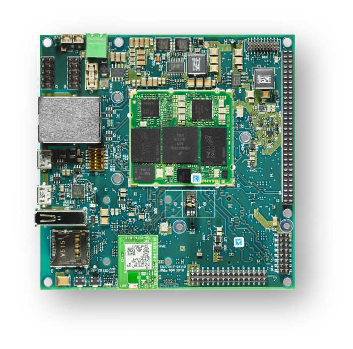
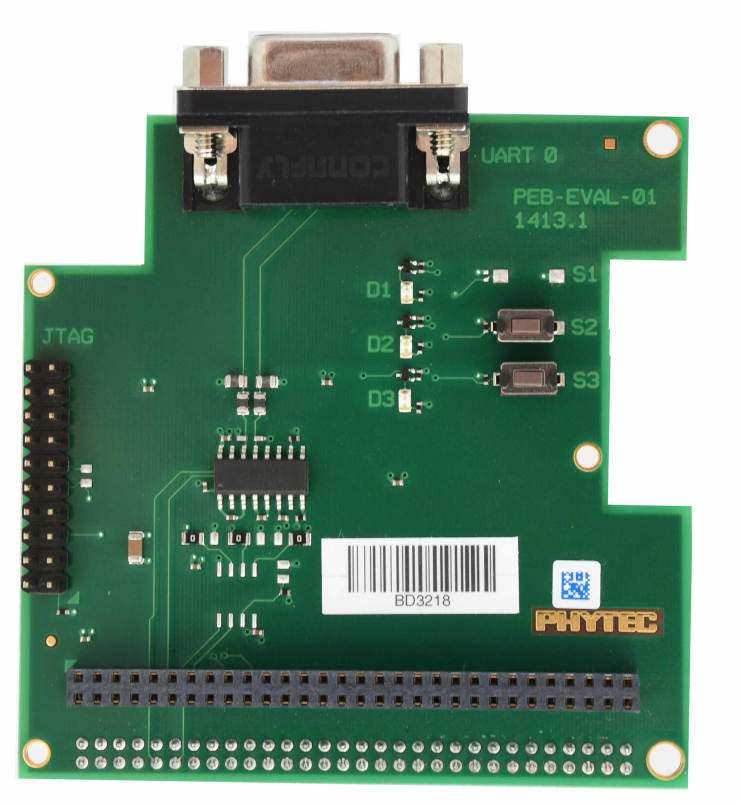

.. _mimx8mm_phyboard_polis:

PhyBOARD Polis (NXP i.MX8M Mini)
################################

Overview
********

The phyBOARD-Polis, either a development platform for the
phyCORE-i.MX 8M Mini/Nano, or a powerful, industry-compatible single-board
computer for immediate implementation of your product idea. As a development
platform, the phyBOARD-Polis serves as reference design for your
customer-specific application and enables parallel development of the software
and carrier board for the phyCORE-i.MX 8M Mini/Nano.

As a powerful, industrial single-board computer (SBC), the phyBOARD-Polis is
equipped with a variety of standard interfaces which are available on standard
or socket/pin header connectors, while interesting extensions of the
phyCORE-i.MX 8M Mini/Nano features such as CAN FD, WLAN and an integrated
TPM chip further extend the range of applications that can be developed with
the phyCORE-i.MX 8M Mini/Nano.

- Board features:

  - RAM: 512MB - 4GB (LPDDR4)
  - Storage:

    - 4GB - 128GB eMMC
    - 8MB - 128MB SPI NOR Flash
    - microSD Interfacce
    - 4kB EEPROM
  - Wireless:

    - WiFi: 802.11 b/g/n (ac) 2,4 GHz / 5 GHz
    - BLE 4.2
  - USB:

    - 1x USB2.0 OTG
    - 1x USB2.0
  - Ethernet: 1x 10/100/1000BASE-T
  - Interfaces:
    - 1x RS232 / RS485
    - 2x UART
    - 3x I²C
    - 2x SPI
    - Up to 4x PWM
    - 4x SAI
    - 1x MIPI CSI-2
    - 1x MIPI DSI-2
    - 2x MMC/SD/SDIO
    - 1x PCIe (mini PCIE)
  - LEDs:

    - 1x Status LED (3 Color LED)
    - 1x Debug UART LED
  - Debug

    - JTAG 20-pin connector
    - MicroUSB for UART debug, two COM ports for A53 and M4

More information about the board can be found at the
`PHYTEC website`_.

Supported Features
==================

The Zephyr ``mimx8mm_phyboard_polis/mimx8mm6/m4`` board configuration supports the following
hardware features:

+-----------+------------+-------------------------------------+
| Interface | Controller | Driver/Component                    |
+===========+============+=====================================+
| NVIC      | on-chip    | nested vector interrupt controller  |
+-----------+------------+-------------------------------------+
| SYSTICK   | on-chip    | systick                             |
+-----------+------------+-------------------------------------+
| CLOCK     | on-chip    | clock_control                       |
+-----------+------------+-------------------------------------+
| PINMUX    | on-chip    | pinmux                              |
+-----------+------------+-------------------------------------+
| UART      | on-chip    | serial port-polling;                |
|           |            | serial port-interrupt               |
+-----------+------------+-------------------------------------+
| GPIO      | on-chip    | GPIO output                         |
|           |            | GPIO input                          |
+-----------+------------+-------------------------------------+

The default configuration can be found in the defconfig file:
:zephyr_file:`boards/phytec/mimx8mm_phyboard_polis/mimx8mm_phyboard_polis_mimx8mm6_m4_defconfig`.

It is recommended to disable peripherals used by the M4 core on the Linux host.

Other hardware features are not currently supported with Zephyr on the
M4-Core.

Connections and IOs
===================

The following components are tested and working correctly.

UART:
-----

Zephyr is configured to use UART4 on the PhyBoard Polis by default to minimize
problems with the A53-Core because UART4 is only accessible from the M4-Core.

+---------------+-----------------+-----------------------------------+
| Board Name    | SoM Name        | Usage                             |
+===============+=================+===================================+
| RS232/485     | UART1           | RS232 / RS485 with flow-control   |
+---------------+-----------------+-----------------------------------+
| To WiFi Module| UART2           | UART to WiFi/BLE Module           |
+---------------+-----------------+-----------------------------------+
| Debug USB(A53)| UART3           | UART Debug Console via USB        |
+---------------+-----------------+-----------------------------------+
| Debug USB(M4) | UART4           | UART Debug Console via USB        |
+---------------+-----------------+-----------------------------------+

.. note::
  Please note, that the to UART2 connected Wifi/BLE Module isn't working with
  Zephyr yet.

.. warning::
  On Boards with the version number 1532.1 UART4 isn't connected to the Debug
  USB. UART4 connects to pin 10(RX) and 12(TX) on the X8 pinheader.

LEDs:
-----

Zephyr has the 3-color status LED configured. The led0 alias (the standard
Zephyr led) is configured to be the blue led. The LED can also light up in red
and green.

GPIO:
-----

The pinmuxing for the GPIOs is the standard pinmuxing of the mimx8mm devicetree
created by NXP. You can find it here:

:zephyr_file:`dts/arm/nxp/nxp_imx8m_m4.dtsi`.

The Pinout of the PhyBOARD Polis can be found here:

`PHYTEC website`_

System Clock
============

The M4 Core is configured to run at a 400 MHz clock speed.

Programming and Debugging
*************************

The i.MX8MM does not have a separate flash for the M4-Core. Because of this
the A53-Core has to load the program for the M4-Core to the right memory
address, set the PC and start the processor.
This can be done with U-Boot or Phytec's Linux BSP via remoteproc.

Because remoteproc in Phytec's BSP only writes to the TCM memory area,
everything was tested in this memory area.

You can read more about remoteproc in Phytec's BSP here: `Remoteproc BSP`_

These are the memory mapping for A53 and M4:

+------------+-------------------------+------------------------+-----------------------+----------------------+
| Region     | Cortex-A53              | Cortex-M4 (System Bus) | Cortex-M4 (Code Bus)  | Size                 |
+============+=========================+========================+=======================+======================+
| OCRAM      | 0x00900000-0x0093FFFF   | 0x20200000-0x2023FFFF  | 0x00900000-0x0093FFFF | 256KB                |
+------------+-------------------------+------------------------+-----------------------+----------------------+
| TCMU       | 0x00800000-0x0081FFFF   | 0x20000000-0x2001FFFF  |                       | 128KB                |
+------------+-------------------------+------------------------+-----------------------+----------------------+
| TCML       | 0x007E0000-0x007FFFFF   |                        | 0x1FFE0000-0x1FFFFFFF | 128KB                |
+------------+-------------------------+------------------------+-----------------------+----------------------+
| OCRAM_S    | 0x00180000-0x00187FFF   | 0x20180000-0x20187FFF  | 0x00180000-0x00187FFF | 32KB                 |
+------------+-------------------------+------------------------+-----------------------+----------------------+

For more information about memory mapping see the
`i.MX 8M Applications Processor Reference Manual`_  (section 2.1.2 and 2.1.3)

At compilation time you have to choose which RAM will be used. This
configuration is done in
:zephyr_file:`boards/phytec/mimx8mm_phyboard_polis/mimx8mm_phyboard_polis_mimx8mm6_m4.dts`
with "zephyr,flash" (when CONFIG_XIP=y) and "zephyr,sram" properties.

You also have to set XIP=n or edit the boards defconfig file, if you don't want
the TCM memory area to be used. You can find the defconf file here:

:zephyr_file:`boards/phytec/mimx8mm_phyboard_polis/mimx8mm_phyboard_polis_mimx8mm6_m4_defconfig`.

The following configurations are possible for the flash and sram chosen nodes
to change the used memory area:

.. code-block:: none

   "zephyr,flash"
   - &tcml_code
   - &ocram_code
   - &ocram_s_code

   "zephyr,sram"
   - &tcmu_sys
   - &ocram_sys
   - &ocram_s_sys

Starting the M4-Core via U-Boot
===============================

Load the compiled zephyr.bin to memory address 0x4800000.
This should output something like this:

.. code-block:: console

   u-boot=> tftp 0x48000000 192.168.3.10:zephyr.bin
   Using ethernet@30be0000 device
   TFTP from server 192.168.3.10; our IP address is 192.168.3.11
   Filename 'zephyr.bin'.
   Load address: 0x48000000
   Loading: ##
            2 KiB/s
   done
   Bytes transferred = 27240 (6a68 hex)

Because it's not possible to load directly to the TCM memory area you have to
copy the binaries. The last argument given is the size of the file in bytes,
you can copy it from the output of the last command.

.. code-block:: console

   u-boot=> cp.b 0x48000000 0x7e0000 27240

And finaly starting the M4-Core at the right memory address:

.. code-block:: console

   u-boot=> bootaux 0x7e0000
   ## Starting auxiliary core stack = 0x20003A58, pc = 0x1FFE1905...

Starting the M4-Core via remoteproc
===================================

Copy the zephyr.elf to ``/lib/firmware`` on the target. Maybe a Zephyr sample
will be included in a future BSP release.

.. note::
   In order to use remoteproc you have to add ``imx8mm-phycore-rpmsg.dtbo`` at
   the end of the line in the ``/boot/bootenv.txt``, then reboot the target.

.. warning::
   Remoteproc only reads firmware files from the ``/lib/firmware`` directory!
   If you try to load a binary from another location unexpected errors will
   occur!

To load and start a firmware use this commands:

.. code-block:: console

   target$ echo /lib/firmware/zephyr.elf > /sys/class/remoteproc/remoteproc0/firmware
   target$ echo start > /sys/class/remoteproc/remoteproc0/state
   [   90.700611] remoteproc remoteproc0: powering up imx-rproc
   [   90.706114] remoteproc remoteproc0: Direct firmware load for /lib/firmware/zephyr.elf failed w2
   [   90.716571] remoteproc remoteproc0: Falling back to sysfs fallback for: /lib/firmware/zephyr.elf
   [   90.739280] remoteproc remoteproc0: Booting fw image /lib/firmware/zephyr.elf, size 599356
   [   90.804448] remoteproc remoteproc0: remote processor imx-rproc is now up

The M4-Core is now started up and running. You can see the output from Zephyr
on UART4.

Debugging
=========

The PhyBOARD Polis can be debugged using a JTAG Debugger.
The easiest way to do that is to use a SEGGER JLink Debugger and Phytec's
``PEB-EVAL-01`` Shield, which can be directly connected to the JLink.
You can find the JLink Software package here: `JLink Software`_

   PEB-EVAL-01

To debug efficiently you should use multiple terminals:

(But its also possible to use ``west debug``)

After connecting everything and building with west use this command while in
the directory of the program you build earlier to start a debug server:

.. code-block:: console

   host$ west debugserver

West automatically connects via the JLink to the Target. And keeps open a
debug server.

Use another terminal, start gdb, connect to target and load Zephyr on the
target:

.. code-block:: console

   host$ gdb-multiarch build/zephyr/zephyr.elf -tui
   (gdb) targ rem :2331
   Remote debugging using :2331
   0x1ffe0008 in _vector_table ()
   (gdb) mon halt
   (gdb) mon reset
   (gdb) c
   Continuing.

The program can be debugged using standard gdb techniques.

.. _PHYTEC website:
   https://www.phytec.de/produkte/single-board-computer/phyboard-polis-imx8m-mini/

.. _PhyBOARD Polis pinout:
   https://download.phytec.de/Products/phyBOARD-Polis-iMX8M_Mini/TechData/phyCORE-i.MX8M_MINI_Pin_Muxing_Table.A1.xlsx?_ga=2.237582016.1177557183.1660563641-1900651135.1634193918

.. _Remoteproc BSP:
   https://wiki.phytec.com/pages/releaseview.action?pageId=472257137#L1002e.A3i.MX8MMini/NanoBSPManual-RunningExamplesfromLinuxusingRemoteproc

.. _i.MX 8M Applications Processor Reference Manual:
   https://www.nxp.com/webapp/Download?colCode=IMX8MMRM

.. _JLink Software:
   https://www.segger.com/downloads/jlink/
