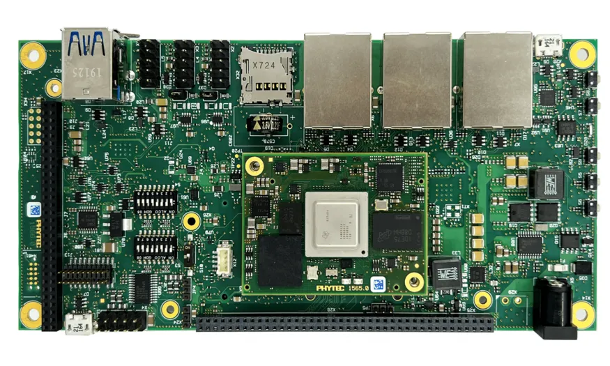

.. _phyboard_electra_am64xx_m4:

phyBOARD-Electra AM64x M4F Core
###############################

Overview
********

The AM64x phyBOARD-Electra board configuration is used by Zephyr applications
that run on the TI AM64x platform. The board configuration provides support
for the ARM Cortex-M4F MCU core and the following features:

- Nested Vector Interrupt Controller (NVIC)
- System Tick System Clock (SYSTICK)

The board configuration also enables support for the semihosting debugging console.

See the `PHYTEC AM64x Product Page`_ for details.

   PHYTEC phyBOARD-Electra with the phyCORE-AM64x SoM

Hardware
********
The AM64x phyBOARD-Electra kit features the AM64x SoC, which is composed of a
dual Cortex-A53 cluster and two dual Cortex-R5F cores in the MAIN domain as
well as a single Cortex-M4 core in the MCU domain. Zephyr is ported to run on
the M4F core and the following listed hardware specifications are used:

- Low-power ARM Cortex-M4F
- Memory

   - 256KB of SRAM
   - 2GB of DDR4

- Debug

   - XDS110 based JTAG

Supported Features
==================

The phyboard_electra/am6442/m4 configuration supports the following hardware features:

+-----------+------------+-------------------------------------+
| Interface | Controller | Driver/Component                    |
+===========+============+=====================================+
| NVIC      | on-chip    | nested vector interrupt controller  |
+-----------+------------+-------------------------------------+
| SYSTICK   | on-chip    | systick                             |
+-----------+------------+-------------------------------------+
| PINCTRL   | on-chip    | pinctrl                             |
+-----------+------------+-------------------------------------+
| UART      | on-chip    | serial                              |
+-----------+------------+-------------------------------------+
| GPIO      | on-chip    | gpio                                |
+-----------+------------+-------------------------------------+

Other hardware features are not currently supported by the port.

Devices
========
System Clock
------------

This board configuration uses a system clock frequency of 400 MHz.

DDR RAM
-------

The board has 2GB of DDR RAM available. This board configuration
allocates Zephyr 4kB of RAM (only for resource table: 0xa4100000 to 0xa4100400).

Serial Port
-----------

This board configuration uses a single serial communication channel with the
MCU domain UART (MCU_UART0).

GPIO
----

The phyCORE-AM64x has a heartbeat LED connected to gpio6. It's configured
to build and run the `basic/blinky` sample.

SD Card
*******

Download PHYTEC's official `WIC`_ as well as `BMAP`_ and flash the WIC file with
an etching software onto an SD-card. This will boot Linux on the A53 application
cores of the SoM. These cores will then load the zephyr binary on the M4 core
using remoteproc.

The default configuration can be found in
:zephyr_file:`boards/phytec/phyboard_electra/phyboard_electra_am6442_m4_defconfig`

Flashing
********

The Linux running on the A53 uses the remoteproc framework to manage the M4F co-processor.
Therefore, the testing requires the binary to be copied to the SD card to allow the A53 cores to
load it while booting using remoteproc.

To test the M4F core, we build the :ref:`hello_world` sample with the following command.

.. zephyr-app-commands::
   :board: phyboard_electra/am6442/m4
   :zephyr-app: samples/hello_world
   :goals: build

This builds the program and the binary is present in the `build/zephyr` directory as `zephyr.elf`.

We now copy this binary onto the SD card in the `/lib/firmware` directory and name it as `am64-mcu-m4f0_0-fw`.

.. code-block:: console

   # Mount the SD card at sdcard for example
   sudo mount /dev/sdX sdcard
   # copy the elf to the /lib/firmware directory
   sudo cp --remove-destination zephyr.elf sdcard/lib/firmware/am64-mcu-m4f0_0-fw

The SD card can now be used for booting. The binary will now be loaded onto the M4F core on boot.

To allow the board to boot using the SD card, set the boot pins to the SD Card boot mode. Refer to `phyBOARD SD Card Booting Essentials`_.

The board should boot into Linux and the binary will run and print Hello world to the MCU_UART0
port.

.. _PHYTEC AM64x Product Page:
   https://www.phytec.com/product/phycore-am64x/

.. _WIC:
   https://download.phytec.de/Software/Linux/BSP-Yocto-AM64x/BSP-Yocto-Ampliphy-AM64x-PD23.2.1/images/ampliphy/phyboard-electra-am64xx-2/phytec-headless-image-phyboard-electra-am64xx-2.wic.xz

.. _BMAP:
   https://download.phytec.de/Software/Linux/BSP-Yocto-AM64x/BSP-Yocto-Ampliphy-AM64x-PD23.2.1/images/ampliphy/phyboard-electra-am64xx-2/phytec-headless-image-phyboard-electra-am64xx-2.wic.bmap

.. _phyBOARD SD Card Booting Essentials:
   https://docs.phytec.com/projects/yocto-phycore-am64x/en/bsp-yocto-ampliphy-am64x-pd23.2.1/bootingessentials/sdcard.html
