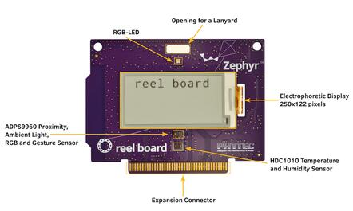
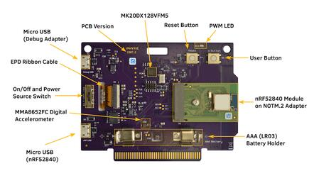
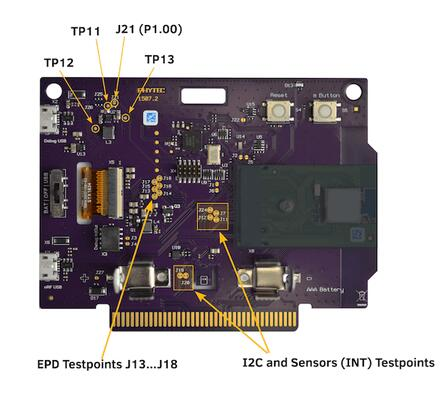
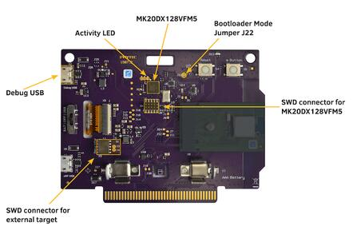
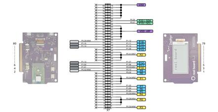
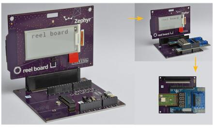

.. _reel_board:

reel board
##########

Overview
********

`reel board`_ is a evaluation board based on the Nordic Semiconductor
nRF52840 SoC. The board was developed by PHYTEC Messtechnik GmbH in
cooperation with Zephyr Project for the Hackathon - "Get Connected".
The board has a built-in debug adapter based on the DAPLink interface
firmware and NXP MK20DX128VFM5 SoC.

It is equipped with the Electrophoretic (electronic ink) Display (EPD),
environmental (temperature, humidity, light, accelerometer) sensors, and
Bluetooth connectivity making it easy to experiment and evaluate the
Zephyr OS in these kinds of use cases:

* battery powered sensor node
* low-power, low-cost human-machine interface (HMI) for remote
  control and environmental sensor monitoring
* temperature and humidity monitor on your table
* product, name or price tag
* interactive badge for meetings and conferences

The board provides support for the Nordic Semiconductor nRF52840 ARM |reg|
Cortex |reg|-M4F SoC with an integrated 2.4 GHz transceiver supporting Bluetooth
|reg| Low Energy and IEEE |reg| 802.15.4.

The schematic can be found on the `reel board website`_.

Hardware
********

On the front of the board are RGB-LED, ADPS9960 and HDC1010 sensors,
and Electrophoretic Display.
The RGB-LED is controlled by the nRF52840 via GPIO pins.
Display is controlled by the nRF52840 via SPI and 3 GPIOs.

On the back side of the board are all other components such as nRF52840,
a circuit for the Debug Adapter, On/Off and power source switch, battery holder,
buttons and the MMA8652FC (accelerometer) sensor.

ADPS9960 is a Digital Proximity, Ambient Light, RGB and Gesture sensor.
HDC1010 is a digital humidity and temperature sensor.
MMA8652FC is a 12-bit Digital Accelerometer.
All sensors are connected to the I2C bus and one GPIO pin each,
which can be used as an interrupt source.

     reel board front (Credit: PHYTEC)

     reel board back (Credit: PHYTEC)

Since PCB version 1507.2, the nRF52840 SoC is not soldered directly to
the board but integrated as a module on a NOTM.2 adapter.
The wiring is identical for versions 1507.1 and 1507.2.

.. _reel_board_display:

Display
=======

GDEH0213B1 is the display with which the board was introduced
in 2018. Unfortunately, this display has been discontinued.
Currently the board is delivered with the display GDEH0213B72.
It is expected that the display will be replaced over time
due the short product lifecycle of this type of displays.
The following table lists the displays used on the reel board.
The label on the ribbon cable can help to distinguish the displays.
According to the display type, the correct designation must be
used for building an application.

+--------------+--------------------+----------------------+-------------------+
| Display      | Ribbon Cable Label | Controller / Driver  | Board Designation |
+==============+====================+======================+===================+
| Good Display | HINK-E0213         | SSD1673 /            | reel_board        |
| GDEH0213B1   |                    | ssd16xx              |                   |
+--------------+--------------------+----------------------+-------------------+
| Good Display | HINK-E0213A22      | SSD1675A /           | reel_board@2      |
| GDEH0213B72  |                    | ssd16xx              |                   |
+--------------+--------------------+----------------------+-------------------+

Power supply
============

The board is optimized for low power applications and supports two
power source configurations, battery and micro USB connector.

The On/Off switch can choose which power source is used.

reel board uses a TPS610981 boost converter to generate supply voltage
for nRF52840 and peripherals (sensors and EPD).
The boost converter has two modes:

* Active mode - supply voltages for nRF52840 and peripherals are on
* Low Power mode - only supply voltage for nRF52840 is on

The mode is controlled by MODE pin (P1.00).

.. note::
   Actually there is no possibility to reduce energy consumption by the
   Low Power mode. Both voltages are always on, see:
   :zephyr_file:`boards/phytec/reel_board/board.c`

Supported Features
==================

The reel_board board configuration supports the following
hardware features:

+-----------+------------+----------------------+
| Interface | Controller | Driver/Component     |
+===========+============+======================+
| NVIC      | on-chip    | nested vectored      |
|           |            | interrupt controller |
+-----------+------------+----------------------+
| RTC       | on-chip    | system clock         |
+-----------+------------+----------------------+
| UART      | on-chip    | serial port          |
+-----------+------------+----------------------+
| I2C       | on-chip    | i2c                  |
+-----------+------------+----------------------+
| PWM       | on-chip    | pwm                  |
+-----------+------------+----------------------+
| SPI       | on-chip    | spi                  |
+-----------+------------+----------------------+
| GPIO      | on-chip    | gpio                 |
+-----------+------------+----------------------+
| FLASH     | on-chip    | flash                |
+-----------+------------+----------------------+
| RADIO     | on-chip    | Bluetooth            |
+-----------+------------+----------------------+
| SENSOR    | off-chip   | MMA8652FC polling:   |
|           |            | ADPS9960 polling:    |
|           |            | HDC1010 polling      |
+-----------+------------+----------------------+

Other hardware features have not been enabled yet for this board.

Connections and IOs
===================

Port P0
-------

+-------+----------------------------+---------------------------+
| Name  | Function                   | Usage                     |
+=======+============================+===========================+
| P0.00 | XL1                        | 32.768 kHz oscillator     |
+-------+----------------------------+---------------------------+
| P0.01 | XL2                        | 32.768 kHz oscillator     |
+-------+----------------------------+---------------------------+
| P0.02 | expansion connector pin 30 | None                      |
+-------+----------------------------+---------------------------+
| P0.03 | expansion connector pin 31 | None                      |
+-------+----------------------------+---------------------------+
| P0.04 | expansion connector pin 19 | None                      |
+-------+----------------------------+---------------------------+
| P0.05 | expansion connector pin 11 | None                      |
+-------+----------------------------+---------------------------+
| P0.06 | UART0_TX                   | UART Console over USB     |
+-------+----------------------------+---------------------------+
| P0.07 | Button                     | user button (S5)          |
+-------+----------------------------+---------------------------+
| P0.08 | UART0_RX                   | UART Console over USB     |
+-------+----------------------------+---------------------------+
| P0.09 | expansion connector pin 27 | None                      |
+-------+----------------------------+---------------------------+
| P0.10 | expansion connector pin 29 | None                      |
+-------+----------------------------+---------------------------+
| P0.11 | RGB LED (red)              | GPIO                      |
+-------+----------------------------+---------------------------+
| P0.12 | RGB LED (green)            | GPIO                      |
+-------+----------------------------+---------------------------+
| P0.13 | PWM LED | Buzzer           | GPIO                      |
+-------+----------------------------+---------------------------+
| P0.14 | EPD Busy output            | GPIO                      |
+-------+----------------------------+---------------------------+
| P0.15 | EPD Reset input            | GPIO                      |
+-------+----------------------------+---------------------------+
| P0.16 | EPD DC input               | GPIO                      |
+-------+----------------------------+---------------------------+
| P0.17 | EPD SPI3_CS                | SPI                       |
+-------+----------------------------+---------------------------+
| P0.18 | CPU Reset                  | Reset (S4)                |
+-------+----------------------------+---------------------------+
| P0.19 | EPD SPI3_CLK               | SPI                       |
+-------+----------------------------+---------------------------+
| P0.20 | EPD SPI3_MOSI              | SPI                       |
+-------+----------------------------+---------------------------+
| P0.21 | SPI3_MISO                  | SPI (not connected)       |
+-------+----------------------------+---------------------------+
| P0.22 | HDC1010 DRDYn              | GPIO                      |
+-------+----------------------------+---------------------------+
| P0.23 | APDS9960 INT               | GPIO                      |
+-------+----------------------------+---------------------------+
| P0.24 | MMA8652FC INT1             | GPIO                      |
+-------+----------------------------+---------------------------+
| P0.25 | MMA8652FC INT2             | GPIO                      |
+-------+----------------------------+---------------------------+
| P0.26 | I2C_0                      | I2C                       |
+-------+----------------------------+---------------------------+
| P0.27 | I2C_0                      | I2C                       |
+-------+----------------------------+---------------------------+
| P0.28 | expansion connector pin 3  | None                      |
+-------+----------------------------+---------------------------+
| P0.29 | expansion connector pin 52 | None                      |
+-------+----------------------------+---------------------------+
| P0.30 | expansion connector pin 1  | None                      |
+-------+----------------------------+---------------------------+
| P0.31 | expansion connector pin 37 | None                      |
+-------+----------------------------+---------------------------+

Port P1
-------

+-------+----------------------------+---------------------------+
| Name  | Function                   | Usage                     |
+=======+============================+===========================+
| P1.00 | peripheral power on        | GPIO                      |
+-------+----------------------------+---------------------------+
| P1.01 | expansion connector pin 32 | None                      |
+-------+----------------------------+---------------------------+
| P1.02 | expansion connector pin 34 | None                      |
+-------+----------------------------+---------------------------+
| P1.03 | expansion connector pin 17 | None                      |
+-------+----------------------------+---------------------------+
| P1.04 | expansion connector pin 15 | None                      |
+-------+----------------------------+---------------------------+
| P1.05 | expansion connector pin 13 | None                      |
+-------+----------------------------+---------------------------+
| P1.06 | expansion connector pin 33 | None                      |
+-------+----------------------------+---------------------------+
| P1.07 | expansion connector pin 35 | None                      |
+-------+----------------------------+---------------------------+
| P1.08 | expansion connector pin 45 | None                      |
+-------+----------------------------+---------------------------+
| P1.09 | RGB LED (blue)             | GPIO                      |
+-------+----------------------------+---------------------------+
| P1.10 | expansion connector pin 47 | None                      |
+-------+----------------------------+---------------------------+
| P1.11 | expansion connector pin 49 | None                      |
+-------+----------------------------+---------------------------+
| P1.12 | expansion connector pin 51 | None                      |
+-------+----------------------------+---------------------------+
| P1.13 | expansion connector pin 36 | None                      |
+-------+----------------------------+---------------------------+
| P1.14 | expansion connector pin 48 | None                      |
+-------+----------------------------+---------------------------+
| P1.15 | expansion connector pin 50 | None                      |
+-------+----------------------------+---------------------------+

Solder Jumper and Testpoints
============================

There are several labeled solder jumpers on the board.
These can be used to connect a logic analyzer to check the behavior of a
driver or to measure the voltage of a signal.

     reel board testpoints (Credit: PHYTEC)

I2C bus and sensors testpoints
------------------------------

+-------+-----------------------+---------------------------+
| Name  | Type                  | Usage                     |
+=======+=======================+===========================+
| J19   | closed solder jumper  | testpoint I2C SDA         |
+-------+-----------------------+---------------------------+
| J20   | closed solder jumper  | testpoint I2C SCL         |
+-------+-----------------------+---------------------------+
| J7    | closed solder jumper  | testpoint INT1 MMA8652FC  |
+-------+-----------------------+---------------------------+
| J24   | closed solder jumper  | testpoint INT2 MMA8652FC  |
+-------+-----------------------+---------------------------+
| J11   | closed solder jumper  | testpoint INT APDS9960    |
+-------+-----------------------+---------------------------+
| J12   | closed solder jumper  | testpoint DRDYn HDC1010   |
+-------+-----------------------+---------------------------+

EPD testpoints
--------------

+-------+-----------------------+---------------------------+
| Name  | Type                  | Usage                     |
+=======+=======================+===========================+
| J13   | closed solder jumper  | testpoint EPD Busy        |
+-------+-----------------------+---------------------------+
| J14   | closed solder jumper  | testpoint EPD Reset       |
+-------+-----------------------+---------------------------+
| J15   | closed solder jumper  | testpoint EPD DC          |
+-------+-----------------------+---------------------------+
| J16   | closed solder jumper  | testpoint EPD SPI_CS      |
+-------+-----------------------+---------------------------+
| J17   | closed solder jumper  | testpoint EPD SPI_CLK     |
+-------+-----------------------+---------------------------+
| J18   | closed solder jumper  | testpoint EPD SPI_MOSI    |
+-------+-----------------------+---------------------------+

Power supply testpoint
----------------------

+-------+-----------------------+-------------------------------------------+
| Name  | Type                  | Usage                                     |
+=======+=======================+===========================================+
| J21   | closed solder jumper  | testpoint peripheral voltage on/off       |
+-------+-----------------------+-------------------------------------------+
| TP11  | testpoint             | testpoint peripheral voltage              |
+-------+-----------------------+-------------------------------------------+
| TP12  | testpoint             | testpoint nRF52840 supply voltage VDD_nRF |
+-------+-----------------------+-------------------------------------------+
| TP13  | testpoint             | testpoint boost converter input voltage   |
+-------+-----------------------+-------------------------------------------+

Built-in Debug Adapter
======================

The debug adapter is based on the DAPLink interface firmware and
NXP MK20DX128VFM5 SoC. The adapter is powered via a micro USB connector and
is always on when the board is connected to the USB host.
reel board can be flashed and debugged, powered either from battery or USB.
If the Adapter is powered via USB, the Adapter circuit heats the board
slightly and the temperature sensor can output values up to 1.5 degrees higher.

     reel board Debug Adapter overview (Credit: PHYTEC)

Debug Adapter Firmware
----------------------

DAPLink firmware for the adapter can be found at `DAPLink reel board Firmware`_.
To update the firmware (if necessary), the adapter must be started in bootloader
mode. For this, the board should be disconnected from the USB host,
the J22 should be closed (use tweezers for this) and the board reconnected to
the USB host.

Debug Adapter Jumper
--------------------

+-------+-----------------------+----------------------------------------------+
| Name  | Type                  | Usage                                        |
+=======+=======================+==============================================+
| J3    | open solder jumper    | close to pass UART TX to external adapter    |
+-------+-----------------------+----------------------------------------------+
| J4    | open solder jumper    | close to pass UART RX to external adapter    |
+-------+-----------------------+----------------------------------------------+
| J22   | open solder jumper    | close to start adapter in bootloader mode    |
+-------+-----------------------+----------------------------------------------+

Adapter LEDs
------------

+-------+-----------------------+--------------------------------+
| Name  | Type                  | Usage                          |
+=======+=======================+================================+
| D11   | green                 | flashes when adapter is active |
+-------+-----------------------+--------------------------------+
| D14   | red                   | reserved                       |
+-------+-----------------------+--------------------------------+
| D15   | yellow                | reserved                       |
+-------+-----------------------+--------------------------------+

Expansion Connector
************************

The expansion connector has the same dimensions and similar pinout
as the BBC MicroBit edge connector. The expansion components that are
designed especially for the reel board are called link boards.

     reel board Expansion Connector (Credit: PHYTEC)

link board BASE
===============

link board BASE is a passive expansion board and allows other link boards or
third party shields in Arduino UNO R3 format to be connected to the reel board.
In addition, it includes a NOTM.2 connector and more powerful DCDC converter
then reel board.

     reel board and link board BASE (Credit: PHYTEC)

link board BASE can be used in combination with other link boards or
third party shields in two ways:

    As an adapter
        reel board is plugged into the link board BASE. Both peripherals on
        reel board and shields can be used as long as there is no conflict
        between I2C devices. Care should be taken to provide enough power
        to the complete circuit.

    Stand-alone
        NOTM.2 adapter is removed from the reel board and
        connected to NOTM.2 connector on the link board BASE.
        The wiring to the shield connector is identical to the
        configuration above and no software modifications for the shield
        are necessary.
        Stand-alone configuration is more suitable for applications where
        peripherals on the reel board are not used or in conflict,
        power provided by the reel board is not enough,
        or for prototypes in the field.

.. figure:: img/link_board_base.jpg
     :align: center
     :alt: link board BASE

     link board BASE (Credit: PHYTEC)

Components on the link board BASE:

    reel board Connector:
        2x40 position edge connector.

    Micro USB Connector:
        USB can be used as power source. USB data lines are wired
        to NOTM.2 connector.

    NOTM.2 Connector:
        Connector for NOTM.2 adapter. If the connector is used then
        reel board should be removed from reel board connector.

    SWD Connector X11:
        Wired to NOTM.2 connector. A debug probe can
        be connected to program or debug MCU in Stand-alone configuration.

    Alternative Power Source X5 or X9:
        Positive pin is closer to the + character. Nominal voltage is
        3.3V, there is no protection against reverse polarity or overvoltage.
        Use it with care.

    Shield Connector:
        Connector for link boards and third party shields in Arduino UNO R3
        format. Only shields designed for 3.3V supply voltage are supported.

Meaning of the Power Source Switch positions:

    EXT
        link board BASE is powered from Alternative Power Source Connector
        X9 or X5.

    USB
        link board BASE is powered from USB connector (via DCDC converter).

    RB
        link board BASE is powered from reel board. The available power is
        below 0.3W and depends on which source is used to power the reel board.

Programming and Debugging
*************************

Applications for the ``reel_board`` board configuration can be
built and flashed in the usual way (see :ref:`build_an_application`
and :ref:`application_run` for more details).

Flashing
========

If you use Linux, create a udev rule (as ``root``) to fix a permission issue
when not using root for flashing.

.. code-block:: console

   # echo 'ATTR{idProduct}=="0204", ATTR{idVendor}=="0d28", MODE="0666", GROUP="plugdev"' > /etc/udev/rules.d/50-cmsis-dap.rules

Reload the rules and replug the device.

.. code-block:: console

   $ sudo udevadm control --reload-rules

Finally, unplug and plug the board again for the rules to take effect.

Build and flash
applications as usual (see :ref:`build_an_application` and
:ref:`application_run` for more details).

Here is an example for the :zephyr:code-sample:`hello_world` application.

First, run your favorite terminal program to listen for output.

.. code-block:: console

   $ minicom -D <tty_device> -b 115200

Replace :code:`<tty_device>` with the port where the reel board
can be found. For example, under Linux, :code:`/dev/ttyACM0`.

Then build and flash the application in the usual way.

.. zephyr-app-commands::
   :zephyr-app: samples/hello_world
   :board: reel_board
   :goals: build flash

.. note::
   Please use reel_board@2 to build a application for the board equipped with
   the GDEH0213B72, see :ref:`reel_board_display`.

.. zephyr-app-commands::
   :zephyr-app: samples/hello_world
   :board: reel_board@2
   :goals: build flash

Debugging
=========

You can debug an application in the usual way.  Here is an example for the
:zephyr:code-sample:`hello_world` application.

.. zephyr-app-commands::
   :zephyr-app: samples/hello_world
   :board: reel_board
   :maybe-skip-config:
   :goals: debug

Testing the LEDs and buttons
****************************

There are 2 samples that allow you to test that the buttons (switches) and
LEDs on the board are working properly with Zephyr:

* :zephyr:code-sample:`blinky`
* :zephyr:code-sample:`button`

You can build and flash the examples to make sure Zephyr is running correctly on
your board.

References
**********

.. _reel board Website:
   https://www.phytec.de/reelboard/

.. target-notes::

.. _reel board:
   https://www.phytec.de/reelboard/

.. _DAPLink reel board Firmware:
   https://github.com/PHYTEC-Messtechnik-GmbH/DAPLink/tree/reel-board
