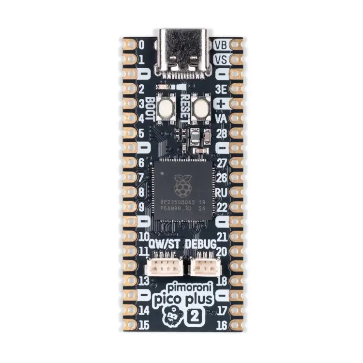

.. zephyr:board:: pico_plus2

Overview
********

The Pimoroni Pico Plus 2 is a compact and versatile board featuring the Raspberry Pi RP2350B SoC.
It includes USB Type-C, Qw/ST connectors, SP/CE connectors, a debug connector, a reset button,
and a BOOT button.

Hardware
********

- Dual Cortex-M33 or Hazard3 processors at up to 150MHz
- 520KB of SRAM, and 4MB of on-board flash memory
- 16MB of on-board QSPI flash (supports XiP)
- 8MB of PSRAM
- USB 1.1 with device and host support
- Low-power sleep and dormant modes
- Drag-and-drop programming using mass storage over USB
- 48 multi-function GPIO pins including 8 that can be used for ADC
- 2 SPI, 2 I2C, 2 UART, 3 12-bit 500ksps Analogue to Digital - Converter (ADC), 24 controllable PWM channels
- 2 Timer with 4 alarms, 1 AON Timer
- Temperature sensor
- 3 Programmable IO (PIO) blocks, 12 state machines total for custom peripheral support
- USB-C connector for power, programming, and data transfer
- Qw/ST (Qwiic/STEMMA QT) connector
- SP/CE connector
- 3-pin debug connector (JST-SH)
- Reset button and BOOT button (BOOT button also usable as a user switch)

     (Credit: Pimoroni)

Supported Features
==================

The Pimoroni Pico Plus 2 supports the following hardware features:

.. list-table::
   :header-rows: 1

   * - Peripheral
     - Kconfig option
     - Devicetree compatible
   * - NVIC
     - N/A
     - :dtcompatible:`arm,v8m-nvic`
   * - ADC
     - :kconfig:option:`CONFIG_ADC`
     - :dtcompatible:`raspberrypi,pico-adc`
   * - Clock controller
     - :kconfig:option:`CONFIG_CLOCK_CONTROL`
     - :dtcompatible:`raspberrypi,pico-clock-controller`
   * - Counter
     - :kconfig:option:`CONFIG_COUNTER`
     - :dtcompatible:`raspberrypi,pico-timer`
   * - DMA
     - :kconfig:option:`CONFIG_DMA`
     - :dtcompatible:`raspberrypi,pico-dma`
   * - GPIO
     - :kconfig:option:`CONFIG_GPIO`
     - :dtcompatible:`raspberrypi,pico-gpio`
   * - HWINFO
     - :kconfig:option:`CONFIG_HWINFO`
     - N/A
   * - I2C
     - :kconfig:option:`CONFIG_I2C`
     - :dtcompatible:`snps,designware-i2c`
   * - PWM
     - :kconfig:option:`CONFIG_PWM`
     - :dtcompatible:`raspberrypi,pico-pwm`
   * - SPI
     - :kconfig:option:`CONFIG_SPI`
     - :dtcompatible:`raspberrypi,pico-spi`
   * - UART
     - :kconfig:option:`CONFIG_SERIAL`
     - :dtcompatible:`raspberrypi,pico-uart`
   * - UART (PIO)
     - :kconfig:option:`CONFIG_SERIAL`
     - :dtcompatible:`raspberrypi,pico-uart-pio`

Programming and Debugging
*************************

Flashing
========

As with the RaspberryPi Pico, the SWD interface can be used to program and debug the
device, e.g. using OpenOCD with the `Raspberry Pi Debug Probe <https://www.raspberrypi.com/documentation/microcontrollers/debug-probe.html>`_ .

.. target-notes::

.. _Pimoroni Pico Plus 2:
  https://shop.pimoroni.com/products/pimoroni-pico-plus-2
