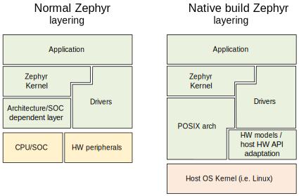

.. _Posix arch:

The POSIX architecture
######################

.. contents::
   :depth: 1
   :backlinks: entry
   :local:

Overview
********

The POSIX architecture, in combination with the inf_clock SOC layer,
provides the foundation,  architecture and SOC layers for a set of virtual test
boards.

Using these, a Zephyr application can be compiled together with
the Zephyr kernel, creating a normal executable that runs as
a native application on the host OS, without emulation. Instead,
you use native host tools for compiling, debugging, and analyzing your
Zephyr application, eliminating the need for architecture-specific
target hardware in the early phases of development.

.. note::

   The POSIX architecture is not related and should not be confused with the
   POSIX OS abstraction.
   The later provides an adapatation shim that enables running applications
   which require POSIX APIs on Zephyr.

Types of POSIX arch based boards
================================

Today there are two types of POSIX boards: The native_posix board and the _bsim
boards.
While they share the main objectives and principles, the first is intended as
a HW agnostic test platform which in some cases utilizes the host OS
peripherals, while the second intend to simulate a particular HW platform,
with focus on its radio (e.g. BT LE) and utilize the `BabbleSim`_ physical layer
simulation and framework, while being fully decoupled of the host.

.. _BabbleSim:
   https://BabbleSim.github.io

.. _posix_arch_deps:

Host system dependencies
========================

This port is designed to run in POSIX compatible operating systems,
but it has only been tested on Linux.

.. note::

   You must have the 32-bit C library installed in your system
   (in Ubuntu 16.04 install the gcc-multilib package)

.. note::

   The 32 bit version of this port does not directly work in Windows Subsystem
   for Linux (WSL) because WSL does not support native 32-bit binaries.
   You may want to consider WSL2, or, if using native_posix,
   you can also just use the native_posix_64
   target: Check :ref:`32 and 64bit versions<native_posix32_64>`.
   Otherwise `with some tinkering
   <https://github.com/microsoft/WSL/issues/2468#issuecomment-374904520>`_ it
   should be possible to make it work.

.. _posix_arch_limitations:

Important limitations
*********************

The underlying assumptions behind this port set some limitations on what
can and cannot be done.
These limitations are due to the code executing natively in
the host CPU without any instrumentation or means to interrupt it unless the
simulated CPU is sleeping.

You can imagine the code executes in a simulated CPU
which runs at an infinitely fast clock: No time passes while the CPU is
running.
Therefore interrupts, including timer interrupts, will not arrive
while code executes, except immediately after the SW enables or unmasks
them if they were pending.

This behavior is intentional, as it provides a deterministic environment to
develop and debug.
For more information please see the
`Rationale for this port`_ and `Architecture`_ sections

Therefore these limitations apply:

- There can **not** be busy wait loops in the application code that wait for
  something to happen without letting the CPU sleep.
  If busy wait loops do exist, they will behave as infinite loops and
  will stall the execution. For example, the following busy wait loop code,
  which could be interrupted on actual hardware, will stall the execution of
  all threads, kernel, and HW models:

  .. code-block:: c

     while (1){}

  Similarly the following code where we expect ``condition`` to be
  updated by an interrupt handler or another thread, will also stall
  the application when compiled for this port.

  .. code-block:: c

     volatile condition = true;
     while (condition){}

- Code that depends on its own execution speed will normally not
  work as expected. For example, code such as shown below, will likely not
  work as expected:

  .. code-block:: c

     peripheral_x->run = true;

     /* Wait for a number of CPU cycles */
     for (int i = 0; i < 100; i++) NOP;

     /* We expect the peripheral done and ready to do something else */

- This port is not meant to, and could not possibly help debug races between
  HW and SW, or similar timing related issues.

- You may not use hard coded memory addresses because there is no I/O or
  MMU emulation.

Working around these limitations
================================

If a busy wait loop exists, it will become evident as the application will be
stalled in it. To find the loop, you can run the binary in a debugger and
pause it after the execution is stuck; it will be paused in
some part of that loop.

The best solution is to remove that busy wait loop, and instead use
an appropriate kernel primitive to synchronize your threads.
Note that busy wait loops are in general a bad coding practice as they
keep the CPU executing and consuming power.

If removing the busy loop is really not an option, you may add a conditionally
compiled call to :c:func:`k_cpu_idle` if you are waiting for an
interrupt, or a call to :c:func:`k_busy_wait` with some small delay in
microseconds.
In the previous example, modifying the code as follows would work:

.. code-block:: c

   volatile condition = true;
   while (condition) {
    #if defined(CONFIG_ARCH_POSIX)
      k_cpu_idle();
    #endif
   }

.. _posix_arch_rationale:

Rationale for this port
***********************

The main intents of this port are:

- Allow functional debugging, instrumentation and analysis of the code with
  native tooling.
- Allow functional regression testing, and simulations in which we have the
  full functionality of the code.
- Run tests fast: several minutes of simulated time per wall time second.
- Possibility to connect to external tools which may be able to run much
  faster or much slower than real time.
- Deterministic, repeatable runs:
  There must not be any randomness or indeterminism (unless host peripherals
  are used).
  The result must **not** be affected by:

  - Debugging or instrumenting the code.
  - Pausing in a breakpoint and continuing later.
  - The host computer performance or its load.

The aim of this port is not to debug HW/SW races, missed HW programming
deadlines, or issues in which an interrupt comes when it was not expected.
Normally those would be debugged with a cycle accurate Instruction Set Simulator
(ISS) or with a development board.

.. _posix_arch_compare:

Comparison with other options
*****************************

This port does not try to replace cycle accurate instruction set simulators
(ISS), development boards, or QEMU, but to complement them. This port's main aim
is to meet the targets described in the previous `Rationale for this port`_
section.

.. figure:: Port_vs_QEMU_vs.svg
    :align: center
    :alt: Comparison of different debugging targets
    :figclass: align-center

    Comparison of different debugging options. Note that realism has many
    dimensions: Having the real memory map or emulating the exact time an
    instruction executes is just some of it; Emulating peripherals accurately
    is another side.

This native port compiles your code directly for the host architectture
(typically x86), with no instrumentation or
monitoring code. Your code executes directly in the host CPU. That is, your code
executes just as fast as it possibly can.

Simulated time is normally decoupled from real host time.
The problem of how to emulate the instruction execution speed is solved
by assuming that code executes in zero simulated time.

There is no I/O or MMU emulation. If you try to access memory through hardcoded
addresses your binary will simply segfault.
The drivers and HW models for this architecture will hide this from the
application developers when it relates to those peripherals.
In general this port is not meant to help developing low level drivers for
target HW. But for developing application code.

Your code can be debugged, instrumented, or analyzed with all normal native
development tools just like any other Linux application.

Execution is fully reproducible, you can pause it without side-effects.

How does this port compare to QEMU:
===================================

With QEMU you compile your image targeting the board which is closer to
your desired board. For example an ARM based one. QEMU emulates the real memory
layout of the board, loads the compiled binary and through instructions
translation executes that ARM targeted binary on the host CPU.
Depending on configuration, QEMU also provides models of some peripherals
and, in some cases, can expose host HW as emulated target peripherals.

QEMU cannot provide any emulation of execution speed. It simply
executes code as fast as it can, and lets the host CPU speed determine the
emulated CPU speed. This produces highly indeterministic behavior,
as the execution speed depends on the host system performance and its load.

As instructions are translated to the host architecture, and the target CPU and
MMU are emulated, there is a performance penalty.

You can connect gdb to QEMU, but have few other instrumentation abilities.

Execution is not reproducible. Some bugs may be triggered only in some runs
depending on the computer and its load.

How does this port compare to an ISS:
======================================

With a cycle accurate instruction set simulator you compile targeting either
your real CPU/platform or a close enough relative. The memory layout is modeled
and some or all peripherals too.

The simulator loads your binary, slowly interprets each instruction, and
accounts for the time each instruction takes.
Time is simulated and is fully decoupled from real time.
Simulations are on the order of 10 to 100 times slower than real time.

Some instruction set simulators work with gdb, and may
provide some extra tools for analyzing your code.

Execution is fully reproducible. You can normally pause your execution without
side-effects.

.. _posix_arch_architecture:

Architecture
************

    Zephyr layering when built against an embedded target (left), and
    targeting the a POSIX arch based board (right)

In this architecture each Zephyr thread is mapped to one POSIX pthread,
but only one of these pthreads executes at a time.
This architecture provides the same interface to the Kernel as other
architectures and is therefore transparent for the application.

When using this architecture, the code is compiled natively for the host system,
and typically as a 32-bit binary assuming pointer and integer types are 32-bits
wide.

To ensure determinism when the Zephyr code is running,
and to ease application debugging,
the board uses a different time than real time: simulated time.
How and if simulated time relates to the host time, is up to the simulated
board.

The Zephyr application sees the code executing as if the CPU were running at
an infinitely fast clock, and fully decoupled from the underlying host CPU
speed.
No simulated time passes while the application or kernel code execute.

The CPU boot is emulated by creating the Zephyr initialization thread and
letting it run. This in turn may spawn more Zephyr threads.
Eventually the SW will run to completion, that is, it will set the CPU
back to sleep.

At this point, control is transferred back to the HW models and the simulation
time can be advanced.

When the HW models raise an interrupt, the CPU wakes back up, the interrupt
is handled, the SW runs until completion again, and control is
transferred back to the HW models, all in zero simulated time.

If the SW unmasks a pending interrupt while running, or triggers a SW
interrupt, the interrupt controller may raise the interrupt immediately
depending on interrupt priorities, masking, and locking state.

