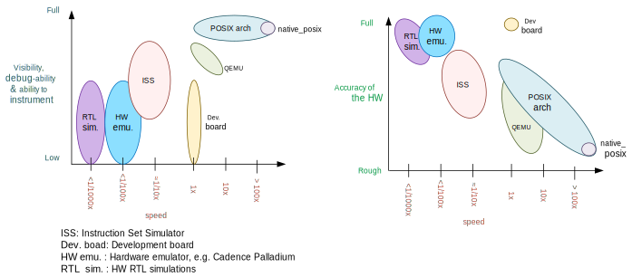
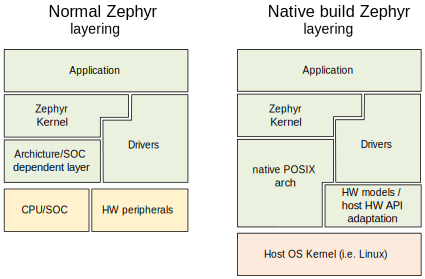

.. _native_posix:

Native POSIX execution (native_posix)
#######################################

.. contents::
   :depth: 1
   :backlinks: entry
   :local:

Overview
********

Using this board, a Zephyr application can be compiled together with
the Zephyr kernel, creating a normal console executable that runs as
a native application on the host OS, without emulation. Instead,
you use native host tools for compiling, debugging, and analyzing your
Zephyr application, eliminating the need for architecture-specific
target hardware in the early phases of development.

This board provides a few peripherals such as an Ethernet driver and UART.
See `Peripherals`_ for more information.

.. _native_posix_deps:

Host system dependencies
========================

This port is designed to run in POSIX compatible operating systems,
but it has only been tested on Linux.

.. note::

   You must have the 32-bit C library installed in your system
   (in Ubuntu 16.04 install the gcc-multilib package)

.. note::

   The 32 bit version of this port does not directly work in Windows Subsystem
   for Linux (WSL) because WSL does not support native 32-bit binaries.
   You may want to consider WSL2, or you can also just use the native_posix_64
   target: Check `32 and 64bit versions`_.
   Otherwise `with some tinkering
   <https://github.com/microsoft/WSL/issues/2468#issuecomment-374904520>`_ it
   should be possible to make it work.

.. _native_important_limitations:

Important limitations
*********************

The underlying assumptions behind this port set some limitations on what
can and cannot be done.
These limitations are due to the code executing natively in
the host CPU without any instrumentation or means to interrupt it unless the
simulated CPU is sleeping.

You can imagine the code executes in a simulated CPU
which runs at an infinitely fast clock: No time passes while the CPU is
running.
Therefore interrupts, including timer interrupts, will not arrive
while code executes, except immediately after the SW enables or unmasks
them if they were pending.

This behavior is intentional, as it provides a deterministic environment to
develop and debug.
For more information please see the
`Rationale for this port`_ and `Architecture`_ sections

Therefore these limitations apply:

- There can **not** be busy wait loops in the application code that wait for
  something to happen without letting the CPU sleep.
  If busy wait loops do exist, they will behave as infinite loops and
  will stall the execution. For example, the following busy wait loop code,
  which could be interrupted on actual hardware, will stall the execution of
  all threads, kernel, and HW models:

  .. code-block:: c

     while (1){}

  Similarly the following code where we expect ``condition`` to be
  updated by an interrupt handler or another thread, will also stall
  the application when compiled for this port.

  .. code-block:: c

     volatile condition = true;
     while (condition){}

- Code that depends on its own execution speed will normally not
  work as expected. For example, code such as shown below, will likely not
  work as expected:

  .. code-block:: c

     peripheral_x->run = true;

     /* Wait for a number of CPU cycles */
     for (int i = 0; i < 100; i++) NOP;

     /* We expect the peripheral done and ready to do something else */

- This port is not meant to, and could not possibly help debug races between
  HW and SW, or similar timing related issues.

- You may not use hard coded memory addresses because there is no I/O or
  MMU emulation.

Working around these limitations
================================

If a busy wait loop exists, it will become evident as the application will be
stalled in it. To find the loop, you can run the binary in a debugger and
pause it after the execution is stuck; it will be paused in
some part of that loop.

The best solution is to remove that busy wait loop, and instead use
an appropriate kernel primitive to synchronize your threads.
Note that busy wait loops are in general a bad coding practice as they
keep the CPU executing and consuming power.

If removing the busy loop is really not an option, you may add a conditionally
compiled call to :c:func:`k_cpu_idle` if you are waiting for an
interrupt, or a call to :c:func:`k_busy_wait` with some small delay in
microseconds.
In the previous example, modifying the code as follows would work:

.. code-block:: c

   volatile condition = true;
   while (condition) {
   	#if defined(CONFIG_ARCH_POSIX)
   		k_cpu_idle();
   	#endif
   }

How to use it
*************

Compiling
=========

Specify the native_posix board target to build a native POSIX application:

.. zephyr-app-commands::
   :zephyr-app: samples/hello_world
   :host-os: unix
   :board: native_posix
   :goals: build
   :compact:

Running
=======

The result of the compilation is an executable (zephyr.exe) placed in the
zephyr/ subdirectory of the build folder.
Run the zephyr.exe executable as you would any other Linux console application.

.. code-block:: console

   $ ./build/zephyr/zephyr.exe
   # Press Ctrl+C to exit

This executable accepts several command line options depending on the
compilation configuration.
You can run it with the ``--help`` command line switch to get a list of
available options::

   $ ./build/zephyr/zephyr.exe --help

Note that the Zephyr kernel does not actually exit once the application is
finished. It simply goes into the idle loop forever.
Therefore you must stop the application manually (Ctrl+C in Linux).

Application tests using the ``ztest`` framework will exit after all
tests have completed.

If you want your application to gracefully finish when it reaches some point,
you may add a conditionally compiled (:option:`CONFIG_ARCH_POSIX`) call to
``posix_exit(int status)`` at that point.

Debugging
=========

Since the Zephyr executable is a native application, it can be debugged and
instrumented as any other native program. The program is compiled with debug
information, so it can be run directly in, for example, ``gdb`` or instrumented
with ``valgrind``.

Because the execution of your Zephyr application is normally deterministic
(there are no asynchronous or random components), you can execute the
code multiple times and get the exact same result. Instrumenting the
code does not affect its execution.

To ease debugging you may want to compile your code without optimizations
(e.g., -O0) by setting :option:`CONFIG_NO_OPTIMIZATIONS`.

Address Sanitizer (ASan)
========================

You can also build Zephyr with `Address Sanitizer`_. To do this, set
:option:`CONFIG_ASAN`, for example, in the application project file, or in the
``west build`` or ``cmake`` command line invocation.

Note that you will need the ASan library installed in your system.
In Debian/Ubuntu this is ``libasan1``.

.. _Address Sanitizer:
   https://github.com/google/sanitizers/wiki/AddressSanitizer

Coverage reports
================

See
:ref:`coverage reports using the POSIX architecture <coverage_posix>`.

32 and 64bit versions
*********************

native_posix comes with two targets: A 32 bit and 64 bit version.
The 32 bit version, ``native_posix``, is the default target, which will compile
your code for the ILP32 ABI (i386 in a x86 or x86_64 system) where pointers
and longs are 32 bits.
This mimics the ABI of most embedded systems Zephyr targets,
and is therefore normally best to test and debug your code, as some bugs are
dependent on the size of pointers and longs.
This target requires either a 64 bit system with multilib support installed or
one with a 32bit userspace.

The 64 bit version, ``native_posix_64``, compiles your code targeting the
LP64 ABI (x86-64 in x86 systems), where pointers and longs are 64 bits.
You can use this target if you cannot compile or run 32 bit binaries.

If you are using another 32 bit POSIX arch target you may also override its ABI
target and pointer bit width by setting :option:`CONFIG_64BIT`.

Rationale for this port
***********************

The main intents of this port are:

- Allow functional debugging, instrumentation and analysis of the code with
  native tooling.
- Allow functional regression testing, and simulations in which we have the
  full functionality of the code.
- Run tests fast: several minutes of simulated time per wall time second.
- Possibility to connect to external tools which may be able to run much
  faster or much slower than real time.
- Deterministic, repeatable runs:
  There must not be any randomness or indeterminism (unless host peripherals
  are used).
  The result must **not** be affected by:

  - Debugging or instrumenting the code.
  - Pausing in a breakpoint and continuing later.
  - The host computer performance or its load.

The aim of this port is not to debug HW/SW races, missed HW programming
deadlines, or issues in which an interrupt comes when it was not expected.
Normally those would be debugged with a cycle accurate Instruction Set Simulator
(ISS) or with a development board.

Comparison with other options
*****************************

This port does not try to replace cycle accurate instruction set simulators
(ISS), development boards, or QEMU, but to complement them. This port's main aim
is to meet the targets described in the previous `Rationale for this port`_
section.

    Comparison of different debugging options. Note that realism has many
    dimensions: Having the real memory map or emulating the exact time an
    instruction executes is just some of it; Emulating peripherals accurately
    is another side.

This native port compiles your code directly to x86, with no instrumentation or
monitoring code. Your code executes directly in the host CPU. That is, your code
executes just as fast as it possibly can.

Simulated time is normally decoupled from real host time.
The problem of how to emulate the instruction execution speed is solved
by assuming that code executes in zero simulated time.

There is no I/O or MMU emulation. If you try to access memory through hardcoded
addresses your binary will simply segfault.
The drivers and HW models for this architecture will hide this from the
application developers when it relates to those peripherals.
In general this port is not meant to help developing low level drivers for
target HW. But for developing application code.

Your code can be debugged, instrumented, or analyzed with all normal native
development tools just like any other Linux application.

Execution is fully reproducible, you can pause it without side-effects.

How does this port compare to QEMU:
===================================

With QEMU you compile your image targeting the board which is closer to
your desired board. For example an ARM based one. QEMU emulates the real memory
layout of the board, loads the compiled binary and through instructions
translation executes that ARM targeted binary on the host CPU.
Depending on configuration, QEMU also provides models of some peripherals
and, in some cases, can expose host HW as emulated target peripherals.

QEMU cannot provide any emulation of execution speed. It simply
executes code as fast as it can, and lets the host CPU speed determine the
emulated CPU speed. This produces highly indeterministic behavior,
as the execution speed depends on the host system performance and its load.

As instructions are translated to the host architecture, and the target CPU and
MMU are emulated, there is a performance penalty.

You can connect gdb to QEMU, but have few other instrumentation abilities.

Execution is not reproducible. Some bugs may be triggered only in some runs
depending on the computer and its load.

How does this port compare to an ISS:
======================================

With a cycle accurate instruction set simulator you compile targeting either
your real CPU/platform or a close enough relative. The memory layout is modeled
and some or all peripherals too.

The simulator loads your binary, slowly interprets each instruction, and
accounts for the time each instruction takes.
Time is simulated and is fully decoupled from real time.
Simulations are on the order of 10 to 100 times slower than real time.

Some instruction set simulators work with gdb, and may
provide some extra tools for analyzing your code.

Execution is fully reproducible. You can normally pause your execution without
side-effects.

Architecture
************

    Zephyr layering when built against an embedded target (left), and
    targeting the native_posix board (right)

This board is based on the POSIX architecture port of Zephyr.
In this architecture each Zephyr thread is mapped to one POSIX pthread,
but only one of these pthreads executes at a time.
This architecture provides the same interface to the Kernel as other
architectures and is therefore transparent for the application.

This board does not try to emulate any particular embedded CPU or SOC.
The code is compiled natively for the host x86 system, as a 32-bit
binary assuming pointer and integer types are 32-bits wide.

To ensure determinism when the Zephyr code is running,
and to ease application debugging,
the board uses a different time than real time: simulated time.
This simulated time is, in principle, not linked to the host time.

The Zephyr application sees the code executing as if the CPU were running at
an infinitely fast clock, and fully decoupled from the underlying host CPU
speed.
No simulated time passes while the application or kernel code execute.

The CPU boot is emulated by creating the Zephyr initialization thread and
letting it run. This in turn may spawn more Zephyr threads.
Eventually the SW will run to completion, that is, it will set the CPU
back to sleep.

At this point, control is transferred back to the HW models and the simulation
time can be advanced.

When the HW models raise an interrupt, the CPU wakes back up, the interrupt
is handled, the SW runs until completion again, and control is
transferred back to the HW models, all in zero simulated time.

If the SW unmasks a pending interrupt while running, or triggers a SW
interrupt, the interrupt controller may raise the interrupt immediately
depending on interrupt priorities, masking, and locking state.

About time in native_posix
==========================

Normally simulated time runs fully decoupled from the real host time
and as fast as the host compute power would allow.
This is desirable when running in a debugger or testing in batch, but not if
interacting with external interfaces based on the real host time.

The Zephyr kernel is only aware of the simulated time as provided by the
HW models. Therefore any normal Zephyr thread will also know only about
simulated time.

The only link between the simulated time and the real/host time, if any,
is created by the clock and timer model.

This model can be configured to slow down the execution of native_posix to
real time.
You can do this with the ``--rt`` and ``--no-rt`` options from the command line.
The default behavior is set with
:option:`CONFIG_NATIVE_POSIX_SLOWDOWN_TO_REAL_TIME`.
Note that all this model does is wait before raising the
next system tick interrupt until the corresponding real/host time.
If, for some reason, native_posix runs slower than real time, all this
model can do is "catch up" as soon as possible by not delaying the
following ticks.
So if the host load is too high, or you are running in a debugger, you will
see simulated time lagging behind the real host time.
This solution ensures that normal runs are still deterministic while
providing an illusion of real timeness to the observer.

When locked to real time, simulated time can also be set to run faster or
slower than real time.
This can be controlled with the ``--rt-ratio=<ratio>`` and ``-rt-drift=<drift>``
command line options. Note that both of these options control the same
underlying mechanism, and that ``drift`` is by definition equal to
``ratio - 1``.
It is also possible to adjust this clock speed on the fly with
:c:func:`native_rtc_adjust_clock()`.

In this way if, for example, ``--rt-ratio=2`` is given, the simulated time
will advance at twice the real time speed.
Similarly if ``--rt-drift=-100e-6`` is given, the simulated time will progress
100ppm slower than real time.
Note that these 2 options have no meaning when running in non real-time
mode.

How simulated time and real time relate to each other
-----------------------------------------------------

Simulated time (``st``) can be calculated from real time (``rt``) as

``st = (rt - last_rt) * ratio + last_st``

And vice-versa:

``rt = (st - last_st) / ratio + last_rt``

Where ``last_rt`` and ``last_st`` are respectively the real time and the
simulated time when the last clock ratio adjustment took place.

All times are kept in microseconds.

Peripherals
***********

The following peripherals are currently provided with this board:

**Interrupt controller**:
  A simple yet generic interrupt controller is provided. It can nest interrupts
  and provides interrupt priorities. Interrupts can be individually masked or
  unmasked. SW interrupts are also supported.

**Clock, timer and system tick model**
  This model provides the system tick timer. By default
  :option:`CONFIG_SYS_CLOCK_TICKS_PER_SEC` configures it to tick every 10ms.

  This peripheral driver also provides the needed functionality for this
  architecture-specific :c:func:`k_busy_wait`.

  Please refer to the section `About time in native_posix`_ for more
  information.

**UART**
  An optional UART driver can be compiled with native_posix.
  For more information refer to the section `UART`_.

**Real time clock**
  The real time clock model provides a model of a constantly powered clock.
  By default this is initialized to the host time at boot.

  This RTC can also be set to start from time 0 with the ``--rtc-reset`` command
  line option.

  It is possible to offset the RTC clock value at boot with the
  ``--rtc-offset=<offset>`` option,
  or to adjust it dynamically with the function :c:func:`native_rtc_offset`.

  After start, this RTC advances with the simulated time, and is therefore
  affected by the simulated time speed ratio.
  See `About time in native_posix`_ for more information.

  The time can be queried with the functions :c:func:`native_rtc_gettime_us`
  and :c:func:`native_rtc_gettime`. Both accept as parameter the clock source:

  - ``RTC_CLOCK_BOOT``: It counts the simulated time passed since boot.
    It is not subject to offset adjustments
  - ``RTC_CLOCK_REALTIME``: RTC persistent time. It is affected by
    offset adjustments.
  - ``RTC_CLOCK_PSEUDOHOSTREALTIME``: A version of the real host time,
    as if the host was also affected by the clock speed ratio and offset
    adjustments performed to the simulated clock and this RTC. Normally
    this value will be a couple of hundredths of microseconds ahead of the
    simulated time, depending on the host execution speed.
    This clock source should be used with care, as depending on the actual
    execution speed of native_posix and the host load,
    it may return a value considerably ahead of the simulated time.

**Entropy device**:
  An entropy device based on the host :c:func:`random` API.
  This device will generate the same sequence of random numbers if initialized
  with the same random seed.
  You can change this random seed value by using the command line option:
  ``--seed=<random_seed>`` where the value specified is a 32-bit integer
  such as 97229 (decimal),  0x17BCD (hex), or 0275715 (octal).

**Ethernet driver**:
  A simple TAP based ethernet driver is provided. The driver will create
  a **zeth** network interface to the host system. One can communicate with
  Zephyr via this network interface. Multiple TAP based network interfaces can
  be created if needed. The IP address configuration can be specified for each
  network interface instance.
  See :option:`CONFIG_ETH_NATIVE_POSIX_SETUP_SCRIPT` option for more details.
  The :ref:`eth-native-posix-sample` sample app provides
  some use examples and more information about this driver configuration.

  Note that this device can only be used with Linux hosts, and that the user
  needs elevated permissions.

**Bluetooth controller**:
  It's possible to use the host's Bluetooth adapter as a Bluetooth
  controller for Zephyr. To do this the HCI device needs to be passed as
  a command line option to ``zephyr.exe``. For example, to use ``hci0``,
  use ``sudo zephyr.exe --bt-dev=hci0``. Using the device requires root
  privileges (or the CAP_NET_ADMIN POSIX capability, to be exact) so
  ``zephyr.exe`` needs to be run through ``sudo``. The chosen HCI device
  must be powered down and support Bluetooth Low Energy (i.e. support the
  Bluetooth specification version 4.0 or greater).

**USB controller**:
  It's possible to use the Virtual USB controller working over USB/IP
  protocol. More information can be found in
  :ref:`Testing USB over USP/IP in native_posix <testing_USB_native_posix>`.

**Display driver**:
  A display driver is provided that creates a window on the host machine to
  render display content.

  This driver requires a 32-bit version of the `SDL2`_ library on the host
  machine and ``pkg-config`` settings to correctly pickup the SDL2 install path
  and compiler flags.

  On a Ubuntu 18.04 host system, for example, install the ``pkg-config`` and
  ``libsdl2-dev:i386`` packages, and configure the pkg-config search path with
  these commands::

    $ sudo apt-get install pkg-config libsdl2-dev:i386
    $ export PKG_CONFIG_PATH=/usr/lib/i386-linux-gnu/pkgconfig

.. _SDL2:
   https://www.libsdl.org/download-2.0.php

**Flash driver**:
  A flash driver is provided that accesses all flash data through a binary file
  on the host file system. The behavior of the flash device can be configured
  through the native POSIX board devicetree or Kconfig settings under
  :option:`CONFIG_FLASH_SIMULATOR`.

  By default the binary data is located in the file *flash.bin* in the current
  working directory. The location of this file can be changed through the
  command line parameter *--flash*. The flash data will be stored in raw format
  and the file will be truncated to match the size specified in the devicetree
  configuration. In case the file does not exists the driver will take care of
  creating the file, else the existing file is used.

  The flash content can be accessed from the host system, as explained in the
  `Host based flash access`_ section.

UART
****

This driver can be configured with :option:`CONFIG_UART_NATIVE_POSIX`
to instantiate up to two UARTs. By default only one UART is enabled.
With :option:`CONFIG_UART_NATIVE_POSIX_PORT_1_ENABLE`
you can enable the second one.

For the first UART, it can link it to a new
pseudoterminal (i.e. ``/dev/pts<nbr>``), or map the UART input and
output to the executable's ``stdin`` and ``stdout``.
This is chosen by selecting either
:option:`CONFIG_NATIVE_UART_0_ON_OWN_PTY` or
:option:`CONFIG_NATIVE_UART_0_ON_STDINOUT`
For interactive use with the :ref:`shell_api`, choose the first (OWN_PTY) option.
The second (STDINOUT) option can be used with the shell for automated
testing, such as when piping other processes' output to control it.
This is because the shell subsystem expects access to a raw terminal,
which (by default) a normal Linux terminal is not.

When :option:`CONFIG_NATIVE_UART_0_ON_OWN_PTY` is chosen, the name of the
newly created UART pseudo-terminal will be displayed in the console.
If you want to interact with it manually, you should attach a terminal emulator
to it. This can be done, for example with the command::

   $ xterm -e screen /dev/<ttyn> &

where ``/dev/<ttyn>`` should be replaced with the actual TTY device.

You may also chose to automatically attach a terminal emulator to the first UART
by passing the command line option ``-attach_uart`` to the executable.
The command used for attaching to the new shell can be set with the command line
option ``-attach_uart_cmd=<"cmd">``. Where the default command is given by
:option:`CONFIG_NATIVE_UART_AUTOATTACH_DEFAULT_CMD`.
Note that the default command assumes both ``xterm`` and ``screen`` are
installed in the system.

Subsystems backends
*******************

Apart from its own peripherals, the native_posix board also has some dedicated
backends for some of Zephyr's subsystems. These backends are designed to ease
development by integrating more seamlessly with the host operating system:

**Console backend**:
  A console backend which by default is configured to
  redirect any :c:func:`printk` write to the native host application's
  ``stdout``.

  This driver is selected by default if the `UART`_ is not compiled in.
  Otherwise :option:`CONFIG_UART_CONSOLE` will be set to select the UART as
  console backend.

**Logger backend**:
  A backend which prints all logger output to the process ``stdout``.
  It supports timestamping, which can be enabled with
  :option:`CONFIG_LOG_BACKEND_FORMAT_TIMESTAMP`; and colored output which can
  be enabled with :option:`CONFIG_LOG_BACKEND_SHOW_COLOR` and controlled
  with the command line options ``--color``, ``--no-color`` and
  ``--force-color``.

  In native_posix, by default, the logger is configured with
  :option:`CONFIG_LOG_IMMEDIATE`.

  This backend can be selected with :option:`CONFIG_LOG_BACKEND_NATIVE_POSIX`
  and is enabled by default unless the native_posix UART is compiled in.
  In this later case, by default, the logger is set to output to the `UART`_.

**Tracing**:
  A backend/"bottom" for Zephyr's CTF tracing subsystem which writes the tracing
  data to a file in the host filesystem.
  More information can be found in :ref:`Common Tracing Format <ctf>`

Host based flash access
***********************

If a flash device is present, the file system partitions on the flash
device can be exposed through the host file system by enabling
:option:`CONFIG_FUSE_FS_ACCESS`. This option enables a FUSE
(File system in User space) layer that maps the Zephyr file system calls to
the required UNIX file system calls, and provides access to the flash file
system partitions with normal operating system commands such as ``cd``,
``ls`` and ``mkdir``.

By default the partitions are exposed through the directory *flash* in the
current working directory. This directory can be changed via the command line
option *--flash-mount*. As this directory operates as a mount point for FUSE
you have to ensure that it exists before starting the native POSIX board.

On exit, the native POSIX board application will take care of unmounting the
directory. In the unfortunate case that the native POSIX board application
crashes, you can cleanup the stale mount point by using the program
``fusermount``::

    $ fusermount -u flash

Note that this feature requires a 32-bit version of the FUSE library, with a
minimal version of 2.6, on the host system and ``pkg-config`` settings to
correctly pickup the FUSE install path and compiler flags.

On a Ubuntu 18.04 host system, for example, install the ``pkg-config`` and
``libfuse-dev:i386`` packages, and configure the pkg-config search path with
these commands::

    $ sudo apt-get install pkg-config libfuse-dev:i386
    $ export PKG_CONFIG_PATH=/usr/lib/i386-linux-gnu/pkgconfig
