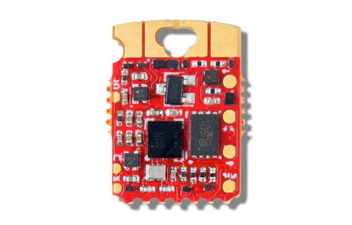

.. _qomu:

Qomu
####

Overview
********

The Qomu board is a platform with an on-board QuickLogic EOS S3 Sensor Processing Platform.

   Qomu (Credit: QuickLogic)

Hardware
********

- QuickLogic EOS S3 MCU Platform
- 16 Mbit of on-board flash memory
- Touchpads (4)
- RGB LED
- Powered from USB

Detailed information about the board can be found in a `Qomu repository`_ and `Qomu User Guide`_.

Connections and IOs
===================

Detailed information about pinouts is available in the `schematics document`_.

Programming
***********

The Qomu platform by default boots from flash.

Below are steps to run Qomu sample application:

#. Build the sample in an usual way:

   .. zephyr-app-commands::
      :zephyr-app: samples/boards/quicklogic/qomu
      :board: qomu
      :goals: build

#. Remove Qomu board from USB port.
#. Insert Qomu board to USB port.
#. While the blue LED is blinking (for 5 seconds), touch the touch-pads with your finger.
   On success, the green led will start flashing.
#. Use TinyFpgaProgrammer application to load the target application:

   .. code-block:: console

      python3 /path/to/TinyFPGA-Programmer-Application/tinyfpga-programmer-gui.py --mode m4 --m4app build/zephyr/zephyr.bin --reset

   Refer to `TinyFPGA Programmer Application repo`_ for detailed information on installation
   and program usage.

References
**********

.. target-notes::

.. _Qomu repository:
    https://github.com/QuickLogic-Corp/qomu-dev-board

.. _Qomu User Guide:
    https://github.com/QuickLogic-Corp/qomu-dev-board/blob/master/doc/Qomu_UserGuide.pdf

.. _schematics document:
    https://github.com/QuickLogic-Corp/qomu-dev-board/blob/master/doc/qomu-board.pdf

.. _TinyFPGA Programmer Application repo:
    https://github.com/QuickLogic-Corp/TinyFPGA-Programmer-Application
