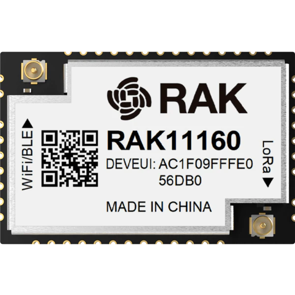

.. zephyr:board:: rak11160

Overview
********

RAK11160 is a WisDuo module based on the STM32WLE5 MCU with integrated LoRa
transceiver. It uses an Espressif ESP8684H2 co-processor to support Bluetooth
and WiFi connectivity. This module is ideal for various IoT applications such as
home automation, sensor networks, building automation, and other IoT network
applications.

Hardware
********

The module has below hardware features:
- STM32WLE5CC MCU with LPWAN single-core Cortex®-M4 at 48 MHz
- 256-Kbyte Flash memory and 64-Kbyte SRAM
- RF transceiver LoRa® modulations
- Hardware encryption AES256-bit and a true random number generator
- SMA connectors for the LORA antenna and BLE/WiFi antenna
- 32-bit single core RISC-V ESP8684 MCU
- 2 MB in ESP8684 MCU flash
- ESP8684 MCU support 802.11b/g/n
- A Bluetooth LE subsystem that supports features of Bluetooth 5 and Bluetooth Mesh

For more information about the RAK3112 stamp module:

- `WisDuo RAK11160 Website`_
- `STM32WLE5CC on www.st.com`_
- `ESP8684 on www.espressif.com`_

Supported Features
==================

.. zephyr:board-supported-hw::

Building & Flashing
*******************

.. zephyr:board-supported-runners::

Connect the board to your host computer and build and flash an application.
The sample application :zephyr:code-sample:`hello_world` is used for this example.
Build the Zephyr kernel and application, then flash it to the device:

.. zephyr-app-commands::
   :zephyr-app: samples/hello_world
   :board: rak11160
   :goals: build flash

Run a serial terminal to connect with your board. By default, ``usart1`` is
accessible via the USB to TTL converter.

- Speed: 115200
- Data: 8 bits
- Parity: None
- Stop bits: 1

.. code-block:: console

   Hello World! rak11160/stm32wle5xx

References
**********

.. target-notes::

.. _WisDuo RAK11160 Website:
   https://docs.rakwireless.com/product-categories/wisduo/rak11160-module/overview

.. _STM32WLE5CC on www.st.com:
   https://www.st.com/en/microcontrollers-microprocessors/stm32wle5cc.html

.. _ESP8684 on www.espressif.com:
   https://www.espressif.com/sites/default/files/documentation/esp8684_datasheet_en.pdf
