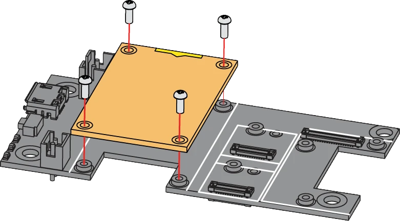

.. zephyr:board:: rak11722

Overview
********

The RAK11722 WisBlock Core module is a RAK11720 stamp module with
an expansion PCB and connectors compatible with the WisBlock Base
Boards. It allows an easy way to access the pins of the RAK11720
module to simplify development and testing processes.

The module itself comprises a RAK11720 as its main component. The
RAK11720 is a combination of an Ambiq Apollo3 Blue AMA3B1KK-KBR-B0
SoC MCU and an SX1262 LoRa chip. It features ultra-low power
consumption of 2.37 uA during sleep mode and high LoRa output power
up to 22 dBm during a transmission mode.

Additionally, RAK11722 complies with LoRaWAN 1.0.3 protocols and
supports LoRa point-to-point communication. The RF communication
characteristic of the module (LoRa + BLE) makes it suitable for
a variety of applications. These include home automation, sensor
networks, building automation, and personal area network applications.
Examples are health/fitness sensors, monitors, and more.

- `WisBlock overview`_
- `RAK11722 datasheet`_

Hardware
********

Supported Features
==================

- Based on AMA3B1KK-KBR-B0 and SX1262
- ARM Cortex-M4F
- 1 MB Flash and 348 KB SRAM
- LoRaWAN 1.0.3 specification compliant
- Supported bands: EU433, CN470, IN865, EU868, AU915, US915, KR920, RU864, and AS923-1/2/3/4
- LoRaWAN Activation by OTAA/ABP
- LoRa Point-to-Point (P2P) communication
- I/O ports: UART/I2C/SPI/ADC/GPIO
- Long-range - greater than 10 km with optimized antenna
- Ultra-low-power consumption of 2.37 μA in sleep mode
- Supply Voltage: 1.8 V ~ 3.6 V
- Temperature range: -40° C ~ 85° C

.. zephyr:board-supported-hw::

Connections and IOs
===================

The RAK11722 features a 40-pin header with various I/O interfaces for the WisBlock ecosystem. The pinout is as follows:

+-----------------------------+----------+-----+-----+----------+-----------------------------+
| Used                        | Name     | Pin | Pin | Name     | Used                        |
+=============================+==========+=====+=====+==========+=============================+
| NC                          | VBAT     | 1   | 2   | VBAT     | NC                          |
+-----------------------------+----------+-----+-----+----------+-----------------------------+
| GND                         | GND      | 3   | 4   | GND      | GND                         |
+-----------------------------+----------+-----+-----+----------+-----------------------------+
| 3V3                         | 3V3      | 5   | 6   | 3V3      | 3V3                         |
+-----------------------------+----------+-----+-----+----------+-----------------------------+
| CH340_P / UART0             | USB_P    | 7   | 8   | USB_N    | CH340_N / UART0             |
+-----------------------------+----------+-----+-----+----------+-----------------------------+
| NC                          | VBUS     | 9   | 10  | SW1      | NC                          |
+-----------------------------+----------+-----+-----+----------+-----------------------------+
| GPIO39 / UART0_TX           | TXD0     | 11  | 12  | RXD0     | GPIO40 / UART0_RX           |
+-----------------------------+----------+-----+-----+----------+-----------------------------+
| RESET                       | RESET    | 13  | 14  | LED1     | GPIO44                      |
+-----------------------------+----------+-----+-----+----------+-----------------------------+
| GPIO45                      | LED2     | 15  | 16  | LED3     | NC                          |
+-----------------------------+----------+-----+-----+----------+-----------------------------+
| 3V3                         | VDD      | 17  | 18  | VDD      | 3V3                         |
+-----------------------------+----------+-----+-----+----------+-----------------------------+
| GPIO25 / I2C2_SDA           | I2C1_SDA | 19  | 20  | I2C1_SCL | GPIO27 / I2C2_SCL           |
+-----------------------------+----------+-----+-----+----------+-----------------------------+
| GPIO13 / ADC_VBAT           | AIN0     | 21  | 22  | AIN1     | GPIO33 / ADC                |
+-----------------------------+----------+-----+-----+----------+-----------------------------+
| BOOT                        | BOOT0    | 23  | 24  | IO7      | GPIO32                      |
+-----------------------------+----------+-----+-----+----------+-----------------------------+
| GPIO1 / SPI0_CS             | SPI_CS   | 25  | 26  | SPI_CLK  | GPIO5 / SPI0_SCK            |
+-----------------------------+----------+-----+-----+----------+-----------------------------+
| GPIO6 / SPI0_MISO           | SPI_MISO | 27  | 28  | SPI_MOSI | GPIO7 / SPI0_MOSI           |
+-----------------------------+----------+-----+-----+----------+-----------------------------+
| GPIO38                      | IO1      | 29  | 30  | IO2      | GPIO4                       |
+-----------------------------+----------+-----+-----+----------+-----------------------------+
| GPIO37                      | IO3      | 31  | 32  | IO4      | GPIO31                      |
+-----------------------------+----------+-----+-----+----------+-----------------------------+
| GPIO42 / UART1_TX           | TXD1     | 33  | 34  | RXD1     | GPIO43 / UART1_RX           |
+-----------------------------+----------+-----+-----+----------+-----------------------------+
| NC                          | I2C2_SDA | 35  | 36  | I2C2_SCL | NC                          |
+-----------------------------+----------+-----+-----+----------+-----------------------------+
| GPIO9                       | IO5      | 37  | 38  | IO6      | GPIO8                       |
+-----------------------------+----------+-----+-----+----------+-----------------------------+
| GND                         | GND      | 39  | 40  | GND      | GND                         |
+-----------------------------+----------+-----+-----+----------+-----------------------------+

Connecting to a Baseboard
=========================

The RAK11722 can be mounted on a baseboard using the 40-pin header, called WisBlock I/O connector. It is compatible with
the WisBlock ecosystem, allowing for easy integration with various WisBlock modules and sensors.

Programming and debugging
*************************

.. zephyr:board-supported-runners::

Building & Flashing
===================

.. zephyr-app-commands::
   :zephyr-app: samples/basic/blinky
   :board: rak11722/apollo3_blue
   :shield: rakwireless_rak19010,rakwireless_rak19012
   :goals: build flash

Debugging
=========

You can debug an application in the usual way. Here is an example for the
:zephyr:code-sample:`hello_world` application.

.. zephyr-app-commands::
   :zephyr-app: samples/hello_world
   :board: rak11722/apollo3_blue
   :shield: rakwireless_rak19007
   :maybe-skip-config:
   :goals: debug

References
**********

.. target-notes::

.. _WisBlock overview:
   https://www.rakwireless.com/en-us/products/wisblock

.. _RAK11722 datasheet:
   https://docs.rakwireless.com/product-categories/wisblock/rak11722/datasheet
