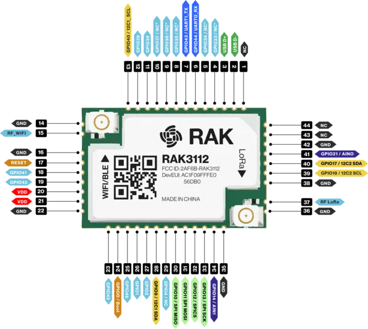

.. zephyr:board:: rak3112

Overview
********

The RAK3112 is a low-power, long-range LoRaWAN module based on the
Espressif ESP32-S3 MCU with an integrated Semtech SX1262 LoRa
transceiver. Supporting LoRa, BLE, and Wi-Fi, this module is ideal for
various IoT applications such as home automation, sensor networks,
building automation, and other IoT network applications.

Hardware
********

It is designed for easy access to the pins on the board and to simplify the evaluation of the RAK3112
module.

The main hardware features are:

- RAK3112 based on Espressif ESP32-S3, dual-core Xtensa® LX7 CPU up to 240 MHz
- Semtech SX1262 for LoRa® modulations
- Integrated 2.4 GHz Wi-Fi (802.11 b/g/n) and Bluetooth® LE 5
- 512 KB of SRAM and 384 KB of ROM on the chip
- IPEX connectors for the antennas
- I/O ports:

   - UART
   - I2C
   - SPI
   - GPIO
   - ADC

For more information about the RAK3112 stamp module:

- `WisDuo RAK3112 Website`_
- `Espressif ESP32-S3 Website`_

.. include:: ../../../espressif/common/soc-esp32s3-features.rst
   :start-after: espressif-soc-esp32s3-features

Supported Features
==================

.. zephyr:board-supported-hw::

System Requirements
*******************

.. include:: ../../../espressif/common/system-requirements.rst
   :start-after: espressif-system-requirements

Programming and Debugging
*************************

.. zephyr:board-supported-runners::

.. include:: ../../../espressif/common/building-flashing.rst
   :start-after: espressif-building-flashing

.. include:: ../../../espressif/common/board-variants.rst
   :start-after: espressif-board-variants

Debugging
=========

.. include:: ../../../espressif/common/openocd-debugging.rst
   :start-after: espressif-openocd-debugging

References
**********

.. target-notes::

.. _`WisDuo RAK3112 Website`: https://docs.rakwireless.com/Product-Categories/WisDuo/RAK3112-Module/Overview/
.. _`Espressif ESP32-S3 Website`: https://www.espressif.com/en/products/socs/esp32-s3
